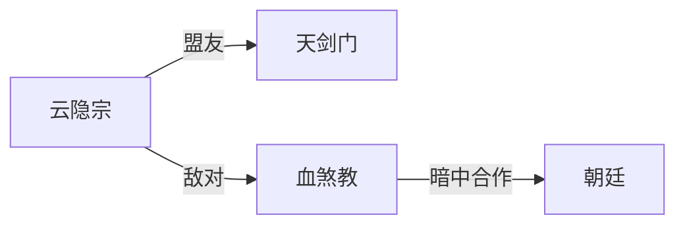

# 势力设定（factions）

> 本文件定义 NovelForge 世界的组织、门派、国家。
> 与 `02_角色/antagonists/` `02_角色/supporting/` 联动：每个势力至少绑定一个有名角色。

---

## 一、势力总览

| 势力名 | 类型 | 立场 | 实力等级 | 核心人物 | 文件锚点 |
|---|---|---|---|---|---|
| （示例）云隐宗 | 门派 | 中立 | 一流 | ____ | `02_角色/supporting/xxx.md` |
| （示例）血煞教 | 邪教 | 敌对 | 一流 | ____ | `02_角色/antagonists/xxx.md` |

> 立场枚举：友方 / 中立 / 敌对 / 未知

## 二、势力详解

### 2.1 ____（势力名）

- **创立背景**：____
- **核心宗旨**：____
- **势力结构**：____（长老会/家族制/独裁等）
- **核心人物**：____
- **与主角关系**：____
- **未来剧情作用**：____

### 2.2 ____（势力名）

（同上模板）

## 三、势力关系图

> 用文字描述势力间的合纵连横。如需可视化，可附 mermaid 图。

## 四、国家与政权

> 修仙世界中朝廷往往弱于修士，但可制造凡俗冲突。

- **主要国家**：____
- **皇权与修士关系**：____
- **凡俗势力**：____

## 五、修订历史

| 日期 | 修订内容 |
|---|---|
| YYYY-MM-DD | 初版 |
