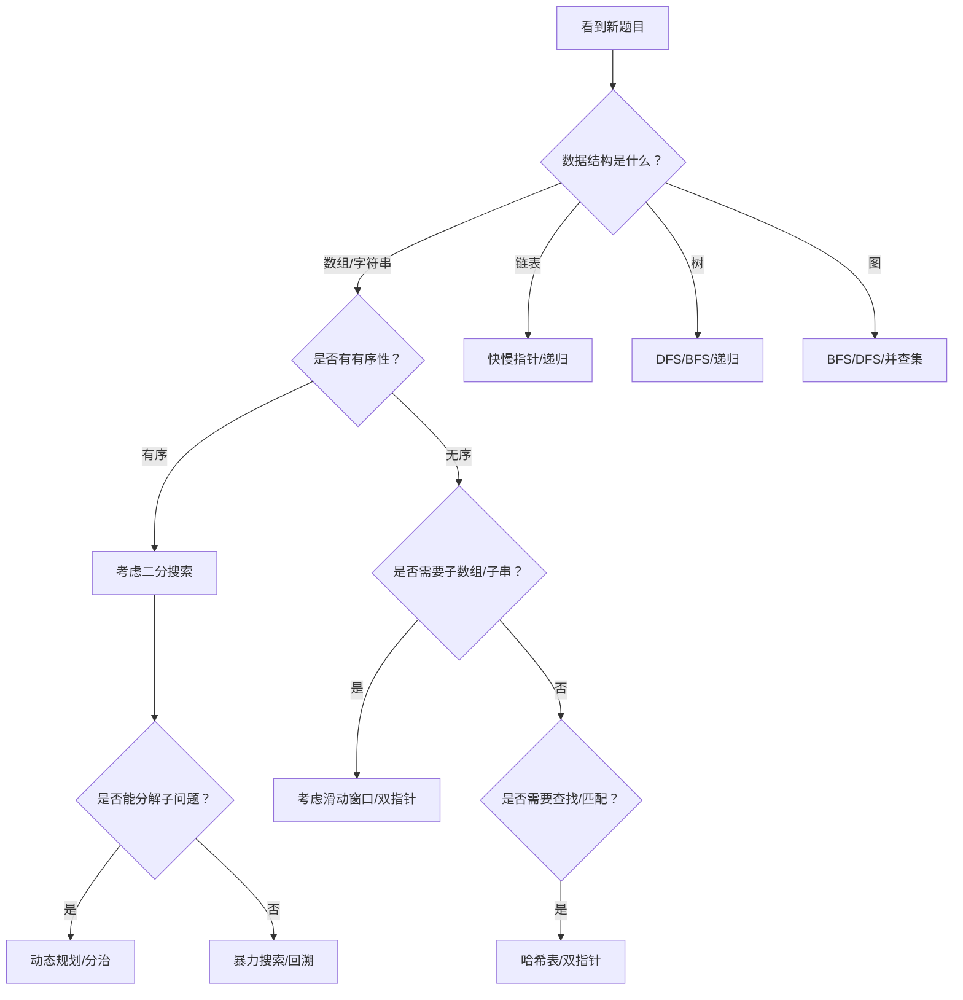

关联源素材：[[《labuladong的刷题笔记》-源素材]]

# 核心观点

**框架思维 > 题海战术**。算法学习的本质不是背诵代码，而是掌握一套通用的解题框架和思维模式，通过「模式识别→框架套用→举一反三」的路径实现高效学习。

# 刷题方法论的核心理念

## 为什么框架思维更重要？

很多学习者存在这样的困惑：
- 看到新技巧大呼精妙，以为学会了
- 换个题目还是做不出来
- **根本原因**：只看到了最终解法，没理解技巧之间的**内在联系**

labuladong 的核心方法论：
1. **由浅入深学习**：先学基础技巧 B、C → 再接触组合技巧 A
2. **建立知识网络**：每道题都能寻根溯源，找到底层技巧
3. **模板化思维**：将解题思路抽象成可复用的模板

## 刷题全家桶工具链

### 📚 学习资源体系

| 资源类型 | 用途 | 特点 |
|---------|------|------|
| 公众号/网站 | 核心教程 | 系统讲解算法原理和应用 |
| 《算法秘籍》PDF | 教材 | 循序渐进的知识体系 |
| 《刷题笔记》PDF | 练习册 | 像背单词一样背算法 |

### 🔌 三大刷题插件

| 插件平台 | 适用场景 | 核心功能 |
|---------|---------|---------|
| Chrome 插件 | 网页端刷题（力扣/LeetCode） | 题解/思路按钮、关联引用 |
| VSCode 插件 | IDE 内刷题 | 集成开发环境+题解查看 |
| JetBrains 插件 | IntelliJ/PyCharm 等 | IDE 全家桶支持 |

**插件独特价值**：
- ✅ 显示题目的**相关文章链接**
- ✅ 显示题目的**相关题目列表**
- ✅ 支持从基础技巧**溯源学习**
- ✅ 代码带详细注释和小灯泡图示

## 高效刷题策略

### 1️⃣ 按题型分类刷题

```
推荐刷题顺序（基于 labuladong 教程结构）：

第一章：基础数据结构
├── 数组双指针 ← 当前专题
├── 二分搜索 ← 当前专题
├── 滑动窗口
├── 链表双指针
├── 前缀和 & 差分数组
└── 队列/栈/堆

第二章：进阶数据结构
├── 二叉树 & BST
└── 图论算法

第三章：暴力搜索
├── 回溯算法
├── DFS/BFS
└── ...

第四章：动态规划
├── 一维 DP
├── 二维 DP
└── 背包问题

第五章：其他经典算法
├── 数学算法
└── 区间问题
```

### 2️⃣ 一题多解 + 举一反三

**正确做法**：
- ✅ 学完一道题后，思考能否用其他方法解决
- ✅ 对比不同解法的时空复杂度
- ✅ 总结这道题用到了哪些基础技巧
- ✅ 找到相似题目进行对比练习

**错误做法**：
- ❌ 只看一种解法就跳过
- ❌ 死记硬背代码不思考变体
- ❌ 刷完题不复盘总结

### 3️⃣ 从理论学习到实战应用

```
理论学习阶段：
  阅读《算法秘籍》→ 理解原理 → 手写模板

巩固练习阶段：
  使用《刷题笔记》→ 快速回忆思路 → 独立编码

实战检验阶段：
  LeetCode 刷题 → 使用插件查漏补缺 → 总结错题

能力提升阶段：
  一题多解 → 变体训练 → 参与竞赛
```

# 解题思维框架（通用套路）

## 核心模式识别

遇到一道新题目时，按以下步骤判断：



## 五步解题法

### Step 1：审题分析（2-3分钟）
- 输入输出格式是什么？
- 数据规模是多少？（决定时间复杂度要求）
- 有无特殊约束？（如原地修改、O(1)空间）
- 是否有隐含条件？（如有序性、范围限制）

### Step 2：模式匹配（1-2分钟）
- 这道题属于哪个题型？
- 能否套用已知框架？
- 和之前做的哪道题类似？
- 需要组合哪些基础技巧？

### Step 3：设计思路（3-5分钟）
- 选择合适的数据结构
- 设计核心算法逻辑
- 考虑边界情况
- 估算时间/空间复杂度

### Step 4：编码实现（5-10分钟）
- 先写伪代码或注释骨架
- 按模块逐步填充
- 注意变量命名和代码风格
- 处理 corner case

### Step 5：测试验证（2-3分钟）
- 手动走一遍示例
- 检查边界情况
- 思考可能的优化点
- 记录易错点和收获

# 常见刷题误区与避免方法

## ❌ 误区 1：贪多求快，不求甚解

**表现**：
- 一天刷10道题，但每道都半懂不懂
- 只看题解不理解思路
- 追求 AC 但不总结

**正确做法**：
- 每天 2-3 道，确保真正理解
- 每道题都要能讲清楚思路
- 建立**错题本**定期回顾

## ❌ 误区 2：死记硬背代码模板

**表现**：
- 背下模板但不理解原理
- 换个题型就不会变形
- 面试时紧张忘模板

**正确做法**：
- 理解模板的**设计思想**
- 掌握模板的**适用条件**
- 能够根据题目**灵活调整**

## ❌ 误区 3：只刷不复习

**表现**：
- 刷过的题过段时间又不会
- 同样的错误反复犯
- 没有形成长期记忆

**正确做法**：
- 使用**间隔重复**策略
- 定期重做错题
- 总结成自己的笔记卡片

## ❌ 误区 4：忽视基础知识

**表现**：
- 直接刷难题跳过基础
- 不理解数据结构的底层实现
- 复杂度分析不过关

**正确做法**：
- 先打好数据结构基础
- 掌握常用算法的时间复杂度
- 按 Easy → Medium → Hard 顺序推进

# 如何建立自己的解题模板库

## 模板库的组织方式

建议按照以下维度组织：

```
我的解题模板/
├── by_data_structure/          # 按数据结构
│   ├── array.md               # 数组相关模板
│   ├── linked_list.md         # 链表相关模板
│   ├── tree.md                # 树相关模板
│   └── graph.md               # 图相关模板
├── by_algorithm/              # 按算法类型
│   ├── binary_search.md       # 二分搜索模板
│   ├── two_pointers.md        # 双指针模板
│   ├── sliding_window.md      # 滑动窗口模板
│   ├── dp.md                  # 动态规划模板
│   └── backtracking.md        # 回溯算法模板
└── by_pattern/                # 按解题模式
    ├── monotonic_stack.md     # 单调栈
    ├── monotonic_queue.md     # 单调队列
    ├── fast_slow_pointer.md   # 快慢指针
    └── prefix_sum.md          # 前缀和
```

## 每个模板应包含的内容

```markdown
## 模板名称
### 适用场景
- 场景1
- 场景2

### 核心代码（Java版）
```java
// 带完整注释的代码
```

### 核心代码（Python版）
```python
# 带完整注释的代码
```

### 时间/空间复杂度
- 时间：O(?)
- 空间：O(?)

### 经典例题
1. [LeetCode XXX] 题目名 - 关键点说明
2. [LeetCode XXX] 题目名 - 关键点说明

### 易错点
- 错误1及原因
- 错误2及原因

### 变体与扩展
- 如何调整模板解决变体问题
```

# 实战练习建议

## 📖 入门阶段（0-50题）

**目标**：熟悉常见题型，掌握基本模板

- [ ] 数组基础操作（20题）
  - [LeetCode 26](https://leetcode.cn/problems/remove-duplicates-from-sorted-array/) 删除有序数组重复项
  - [LeetCode 27](https://leetcode.cn/problems/remove-element/) 移除元素
  - [LeetCode 283](https://leetcode.cn/problems/move-zeroes/) 移动零
- [ ] 字符串处理（15题）
  - [LeetCode 125](https://leetcode.cn/problems/valid-palindrome/) 验证回文串
  - [LeetCode 344](https://leetcode.cn/problems/reverse-string/) 反转字符串
- [ ] 链表基础（15题）
  - [LeetCode 206](https://leetcode.cn/problems/reverse-linked-list/) 反转链表
  - [LeetCode 21](https://leetcode.cn/problems/merge-two-sorted-lists/) 合并两个有序链表

## 🚀 进阶阶段（50-200题）

**目标**：熟练运用框架，能够独立解决 Medium 题目

- [ ] 二分搜索专题（当前 P02）
- [ ] 双指针专题（当前 P01）
- [ ] 滑动窗口专题（P03）
- [ ] 动态规划入门
- [ ] 回溯算法入门

## ⭐ 挑战阶段（200题+）

**目标**：一题多解，优化复杂度，挑战 Hard

- [ ] 动态规划进阶（状态压缩、区间DP）
- [ ] 图论高级算法（最短路、网络流）
- [ ] 数据结构设计（LRU、LFU）
- [ ] 数学算法与位运算

# 关联阅读

- [[T00_算法导论与复杂度]] - 算法基础理论
- [[P01_数组双指针专题]] - 双指针技术详解
- [[P02_二分搜索专题]] - 二分搜索详解
- [[P03_滑动窗口专题]] - 滑动窗口详解
