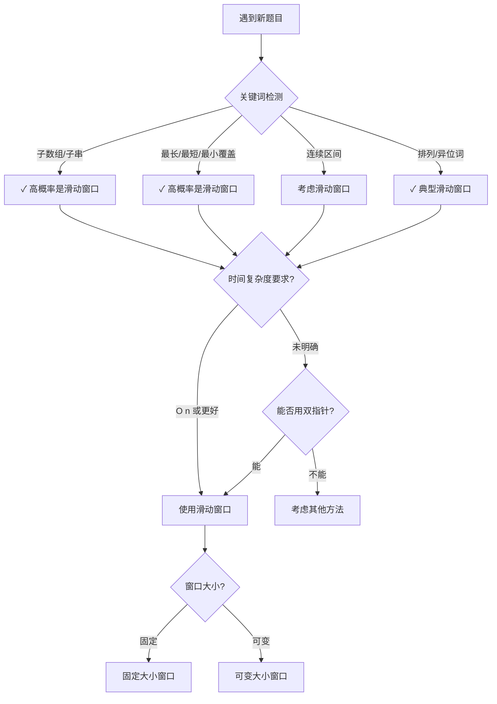

关联源素材：[[《labuladong的刷题笔记》-源素材]]

# 核心观点

**滑动窗口的本质是「维护一个窗口内的状态，通过移动左右边界来探索所有可能的子数组/子字符串」**，它是双指针技术的一种特殊形式，专门用于处理连续子区间问题。核心在于：**每个元素最多进出窗口一次，因此时间复杂度可以优化到 O(n)**。

# 解题思维框架（通用套路）

## 滑动窗口的两大类型

### 类型 1：固定大小窗口

**特征**：
- 窗口大小固定为 k
- 通常用 for 循环遍历右边界，自动维护左边界
- 常结合单调队列、哈希表等数据结构优化

**适用场景**：
- 求每个固定大小窗口的最大值/最小值/平均值
- 检查是否存在满足条件的定长子串

**模板思路**：
```
for right in range(len(nums)):
    # 1. 将 nums[right] 加入窗口
    window.add(nums[right])

    # 2. 当窗口大小达到 k 时，处理结果并移除左边元素
    if right - left + 1 == k:
        # 记录或更新结果（窗口已满）
        result.update(window)

        # 3. 移除最左边的元素，准备下一次滑动
        window.remove(nums[left])
        left += 1
```

### 类型 2：可变大小窗口（更常见）

**特征**：
- 窗口大小不固定，根据条件动态调整
- 用 while 循环收缩左边界
- 需要维护窗口状态（字符计数、和等）

**适用场景**：
- 最长/最短满足条件的子串
- 包含特定字符集合的最小子串
- 无重复字符的最长子串

**核心三问**（labuladong 总结）：
1. **什么时候应该移动 right 扩大窗口？** → 当窗口内的数据还需要更多元素来满足条件时
2. **什么时候应该停止移动 left 收缩窗口？** → 当窗口内的数据已经满足条件（或不满足条件需要收缩）时
3. **什么时候应该更新答案？** → 通常在收缩完成后（保证窗口合法），或每次扩展后（根据题目要求）

## 模式识别：什么时候用滑动窗口？



## 解题步骤总结

```
Step 1: 定义窗口状态 → 需要记录什么信息？（字符计数、元素和等）
        ↓
Step 2: 初始化变量 → left=0, right=0, 结果变量, 状态容器
        ↓
Step 3: 扩展右边界 → for/while 循环，将新元素加入窗口，更新状态
        ↓
Step 4: 收缩左边界 → while 循环判断是否需要收缩，移除左边元素
        ↓
Step 5: 更新结果 → 在合适的位置记录或更新答案
        ↓
Step 6: 返回结果 → 处理边界情况（未找到等）
```

## 代码模板（Java 版）

### 模板 1：通用可变大小滑动窗口

```java
void slidingWindow(String s, String t) {
    // need 记录目标字符串中各字符需要的数量
    Map<Character, Integer> need = new HashMap<>();
    for (char c : t.toCharArray()) {
        need.put(c, need.getOrDefault(c, 0) + 1);
    }

    // window 记录当前窗口中各字符的数量
    Map<Character, Integer> window = new HashMap<>();

    int left = 0, right = 0;
    int valid = 0;  // 记录窗口中满足 need 条件的字符个数

    while (right < s.length()) {
        // c 是将移入窗口的字符
        char c = s.charAt(right);
        // 右移窗口
        right++;
        // ===== 进行窗口内数据的一系列更新 =====
        if (need.containsKey(c)) {
            window.put(c, window.getOrDefault(c, 0) + 1);
            if (window.get(c).equals(need.get(c))) {
                valid++;  // 该字符数量已经满足需求
            }
        }

        /*** debug 输出的位置 ***/
        System.out.printf("window: [%d, %d)\n", left, right);
        /**************************/

        // ===== 判断左侧窗口是否要收缩 =====
        while (window needs shrink) {  // 根据具体问题修改条件
            // d 是将移出窗口的字符
            char d = s.charAt(left);
            // 左移窗口
            left++;
            // ===== 进行窗口内数据的一系列更新 =====
            if (need.containsKey(d)) {
                if (window.get(d).equals(need.get(d))) {
                    valid--;  // 该字符数量不再满足需求
                }
                window.put(d, window.get(d) - 1);
            }
        }
        // ===== 在这里更新答案（如果需要） =====
    }
}
```

### 模板 2：无重复字符的最长子串（简化版）

```java
int lengthOfLongestSubstring(String s) {
    Map<Character, Integer> window = new HashMap<>();
    int left = 0, right = 0;
    int res = 0;  // 记录结果

    while (right < s.length()) {
        char c = s.charAt(right);
        right++;
        // 扩展窗口：加入当前字符
        window.put(c, window.getOrDefault(c, 0) + 1);

        // 收缩窗口：当存在重复字符时
        while (window.get(c) > 1) {
            char d = s.charAt(left);
            left++;
            window.put(d, window.get(d) - 1);
        }

        // 更新答案：此时窗口内无重复字符
        res = Math.max(res, right - left);
    }

    return res;
}
```

### 模板 3：固定大小窗口（滑动窗口最大值）

```java
// 使用单调队列优化的滑动窗口最大值
int[] maxSlidingWindow(int[] nums, int k) {
    MonotonicQueue window = new MonotonicQueue();
    List<Integer> res = new ArrayList<>();

    for (int i = 0; i < nums.length; i++) {
        if (i < k - 1) {
            // 先填满窗口的前 k-1 个
            window.push(nums[i]);
        } else {
            // 窗口向前滑动，加入新数字
            window.push(nums[i]);
            // 记录当前窗口的最大值
            res.add(window.max());
            // 移出旧数字
            window.pop(nums[i - k + 1]);
        }
    }

    return res.stream().mapToInt(i -> i).toArray();
}

// 单调队列实现（从大到小）
class MonotonicQueue {
    LinkedList<Integer> q = new LinkedList<>();

    public void push(int n) {
        // 将小于 n 的元素全部删除，保持单调递减
        while (!q.isEmpty() && q.getLast() < n) {
            q.pollLast();
        }
        q.addLast(n);
    }

    public int max() {
        return q.getFirst();  // 队首就是最大值
    }

    public void pop(int n) {
        if (n == q.getFirst()) {
            q.pollFirst();  // 只有当要删除的元素是最大值时才真正删除
        }
    }
}
```

## 代码模板（Python 版）

### 模板 1：通用可变大小滑动窗口

```python
from collections import defaultdict

def sliding_window(s: str, t: str):
    """
    通用滑动窗口算法框架

    Args:
        s: 原字符串
        t: 目标字符串（包含需要匹配的字符）
    """
    from collections import defaultdict

    need = defaultdict(int)   # 目标字符计数
    window = defaultdict(int)  # 窗口字符计数

    for c in t:
        need[c] += 1

    left, right = 0, 0
    valid = 0  # 记录满足条件的字符数

    while right < len(s):
        # c 是将移入窗口的字符
        c = s[right]
        # 右移窗口
        right += 1
        # ===== 进行窗口内数据的一系列更新 =====
        if c in need:
            window[c] += 1
            if window[c] == need[c]:
                valid += 1

        # ***** debug 输出 *****
        print(f"window: [{left}, {right})")
        # **********************

        # ===== 判断左侧窗口是否要收缩 =====
        while window_needs_shrink():  # 根据具体问题修改条件
            # d 是将移出窗口的字符
            d = s[left]
            # 左移窗口
            left += 1
            # ===== 进行窗口内数据的一系列更新 =====
            if d in need:
                if window[d] == need[d]:
                    valid -= 1
                window[d] -= 1

        # ===== 在这里更新答案（如果需要） =====
```

### 模板 2：无重复字符的最长子串

```python
def length_of_longest_substring(s: str) -> int:
    """
    LeetCode 3: 无重复字符的最长子串

    使用滑动窗口找出不含重复字符的最长子串长度
    """
    from collections import defaultdict

    window = defaultdict(int)
    left = right = 0
    res = 0  # 记录最长长度

    while right < len(s):
        c = s[right]
        right += 1
        # 扩展窗口：加入当前字符
        window[c] += 1

        # 收缩窗口：当存在重复字符时
        while window[c] > 1:
            d = s[left]
            left += 1
            window[d] -= 1

        # 更新答案：此时窗口内无重复字符
        res = max(res, right - left)

    return res
```

### 模板 3：最小覆盖子串（完整版）

```python
def min_window(s: str, t: str) -> str:
    """
    LeetCode 76: 最小覆盖子串

    返回 s 中涵盖 t 所有字符的最小子串
    """
    from collections import defaultdict

    need = defaultdict(int)
    window = defaultdict(int)

    for c in t:
        need[c] += 1

    left, right = 0, 0
    valid = 0  # 记录满足条件的字符数
    start, length = 0, float('inf')  # 记录最小覆盖子串的起始位置和长度

    while right < len(s):
        c = s[right]
        right += 1
        # 扩展窗口
        if c in need:
            window[c] += 1
            if window[c] == need[c]:
                valid += 1

        # 收缩窗口：当所有字符都满足条件时
        while valid == len(need):
            # 更新最小覆盖子串
            if right - left < length:
                start = left
                length = right - left

            d = s[left]
            left += 1
            # 移出窗口
            if d in need:
                if window[d] == need[d]:
                    valid -= 1
                window[d] -= 1

    return "" if length == float('inf') else s[start:start+length]
```

### 模板 4：固定大小窗口（滑动窗口最大值）

```python
from collections import deque

def max_sliding_window(nums: list[int], k: int) -> list[int]:
    """
    LeetCode 239: 滑动窗口最大值

    使用单调队列实现 O(n) 时间复杂度
    """
    def clean_queue(index: int):
        # 移除超出窗口范围的元素
        while q and q[0] <= index - k:
            q.popleft()
        # 保持单调递减：移除比当前元素小的元素
        while q and nums[q[-1]] < nums[index]:
            q.pop()

    q = deque()  # 存储索引，保持单调递减
    result = []

    for i in range(len(nums)):
        clean_queue(i)
        q.append(i)
        # 当窗口形成后，记录最大值
        if i >= k - 1:
            result.append(nums[q[0]])

    return result
```

# 经典例题解析

## 例题 1: [LeetCode 3] 无重复字符的最长子串 ⭐⭐

- **难度**：Medium
- **题意简述**：给定一个字符串 `s`，请你找出其中不含有重复字符的**最长子串**的长度。
- **示例**：
  - 输入：`s = "abcabcbb"` → 输出：`3`（子串 `"abc"`）
  - 输入：`s = "bbbbb"` → 输出：`1`（子串 `"b"`）
- **思路分析**：
  - 这是滑动窗口的入门题，不需要 `need` 和 `valid`
  - 只需用 `window` 记录字符出现次数
  - 当 `window[c] > 1` 时说明有重复，收缩左边界
  - **关键点**：在**收缩完成后**更新结果，因为收缩后的窗口一定无重复

- **代码实现**：

```java
class Solution {
    public int lengthOfLongestSubstring(String s) {
        Map<Character, Integer> window = new HashMap<>();
        int left = 0, right = 0;
        int res = 0;

        while (right < s.length()) {
            char c = s.charAt(right);
            right++;
            window.put(c, window.getOrDefault(c, 0) + 1);

            // 当存在重复字符时，收缩窗口
            while (window.get(c) > 1) {
                char d = s.charAt(left);
                left++;
                window.put(d, window.get(d) - 1);
            }

            // 收缩完成后更新结果
            res = Math.max(res, right - left);
        }
        return res;
    }
}
```

```python
class Solution:
    def lengthOfLongest(self, s: str) -> int:
        window = {}
        left = right = 0
        res = 0

        while right < len(s):
            c = s[right]
            right += 1
            window[c] = window.get(c, 0) + 1

            # 当存在重复字符时收缩
            while window[c] > 1:
                d = s[left]
                left += 1
                window[d] -= 1

            # 更新结果
            res = max(res, right - left)

        return res
```

- **复杂度分析**：
  - 时间复杂度：O(n)，每个字符最多进出窗口一次
  - 空间复杂度：O(min(m, n))，m 为字符集大小


## 例题 3: [LeetCode 567] 字符串的排列 ⭐⭐

- **难度**：Medium
- **题意简述**：给定两个字符串 `s1` 和 `s2`，写一个函数来判断 `s2` 是否包含 `s1` 的排列（即 `s1` 的排列之一是 `s2` 的子串）。
- **示例**：
  - 输入：`s1 = "ab", s2 = "eidbaooo"` → 输出：`true`（包含 `"ba"`）
- **思路分析**：
  - 本质上是**固定大小的滑动窗口**（窗口大小 = len(s1)）
  - 与最小覆盖子串类似，但多了窗口大小限制
  - 当 `valid == need.size()` 且 `right - left >= len(s1)` 时找到答案

- **代码实现**：

```java
class Solution {
    public boolean checkInclusion(String t, String s) {
        Map<Character, Integer> need = new HashMap<>();
        Map<Character, Integer> window = new HashMap<>();

        for (char c : t.toCharArray()) {
            need.put(c, need.getOrDefault(c, 0) + 1);
        }

        int left = 0, right = 0;
        int valid = 0;

        while (right < s.length()) {
            char c = s.charAt(right);
            right++;

            if (need.containsKey(c)) {
                window.put(c, window.getOrDefault(c, 0) + 1);
                if (window.get(c).equals(need.get(c))) {
                    valid++;
                }
            }

            // 当窗口大小超过 t 的长度时收缩
            while (right - left >= t.length()) {
                if (valid == need.size()) {
                    return true;
                }

                char d = s.charAt(left);
                left++;

                if (need.containsKey(d)) {
                    if (window.get(d).equals(need.get(d))) {
                        valid--;
                    }
                    window.put(d, window.get(d) - 1);
                }
            }
        }
        return false;
    }
}
```

```python
class Solution:
    def checkInclusion(self, s1: str, s2: str) -> bool:
        from collections import defaultdict

        need = defaultdict(int)
        window = defaultdict(int)

        for c in s1:
            need[c] += 1

        left = right = 0
        valid = 0

        while right < len(s2):
            c = s2[right]
            right += 1

            if c in need:
                window[c] += 1
                if window[c] == need[c]:
                    valid += 1

            # 收缩窗口
            while right - left >= len(s1):
                if valid == len(need):
                    return True

                d = s2[left]
                left += 1

                if d in need:
                    if window[d] == need[d]:
                        valid -= 1
                    window[d] -= 1

        return False
```


## 例题 5: [LeetCode 209] 长度最小的子数组 ⭐⭐

- **难度**：Medium
- **题意简述**：给定一个含有 `n` 个正整数的数组和一个正整数 `target`。找出该数组中满足其和 ≥ `target` 的**长度最小的连续子数组** `[numsl, numsl+1, ..., numsr-1, numsr]`，并返回其长度。如果不存在符合条件的子数组，返回 `0`。
- **示例**：
  - 输入：`target = 7, nums = [2,3,1,2,4,3]` → 输出：`2`（子串 `[4,3]`）
- **思路分析**：
  - 这是**可变大小滑动窗口在数组上的应用**
  - 维护窗口内元素的和 `window_sum`
  - 当 `window_sum >= target` 时，尝试收缩左边界找更短的子数组
  - **注意**：因为都是正整数，所以可以用滑动窗口；如果有负数则不行！

- **代码实现**：

```java
class Solution {
    public int minSubArrayLen(int target, int[] nums) {
        int left = 0, right = 0;
        int sum = 0;
        int len = Integer.MAX_VALUE;

        while (right < nums.length) {
            // 扩展窗口
            sum += nums[right];
            right++;

            // 收缩窗口：当和足够时
            while (sum >= target) {
                // 更新最小长度
                len = Math.min(len, right - left);

                // 移除左边元素
                sum -= nums[left];
                left++;
            }
        }

        return len == Integer.MAX_VALUE ? 0 : len;
    }
}
```

```python
class Solution:
    def minSubArrayLen(self, target: int, nums: List[int]) -> int:
        left = right = 0
        window_sum = 0
        min_length = float('inf')

        while right < len(nums):
            window_sum += nums[right]
            right += 1

            # 收缩窗口
            while window_sum >= target:
                min_length = min(min_length, right - left)
                window_sum -= nums[left]
                left += 1

        return 0 if min_length == float('inf') else min_length
```

- **复杂度分析**：
  - 时间复杂度：O(n)
  - 空间复杂度：O(1)

- **重要提示**：
  - ⚠️ 此方法只适用于**所有元素都是正数**的情况！
  - 如果包含负数，收缩左边界不一定能让和变小，此时需要用**前缀和 + 哈希表**

# 常见变形与扩展

## 变形 1：求所有异位词的起始索引（LeetCode 438）

与 LeetCode 567 类似，但需要**记录所有符合条件的起始索引**而不是只返回 true/false。

## 变形 2：至多包含 K 个不同字符的最长子串

- 维护窗口内**不同字符的种类数**
- 当种类数 > K 时收缩窗口
- 比「无重复字符」更具一般性

## 变形 3：替换后的最长重复字符（LeetCode 424）

- 可以将 k 个字符替换成任意其他字符
- 本质上也是滑动窗口：窗口内（最长字符数 + k）>= 窗口大小

## 变形 4：和为 K 的子数组（LeetCode 560）

- **注意**：这题不能用滑动窗口（因为有负数）
- 正确做法：**前缀和 + 哈希表**
- 但如果限定所有数为正数，则可以用滑动窗口

# 易错点与陷阱

## ❌ 易错点 1：边界条件错误

- **问题描述**：`left` 指针越界或循环终止条件错误
- **常见情况**：
  ```java
  // 错误：可能越界
  while (left <= right && condition) { ... }

  // 正确：明确检查范围
  while (left < right && condition) { ... }
  ```
- **解决方案**：始终确保 `left <= right`，并在访问 `s[left]` 前检查边界

## ❌ 易错点 2：窗口状态更新时机错误

- **问题描述**：不确定应该在扩展前还是扩展后更新状态
- **规则总结**：
  ```
  ✅ 正确流程：
     1. right++ （先移动右边界）
     2. 更新 window[s[right-1]] （再更新状态）
     3. 判断是否需要收缩
     4. left++ （先移动左边界）
     5. 更新 window[s[left-1]] （再更新状态）
     6. 更新结果
  ```

## ❌ 易错点 3：结果更新位置错误

- **问题描述**：在错误的时机更新答案
- **两种模式**：
  ```
  模式A：收缩后更新（适用于「最小/最短」类问题）
      while (需要收缩) { 收缩... }
      更新答案  ← 在这里

  模式B：每次扩展后更新（适用于「最大/最长」类问题）
      扩展...
      更新答案  ← 在这里
      while (需要收缩) { 收缩... }
  ```
- **判断标准**：收缩后更新的窗口一定是合法的；扩展后可能还不合法

## ❌ 易错点 4：忘记重置或清理状态

- **问题描述**：多组测试数据时没有清空窗口状态
- **解决方案**：每次新测试用例都要重新初始化 `window`、`left`、`right` 等

## ❌ 易错点 5：混淆固定窗口和可变窗口

- **问题描述**：该用固定窗口的地方用了可变窗口，反之亦然
- **区分方法**：
  - 固定窗口：题目明确给出窗口大小 k
  - 可变窗口：根据条件动态调整窗口大小

## ✅ 优化技巧 1：使用数组代替哈希表

- **适用场景**：当字符集较小时（如只有小写字母）
- **优势**：数组访问速度比 HashMap 快
- **示例**：
  ```java
  // 使用数组代替 HashMap
  int[] window = new int[128];  // ASCII 字符集
  int[] need = new int[128];

  // 操作
  window[c]++;
  window[d]--;
  ```

## ✅ 优化技巧 2：提前终止

- **适用场景**：当已知最优解不可能更大时
- **示例**：
  ```java
  // 如果剩余长度已经小于当前最优解，可以直接终止
  if (len(s) - left < current_best) break;
  ```

## ✅ 优化技巧 3：滑动窗口 vs 其他方法的对比

| 方法 | 适用条件 | 时间复杂度 | 空间复杂度 |
|------|---------|-----------|-----------|
| 滑动窗口 | 连续子区间、通常为正数 | O(n) | O(k) 或 O(1) |
| 前缀和+哈希 | 可能有负数、和不连续也可 | O(n) | O(n) |
| 暴力枚举 | 所有问题 | O(n²) 或 O(n³) | O(1) |

# 实战练习建议

## 📖 入门题（掌握基本概念）

- [ ] [LeetCode 3](https://leetcode.cn/problems/longest-substring-without-repeating-characters/) 无重复字符的最长子串 ⭐⭐
- [ ] [LeetCode 209](https://leetcode.cn/problems/minimum-size-subarray-sum/) 长度最小的子数组 ⭐⭐
- [ ] [LeetCode 567](https://leetcode.cn/problems/permutation-in-string/) 字符串的排列 ⭐⭐

## 🚀 进阶题（熟练运用模板）

- [ ] [LeetCode 76](https://leetcode.cn/problems/minimum-window-substring/) 最小覆盖子串 ⭐⭐⭐
- [ ] [LeetCode 438](https://leetcode.cn/problems/find-all-anagrams-in-a-string/) 找到字符串中所有字母异位词 ⭐⭐
- [ ] [LeetCode 239](https://leetcode.cn/problems/sliding-window-maximum/) 滑动窗口最大值 ⭐⭐⭐
- [ ] [LeetCode 424](https://leetcode.cn/problems/longest-repeating-character-replacement/) 替换后的最长重复字符 ⭐⭐⭐

## ⭐ 挑战题（综合运用能力）

- [ ] [LeetCode 340](https://leetcode.com/problems/longest-substring-with-at-most-k-distinct-characters/) 至多包含 K 个不同字符的最长子串 ⭐⭐⭐
- [ ] [LeetCode 480](https://leetcode.cn/problems/sliding-window-median/) 滑动窗口中位数 ⭐⭐⭐⭐（困难）
- [ ] [LeetCode 992](https://leetcode.cn/problems/subarrays-with-k-different-integers/) K 个不同整数的子数组 ⭐⭐⭐⭐（困难）
- [ ] [LeetCode 1004](https://leetcode.cn/problems/max-consecutive-ones-iii/) 最大连续1的个数 III ⭐⭐⭐

# 关联阅读

- [[P01_数组双指针专题]] - 双指针技术（滑动窗口的基础）
- [[T06_二分查找]] - 二分查找（有时可与滑动窗口结合）
- [[T07_散列表与哈希]] - 哈希表（滑动窗口常配合使用的数据结构）
- [[P00_刷题方法论与思维框架]] - 刷题方法论总览
- [[P02_二分搜索专题]] - 二分搜索详解
- [[P04_链表双指针专题]] - 链表双指针技术
