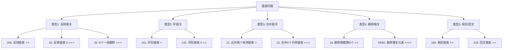

关联源素材：[[《labuladong的刷题笔记》-源素材]]

# 核心观点

**链表题目的核心在于「指针操作的精确性」和「边界条件的完备性」**。链表是面试中出现频率最高的数据结构之一，其题目通常围绕**反转、环检测、合并、删除、相交**五大经典模式展开。掌握虚拟头节点（Dummy Node）、快慢指针、多指针协作三大通用技巧，配合递归与迭代两种思维，可以解决90%以上的链表问题。

# 解题思维框架（通用套路）

## 链表的三大通用技巧

### 技巧 1：虚拟头节点（Dummy Node）

**为什么需要？**
- 统一处理头节点的特殊情况（如删除头节点、在头部插入）
- 避免对 head 进行特殊判断，简化代码逻辑

**使用场景**：
- 删除链表中的某个节点（可能删到头节点）
- 反转链表的某一部分（需要记录前驱节点）
- 合并链表时需要统一处理

**模板示例**：
```java
ListNode dummy = new ListNode(0);  // 虚拟头节点
dummy.next = head;                 // 指向真正的头节点
ListNode curr = dummy;             // 从 dummy 开始遍历

// 操作完成后返回 dummy.next
return dummy.next;
```

### 技巧 2：快慢指针（Fast & Slow Pointers）

**核心思想**：
- **快指针每次走2步，慢指针每次走1步**
- 当快指针到达终点时，慢指针恰好在中间位置

**三大应用场景**：

| 应用 | 快指针速度 | 慢指针速度 | 用途 |
|------|-----------|-----------|------|
| 找中点 | 2步/次 | 1步/次 | 找到链表中点或上中点 |
| 环检测 | 2步/次 | 1步/次 | 判断是否有环、找环入口 |
| 倒数第K个 | 先走K步 | 等快指针出发后再走 | 找倒数第K个节点 |

### 技巧 3：多指针协作

**为什么需要？**
- 单链表只能单向遍历，修改指针时容易丢失后续节点
- 多个指针协作可以保存关键位置的信息

**常见组合**：
- **反转链表**：prev + curr + next（三指针）
- **合并链表**：p1 + p2（双指针）
- **删除节点**：prev + curr（前后指针）
- **K组翻转**：需要更多辅助指针

## 经典题型分类（5大类型）



## 解题步骤总结

```
Step 1: 分析需求 → 明确要做什么操作（反转/删除/合并等）
        ↓
Step 2: 选择技巧 → Dummy Node? 快慢指针? 多指针?
        ↓
Step 3: 处理边界 → 空链表? 单节点? 头尾节点?
        ↓
Step 4: 设计指针 → 定义需要的指针变量及其初始值
        ↓
Step 5: 编写循环 → while 条件? 循环体内操作?
        ↓
Step 6: 返回结果 → return dummy.next / newHead / ...
        ↓
Step 7: 测试用例 → 空/单节点/普通/边界情况
```

# 代码模板（Java 版）

## 模板 1：链表节点定义

```java
/**
 * 链表节点定义
 */
class ListNode {
    int val;
    ListNode next;
    ListNode() {}
    ListNode(int val) { this.val = val; }
    ListNode(int val, ListNode next) { this.val = val; this.next = next; }
}
```

## 模板 2：反转链表（三指针法）⭐⭐⭐

```java
/**
 * 反转链表 - 迭代法（推荐）
 * 时间复杂度：O(n)
 * 空间复杂度：O(1)
 */
ListNode reverseList(ListNode head) {
    ListNode prev = null;      // 前驱节点
    ListNode curr = head;      // 当前节点

    while (curr != null) {
        ListNode next = curr.next;  // ① 先保存下一个节点
        curr.next = prev;          // ② 反转指针方向
        prev = curr;               // ③ prev 前进
        curr = next;               // ④ curr 前进
    }

    return prev;  // prev 就是新的头节点
}

/**
 * 反转链表 - 递归法
 * 时间复杂度：O(n)
 * 空间复杂度：O(n)（递归栈空间）
 */
ListNode reverseListRecursive(ListNode head) {
    // 递归出口：空节点或只有一个节点
    if (head == null || head.next == null) {
        return head;
    }

    // 递归反转后面的部分
    ListNode newHead = reverseListRecursive(head.next);

    // 反转当前节点和它的后继的关系
    head.next.next = head;
    head.next = null;

    return newHead;
}
```

## 模板 3：快慢指针（环检测）⭐⭐

```java
/**
 * 判断链表是否有环
 * LeetCode 141
 * 时间复杂度：O(n)
 * 空间复杂度：O(1)
 */
boolean hasCycle(ListNode head) {
    ListNode slow = head;
    ListNode fast = head;

    while (fast != null && fast.next != null) {
        slow = slow.next;         // 慢指针走一步
        fast = fast.next.next;    // 快指针走两步

        if (slow == fast) {       // 相遇说明有环
            return true;
        }
    }

    return false;  // fast 到达终点，无环
}

/**
 * 找到环的入口节点
 * LeetCode 142
 * 数学原理：设头到环入口距离为 a，环入口到相遇点为 b，相遇点到环入口为 c
 *          则：fast = 2 * slow
 *              fast = a + b + n(b + c)
 *              slow = a + b
 *          推导得：a = c + (n-1)(b+c)
 *          所以：从相遇点和头节点同时出发，会在环入口相遇
 */
ListNode detectCycle(ListNode head) {
    ListNode slow = head;
    ListNode fast = head;

    // 第一阶段：找相遇点
    while (fast != null && fast.next != null) {
        slow = slow.next;
        fast = fast.next.next;

        if (slow == fast) {
            // 第二阶段：找环入口
            ListNode ptr1 = head;       // 从头开始
            ListNode ptr2 = slow;       // 从相遇点开始

            while (ptr1 != ptr2) {
                ptr1 = ptr1.next;
                ptr2 = ptr2.next;
            }

            return ptr1;  // 环入口
        }
    }

    return null;  // 无环
}
```

## 模板 4：合并两个有序链表 ⭐⭐

```java
/**
 * 合并两个有序链表
 * LeetCode 21
 * 时间复杂度：O(m + n)
 * 空间复杂度：O(1)
 */
ListNode mergeTwoLists(ListNode list1, ListNode list2) {
    // 使用 dummy node 简化操作
    ListNode dummy = new ListNode(0);
    ListNode curr = dummy;

    while (list1 != null && list2 != null) {
        if (list1.val <= list2.val) {
            curr.next = list1;
            list1 = list1.next;
        } else {
            curr.next = list2;
            list2 = list2.next;
        }
        curr = curr.next;
    }

    // 连接剩余部分
    curr.next = (list1 != null) ? list1 : list2;

    return dummy.next;
}
```

## 模板 5：删除倒数第 N 个结点 ⭐⭐

```java
/**
 * 删除链表的倒数第 N 个结点
 * LeetCode 19
 * 使用快慢指针：快指针先走 n 步，然后同时走
 * 时间复杂度：O(n)
 * 空间复杂度：O(1)
 */
ListNode removeNthFromEnd(ListNode head, int n) {
    ListNode dummy = new ListNode(0);
    dummy.next = head;

    ListNode fast = dummy;   // 快指针
    ListNode slow = dummy;   // 慢指针（最终指向待删除节点的前驱）

    // 快指针先走 n+1 步（多走一步让 slow 指向前驱）
    for (int i = 0; i <= n; i++) {
        fast = fast.next;
    }

    // 同时移动直到 fast 到达末尾
    while (fast != null) {
        fast = fast.next;
        slow = slow.next;
    }

    // 删除节点
    slow.next = slow.next.next;

    return dummy.next;
}
```

# 代码模板（Python 版）

## 模板 1：链表节点定义

```python
class ListNode:
    """链表节点定义"""
    def __init__(self, val=0, next=None):
        self.val = val
        self.next = next
```

## 模板 2：反转链表（三指针法）

```python
def reverse_list(head: ListNode) -> ListNode:
    """
    反转链表 - 迭代法（推荐）

    Args:
        head: 链表头节点

    Returns:
        反转后的新头节点
    """
    prev = None
    curr = head

    while curr:
        next_node = curr.next   # ① 保存下一个节点
        curr.next = prev        # ② 反转指针
        prev = curr             # ③ prev 前进
        curr = next_node        # ④ curr 前进

    return prev


def reverse_list_recursive(head: ListNode) -> ListNode:
    """
    反转链表 - 递归法

    Args:
        head: 链表头节点

    Returns:
        反转后的新头节点
    """
    # 递归出口
    if not head or not head.next:
        return head

    # 递归反转后面的部分
    new_head = reverse_list_recursive(head.next)

    # 反转当前节点和它的后继
    head.next.next = head
    head.next = None

    return new_head
```

## 模板 3：快慢指针（环检测）

```python
def has_cycle(head: ListNode) -> bool:
    """
    判断链表是否有环 - LeetCode 141

    Args:
        head: 链表头节点

    Returns:
        True 如果有环，False 否则
    """
    slow = fast = head

    while fast and fast.next:
        slow = slow.next           # 慢指针走一步
        fast = fast.next.next      # 快指针走两步

        if slow == fast:           # 相遇说明有环
            return True

    return False  # 无环


def detect_cycle(head: ListNode) -> ListNode:
    """
    找到环的入口节点 - LeetCode 142

    数学原理：
    设头到环入口距离为 a，环入口到相遇点为 b，相遇点到环入口为 c
    则：fast = 2 * slow
        fast 走过的路程 = a + b + n(b + c)  （n 为圈数）
        slow 走过的路程 = a + b
    推导得：a = c + (n-1)(b+c)
    所以从相遇点和头节点同时出发，会在环入口相遇

    Args:
        head: 链表头节点

    Returns:
        环入口节点，如果无环返回 None
    """
    slow = fast = head

    # 第一阶段：找相遇点
    while fast and fast.next:
        slow = slow.next
        fast = fast.next.next

        if slow == fast:
            # 第二阶段：找环入口
            ptr1 = head     # 从头开始
            ptr2 = slow     # 从相遇点开始

            while ptr1 != ptr2:
                ptr1 = ptr1.next
                ptr2 = ptr2.next

            return ptr1  # 环入口

    return None  # 无环
```

## 模板 4：合并两个有序链表

```python
def merge_two_lists(list1: ListNode, list2: ListNode) -> ListNode:
    """
    合并两个有序链表 - LeetCode 21

    Args:
        list1: 有序链表1
        list2: 有序链表2

    Returns:
        合并后的有序链表
    """
    # 使用 dummy node 简化操作
    dummy = ListNode(0)
    curr = dummy

    while list1 and list2:
        if list1.val <= list2.val:
            curr.next = list1
            list1 = list1.next
        else:
            curr.next = list2
            list2 = list2.next
        curr = curr.next

    # 连接剩余部分
    curr.next = list1 if list1 else list2

    return dummy.next
```

## 模板 5：删除倒数第 N 个结点

```python
def remove_nth_from_end(head: ListNode, n: int) -> ListNode:
    """
    删除链表的倒数第 N 个结点 - LeetCode 19

    使用快慢指针技巧：快指针先走 n 步

    Args:
        head: 链表头节点
        n: 倒数第 n 个

    Returns:
        删除后的链表头节点
    """
    dummy = ListNode(0)
    dummy.next = head

    fast = slow = dummy

    # 快指针先走 n+1 步（多走一步让 slow 指向待删除节点的前驱）
    for _ in range(n + 1):
        fast = fast.next

    # 同时移动直到 fast 到达末尾
    while fast:
        fast = fast.next
        slow = slow.next

    # 删除节点
    slow.next = slow.next.next

    return dummy.next
```

# 经典例题解析

## 例题 1: [LeetCode 206] 反转链表 ⭐⭐

- **难度**：Easy
- **题意简述**：给你单链表的头节点 `head`，请你反转链表，并返回反转后的链表。
- **示例**：
  - 输入：`head = [1,2,3,4,5]` → 输出：`[5,4,3,2,1]`
- **思路分析**：
  - 这是最基础的链表操作，必须熟练掌握
  - **迭代法**：使用三个指针（prev, curr, next），依次反转每个节点的指向
  - **递归法**：先递归反转后面的部分，再处理当前节点
  - **关键细节**：必须先保存 `curr.next`，否则反转后会丢失后续节点

- **代码实现**（见模板 2）

- **变体与扩展**：
  - [LeetCode 92](https://leetcode.cn/problems/reverse-linked-list-ii/) 反转链表 II（反转指定区间）
  - [LeetCode 25](https://leetcode.cn/problems/reverse-nodes-in-k-group/) K 个一组翻转链表


## 例题 3: [LeetCode 141/142] 环形链表 ⭐/⭐⭐

- **难度**：Easy / Medium
- **题意简述**：
  - 141：给定一个链表，判断链表中是否有环
  - 142：给定一个链表，返回链表开始入环的第一个节点。如果链表无环，返回 `null`
- **思路分析**（已在前文详细讲解数学证明）：
  - **141**：快慢指针，相遇则有环
  - **142**：两阶段算法
    - 阶段1：快慢指针找到相遇点
    - 阶段2：一个指针从头开始，一个从相遇点开始，再次相遇即为环入口

- **代码实现**（见模板 3）


## 例题 5: [LeetCode 23] 合并 K 个升序链表 ⭐⭐⭐

- **难度**：Hard
- **题意简述**：给你一个链表数组，每个链表都已经按升序排列。请你将所有链表合并到一个升序链表中，返回合并后的链表。
- **示例**：
  - 输入：`lists = [[1,4,5],[1,3,4],[2,6]]` → 输出：`[1,1,2,3,4,4,5,6]`
- **思路分析**（三种方法）：

  **方法 1：逐一合并**
  - 依次调用 mergeTwoLists
  - 时间复杂度：O(k²n)，k 是链表数量，n 是平均长度

  **方法 2：分治合并**
  - 类似归并排序，两两合并
  - 时间复杂度：O(kn log k)

  **方法 3：优先队列（最优）**
  - 将所有链表的头节点放入最小堆
  - 每次取出最小的节点加入结果
  - 时间复杂度：O(kn log k)

- **代码实现**（优先队列法）：

```java
class Solution {
    public ListNode mergeKLists(ListNode[] lists) {
        if (lists == null || lists.length == 0) return null;

        // 最小堆（优先队列）
        PriorityQueue<ListNode> pq = new PriorityQueue<>(
            (a, b) -> a.val - b.val
        );

        // 将所有链表的头节点加入堆
        for (ListNode list : lists) {
            if (list != null) {
                pq.offer(list);
            }
        }

        ListNode dummy = new ListNode(0);
        ListNode curr = dummy;

        while (!pq.isEmpty()) {
            // 取出最小节点
            ListNode node = pq.poll();
            curr.next = node;
            curr = curr.next;

            // 如果该节点后面还有节点，加入堆
            if (node.next != null) {
                pq.offer(node.next);
            }
        }

        return dummy.next;
    }
}
```

```python
import heapq

class Solution:
    def mergeKLists(self, lists: List[ListNode]) -> ListNode:
        if not lists:
            return None

        # 最小堆
        heap = []

        # 将所有链表的头节点加入堆
        for i, lst in enumerate(lists):
            if lst:
                heapq.heappush(heap, (lst.val, i, lst))

        dummy = ListNode(0)
        curr = dummy

        while heap:
            val, i, node = heapq.heappop(heap)
            curr.next = node
            curr = curr.next

            if node.next:
                heapq.heappush(heap, (node.next.val, i, node.next))

        return dummy.next
```


## 例题 7: [LeetCode 234] 回文链表 ⭐⭐

- **难度**：Easy
- **题意简述**：请判断一个链表是否为回文链表。
- **示例**：
  - 输入：`head = [1,2,2,1]` → 输出：`true`
- **思路分析**（三种方法）：

  **方法 1：数组 + 双指针**（简单但空间 O(n)）
  - 将链表值存入数组
  - 用双指针从两端向中间比较

  **方法 2：递归**（巧妙但难理解）
  - 利用递归栈的后进先出特性

  **方法 3：快慢指针 + 反转后半部分**（最优 O(1) 空间）
  1. 用快慢指针找到中点
  2. 反转后半部分
  3. 比较前半部分和反转后的后半部分
  4. （可选）恢复链表

- **代码实现**（方法 3 - 最优解）：

```java
class Solution {
    public boolean isPalindrome(ListNode head) {
        // 1. 找到中点
        ListNode slow = head, fast = head;
        while (fast != null && fast.next != null) {
            slow = slow.next;
            fast = fast.next.next;
        }

        // 2. 反转后半部分
        ListNode secondHalf = reverseList(slow);

        // 3. 比较
        ListNode p1 = head, p2 = secondHalf;
        boolean result = true;
        while (result && p2 != null) {
            if (p1.val != p2.val) result = false;
            p1 = p1.next;
            p2 = p2.next;
        }

        // 4. 可选：恢复链表
        // reverseList(secondHalf);

        return result;
    }

    private ListNode reverseList(ListNode head) {
        ListNode prev = null, curr = head;
        while (curr != null) {
            ListNode next = curr.next;
            curr.next = prev;
            prev = curr;
            curr = next;
        }
        return prev;
    }
}
```

```python
class Solution:
    def isPalindrome(self, head: ListNode) -> bool:
        # 1. 找到中点
        slow = fast = head
        while fast and fast.next:
            slow = slow.next
            fast = fast.next.next

        # 2. 反转后半部分
        second_half = self.reverse_list(slow)

        # 3. 比较
        p1, p2 = head, second_half
        result = True
        while result and p2:
            if p1.val != p2.val:
                result = False
            p1 = p1.next
            p2 = p2.next

        # 4. 可选：恢复链表
        # self.reverse_list(second_half)

        return result

    def reverse_list(self, head: ListNode) -> ListNode:
        prev = None
        curr = head
        while curr:
            next_node = curr.next
            curr.next = prev
            prev = curr
            curr = next_node
        return prev
```

- **复杂度分析**：
  - 时间复杂度：O(n)
  - 空间复杂度：O(1)（如果不恢复链表）

---

## 例题 8: [LeetCode 160] 相交链表 ⭐⭐

- **难度**：Easy
- **题意简述**：给你两个单链表的头节点 `headA` 和 `headB`，请你找出并返回两个单链表相交的起始节点。如果两个链表没有交点，返回 `null`。
- **示例**：
  - 输入：`intersectVal = 8, listA = [4,1,8,4,5], listB = [5,6,1,8,4,5], skipA = 2, skipB = 3`
  - 输出：`Intersected at '8'`
- **思路分析**（两种方法）：

  **方法 1：哈希表**
  - 遍历链表A，将所有节点存入 HashSet
  - 遍历链表B，检查是否在集合中
  - 时间：O(m+n)，空间：O(m) 或 O(n)

  **方法 2：双指针（最优）** ⭐
  - 指针 pA 遍历 A 再遍历 B
  - 指针 pB 遍历 B 再遍历 A
  - 如果有交点，它们会在交点处相遇
  - 如果没有交点，它们会同时到达 null
  - 时间：O(m+n)，空间：O(1)

- **代码实现**（方法 2 - 双指针）：

```java
public class Solution {
    public ListNode getIntersectionNode(ListNode headA, ListNode headB) {
        if (headA == null || headB == null) return null;

        ListNode pA = headA, pB = headB;

        // 当 pA != pB 时继续循环
        while (pA != pB) {
            // pA 走到底后转向 headB
            pA = (pA == null) ? headB : pA.next;
            // pB 走到底后转向 headA
            pB = (pB == null) ? headA : pB.next;
        }

        // 要么是交点，要么都是 null
        return pA;
    }
}
```

```python
class Solution:
    def getIntersectionNode(self, headA: ListNode, headB: ListNode) -> ListNode:
        if not headA or not headB:
            return None

        pA, pB = headA, headB

        while pA != pB:
            pA = pA.next if pA else headB
            pB = pB.next if pB else headA

        return pA
```

- **数学解释**：
  ```
  设 A 的长度为 a，B 的长度为 b，公共部分长度为 c
  pA 走过的路径：a + (b - c)
  pB 走过的路径：b + (a - c)
  两者相等！所以会同时到达交点（或同时到达 null）
  ```

# 常见陷阱与易错点

## ❌ 易错点 1：忘记处理空链表

- **问题描述**：没有检查 `head == null` 就直接访问 `head.next`
- **后果**：NullPointerException / AttributeError
- **正确做法**：
  ```java
  if (head == null || head.next == null) return head;
  ```

## ❌ 易错点 2：指针丢失（最常见错误！）

- **问题描述**：修改 `curr.next` 之前没有保存 `curr.next` 的引用
- **典型错误代码**：
  ```java
  // 错误！丢失了后续链表
  curr.next = prev;  // 现在 curr.next 变成了 prev
  prev = curr;
  curr = curr.next;  // ❌ 此时 curr.next 已经不是原来的下一个了！
  ```
- **正确做法**：
  ```java
  ListNode next = curr.next;  // ✅ 先保存
  curr.next = prev;
  prev = curr;
  curr = next;               // ✅ 用保存的引用
  ```

## ❌ 易错点 3：边界条件处理不当

**常见边界情况**：

| 场景 | 需要注意的点 |
|------|-------------|
| 空链表 | 直接返回 null |
| 只有一个节点 | 特殊处理或确保循环不执行 |
| 删除头节点 | 必须使用 Dummy Node |
| 删除尾节点 | 确保 tail.next 正确设置 |
| 所有节点相同 | 删除重复时的特殊逻辑 |
| 循环终止条件 | 注意 `!= null` vs `.next != null` |

## ❌ 易错点 4：环形链表的终止条件

- **问题描述**：while 循环的条件写错导致死循环或漏判
- **规则总结**：
  ```java
  // 快慢指针的标准写法
  while (fast != null && fast.next != null) {  // ✅ 正确
      slow = slow.next;
      fast = fast.next.next;
  }

  // 错误写法
  while (fast != null) {  // ❌ 可能 NullPointerException
      fast = fast.next.next;  // fast.next 可能是 null
  }
  ```

## ❌ 易错点 5：Dummy Node 的使用时机

- **何时必须使用**：
  - ✅ 可能删除或修改头节点
  - ✅ 需要在头部插入节点
  - ✅ 反转包含头节点的区间
- **何时不需使用**：
  - ❌ 只是遍历链表
  - ❌ 确定不会修改头节点

## ❌ 易错点 6：递归法的栈溢出风险

- **问题描述**：对于很长的链表，递归可能导致栈溢出
- **影响语言**：Java（默认栈较小）、Python（默认递归深度限制约1000）
- **解决方案**：
  - 优先使用迭代法
  - 如必须递归，考虑增加栈大小（不推荐面试中使用）

## ✅ 最佳实践 1：统一使用 Dummy Node

- **建议**：除非确定不需要，否则**始终使用 Dummy Node**
- **好处**：
  - 代码更简洁，减少 if-else 判断
  - 减少出错概率
  - 统一代码风格

## ✅ 最佳实践 2：画图辅助思考

- **强烈建议**：遇到复杂的链表问题时，**画图！画图！画图！**
- 画出：
  - 初始状态
  - 每一步操作后的状态
  - 指针的移动方向
  - 最终状态

## ✅ 最佳实践 3：测试用例要全面

**必测场景**：
1. 空链表 `[]`
2. 单节点 `[1]`
3. 两节点 `[1, 2]`
4. 普通情况 `[1, 2, 3, 4, 5]`
5. 全部相同 `[1, 1, 1, 1]`
6. 边界操作（删除头/尾节点）

## ✅ 最佳实践 4：时间/空间复杂度的权衡

| 方法 | 时间 | 空间 | 适用场景 |
|------|------|------|---------|
| 迭代法 | O(n) | O(1) | ✅ 推荐，大多数情况 |
| 递归法 | O(n) | O(n) | 代码简洁，但不适合长链表 |
| 哈希表法 | O(n) | O(n) | 空间换时间，某些特定问题 |

# 实战练习建议

## 📖 入门题（掌握基本概念）

- [ ] [LeetCode 206](https://leetcode.cn/problems/reverse-linked-list/) 反转链表 ⭐⭐
- [ ] [LeetCode 21](https://leetcode.cn/problems/merge-two-sorted-lists/) 合并两个有序链表 ⭐
- [ ] [LeetCode 141](https://leetcode.cn/problems/linked-list-cycle/) 环形链表 ⭐
- [ ] [LeetCode 83](https://leetcode.cn/problems/delete-duplicates-in-sorted-list/) 删除排序链表中的重复元素 ⭐
- [ ] [LeetCode 234](https://leetcode.cn/problems/palindrome-linked-list/) 回文链表 ⭐⭐

## 🚀 进阶题（熟练运用技巧）

- [ ] [LeetCode 19](https://leetcode.cn/problems/remove-nth-node-from-end-of-list/) 删除链表的倒数第 N 个结点 ⭐⭐
- [ ] [LeetCode 142](https://leetcode.cn/problems/linked-list-cycle-ii/) 环形链表 II ⭐⭐
- [ ] [LeetCode 160](https://leetcode.cn/problems/intersection-of-two-linked-lists/) 相交链表 ⭐⭐
- [ ] [LeetCode 82](https://leetcode.cn/problems/delete-duplicates-from-sorted-list-ii/) 删除排序链表中的重复元素 II ⭐⭐
- [ ] [LeetCode 92](https://leetcode.cn/problems/reverse-linked-list-ii/) 反转链表 II ⭐⭐⭐
- [ ] [LeetCode 24](https://leetcode.cn/problems/swap-nodes-in-pairs/) 两两交换链表中的节点 ⭐⭐

## ⭐ 挑战题（综合运用能力）

- [ ] [LeetCode 25](https://leetcode.cn/problems/reverse-nodes-in-k-group/) K 个一组翻转链表 ⭐⭐⭐
- [ ] [LeetCode 23](https://leetcode.cn/problems/merge-k-sorted-lists/) 合并 K 个升序链表 ⭐⭐⭐
- [ ] [LeetCode 148](https://leetcode.cn/problems/sort-list/) 排序链表 ⭐⭐⭐
- [ ] [LeetCode 2](https://leetcode.cn/problems/add-two-numbers/) 两数相加 ⭐⭐
- [ ] [LeetCode 445](https://leetcode.cn/problems/add-two-numbers-ii/) 两数相加 II ⭐⭐⭐
- [ ] [LeetCode 86](https://leetcode.cn/problems/partition-list/) 分隔链表 ⭐⭐

# 关联阅读

- [[T02_链表]] - 链表基础知识
- [[P01_数组双指针专题]] - 双指针技术（链表双指针的基础）
- [[P03_滑动窗口专题]] - 滑动窗口详解（另一种双指针应用）
- [[P00_刷题方法论与思维框架]] - 刷题方法论总览
- [[P08_BFS_DFS专题]] - BFS/DFS 专题（图论相关）
