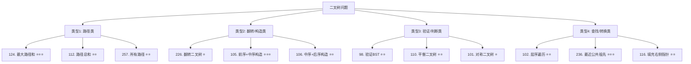

关联源素材：[[《labuladong的刷题笔记》-源素材]]

# 核心观点

**二叉树题目的本质是「递归思维」的完美体现**。90% 的二叉树问题都可以用递归解决，关键在于掌握两大递归范式：**遍历思维（自顶向下）**和**分解问题思维（自底向上）**。理解前序/中序/后序位置的本质区别，配合 BFS 层序遍历，就能系统性地解决路径求和、树形验证、构造重建、最近公共祖先等各类经典题型。

# 解题思维框架（通用套路）

## 二叉树题目三问法

遇到任何二叉树问题时，先问自己三个问题：

```
❓ 问题 1：这个能否分解为子问题？
   → 如果能 → 使用「分解问题思维」（自底向上）
   → 示例：树的高度、直径、是否平衡

❓ 问题 2：是否需要遍历所有节点并记录状态？
   → 如果需要 → 使用「遍历思维」（自顶向下）
   → 示例：路径求和、找所有路径、记录访问轨迹

❓ 问题 3：是否需要维护额外信息？
   → 如果需要 → 带参数的递归 + 可能在前后序位置操作
   → 示例：验证BST需要传递上下界，找路径需要传递当前路径
```

## 两大递归范式详解

### 范式 1：遍历思维（自顶向下）

**核心思想**：
- 从根节点出发，**携带状态信息**向下遍历
- 在**前序位置**进入节点时做操作（添加到路径、累加等）
- 在**后序位置**离开节点时撤销操作（从路径移除、回溯）
- 类似于 DFS 搜索，强调「过程」

**适用场景**：
- ✅ 路径类问题（路径总和、所有路径）
- ✅ 需要记录状态的遍历
- ✅ 需要在某个时刻收集结果

**代码框架**：

```python
def traverse(root, path, result):
    if not root:
        return
    
    # ===== 前序位置（进入节点时）=====
    path.append(root.val)           # 记录当前节点
    # 可以在这里判断是否满足条件
    
    traverse(root.left, path, result)
    traverse(root.right, path, result)
    
    # ===== 后序位置（离开节点时）=====
    path.pop()                      # 撤销选择（关键！）
```

### 范式 2：分解问题思维（自底向上）

**核心思想**：
- **假设子问题已经解决**，利用子问题的结果构建当前问题的解
- 先递归到底部（base case），然后在**后序位置**组合结果
- 强调「结果」，不关心具体遍历过程

**适用场景**：
- ✅ 树的高度/深度
- ✅ 树的直径
- ✅ 是否平衡二叉树
- ✅ 最大路径和
- ✅ 翻转二叉树

**代码框架**：

```python
def solve(root):
    # Base case：空节点返回基本情况
    if not root:
        return base_case_value  # 如：0, -inf, True, None 等
    
    # 先递归解决子问题
    left_result = solve(root.left)
    right_result = solve(root.right)
    
    # ===== 后序位置：利用左右子树的结果 =====
    # 组合出当前节点的结果
    return combine(left_result, right_result, root.val)
```

## 三种遍历顺序的本质区别

| 遍历顺序 | 访问时机 | 特点 | 典型应用 |
|---------|---------|------|---------|
| **前序 (Pre-order)** | 进入节点时 | 自顶向下，先处理根 | 复制树、序列化前缀 |
| **中序 (In-order)** | 左子树处理后 | BST 中序是有序的 | BST 验证、排序 |
| **后序 (Post-order)** | 离开节点时 | 自底向上，先处理子树 | 树高度、路径和、翻转 |

**关键洞察**：
```
前序位置 = 第一次经过节点时（进入）
中序位置 = 左子树处理完，准备处理右子树时
后序位置 = 第二次经过节点时（离开）

💡 前序位置可以获取「父节点传下来的信息」
💡 后序位置可以获取「子节点返回的信息」
```

## 经典题型分类



# 代码模板（Java 版）

## 模板 1：二叉树节点定义

```java
/**
 * 二叉树节点定义
 */
class TreeNode {
    int val;
    TreeNode left;
    TreeNode right;
    TreeNode() {}
    TreeNode(int val) { this.val = val; }
    TreeNode(int val, TreeNode left, TreeNode right) {
        this.val = val;
        this.left = left;
        this.right = right;
    }
}
```

## 模板 2：遍历思维 - 路径求和 ⭐⭐

```java
/**
 * 路径总和 II - 找出所有从根到叶子的路径，使路径和等于 targetSum
 * LeetCode 113
 * 时间复杂度：O(n)
 * 空间复杂度：O(h) h为树高
 */
class Solution {
    private List<List<Integer>> result = new ArrayList<>();

    public List<List<Integer>> pathSum(TreeNode root, int targetSum) {
        traverse(root, new ArrayList<>(), 0, targetSum);
        return result;
    }

    private void traverse(TreeNode node, List<Integer> path, int currentSum, int target) {
        if (node == null) return;

        // 前序位置：进入节点
        path.add(node.val);
        currentSum += node.val;

        // 到达叶子节点且和等于目标值
        if (node.left == null && node.right == null && currentSum == target) {
            result.add(new ArrayList<>(path));  // 注意要拷贝！
        }

        // 继续遍历左右子树
        traverse(node.left, path, currentSum, target);
        traverse(node.right, path, currentSum, target);

        // 后序位置：离开节点，撤销选择
        path.remove(path.size() - 1);
    }
}
```

## 模板 3：分解问题思维 - 树的高度 ⭐

```java
/**
 * 二叉树的最大深度
 * LeetCode 104
 * 时间复杂度：O(n)
 * 空间复杂度：O(h) 递归栈空间
 */
class Solution {
    public int maxDepth(TreeNode root) {
        // Base case：空节点深度为0
        if (root == null) {
            return 0;
        }

        // 递归计算左右子树的深度
        int leftDepth = maxDepth(root.left);
        int rightDepth = maxDepth(root.right);

        // 后序位置：取较大值 + 1（当前层）
        return Math.max(leftDepth, rightDepth) + 1;
    }
}
```

## 模板 4：分解问题思维 - 最大路径和 ⭐⭐⭐

```java
/**
 * 二叉树中的最大路径和
 * LeetCode 124
 * 时间复杂度：O(n)
 * 空间复杂度：O(h)
 *
 * 思路：对每个节点计算：
 * 1. 以该节点为起点的最大单向路径和（供父节点使用）
 * 2. 经过该节点的最大路径和（左+右+当前，更新全局最大值）
 */
class Solution {
    private int maxSum = Integer.MIN_VALUE;

    public int maxPathSum(TreeNode root) {
        maxGain(root);
        return maxSum;
    }

    /**
     * 计算以 node 为起点的最大单向路径和
     * @return 最大贡献值（至少包含 node.val）
     */
    private int maxGain(TreeNode node) {
        if (node == null) return 0;

        // 递归计算左右子树的最大贡献值
        // 如果贡献值为负数，则不选取（取0）
        int leftGain = Math.max(maxGain(node.left), 0);
        int rightGain = Math.max(maxGain(node.right), 0);

        // 当前节点的最大路径和（左+右+当前）
        int priceNewPath = node.val + leftGain + rightGain;

        // 更新全局最大值
        maxSum = Math.max(maxSum, priceNewPath);

        // 返回给父节点的最大贡献值（只能选一边）
        return node.val + Math.max(leftGain, rightGain);
    }
}
```

## 模板 5：验证二叉搜索树 ⭐⭐

```java
/**
 * 验证二叉搜索树
 * LeetCode 98
 * 时间复杂度：O(n)
 * 空间复杂度：O(h)
 *
 * 思路：BST 的定义是左 < 根 < 右
 * 所以在遍历时需要传递上下界约束
 */
class Solution {
    public boolean isValidBST(TreeNode root) {
        return validate(root, null, null);
    }

    /**
     * 验证以 node 为根的子树是否为合法的 BST
     * @param lower 下界（不包含），null 表示无下界
     * @param upper 上界（不包含），null 表示无上界
     */
    private boolean validate(TreeNode node, Integer lower, Integer upper) {
        if (node == null) return true;

        int val = node.val;

        // 检查当前节点是否在合法范围内
        if (lower != null && val <= lower) return false;
        if (upper != null && val >= upper) return false;

        // 递归验证左右子树，更新上下界
        // 左子树：上界变为当前节点值
        // 右子树：下界变为当前节点值
        return validate(node.left, lower, val) &&
               validate(node.right, val, upper);
    }
}
```

## 模板 6：BFS 层序遍历 ⭐⭐

```java
import java.util.*;

/**
 * 二叉树的层序遍历
 * LeetCode 102
 * 时间复杂度：O(n)
 * 空间复杂度：O(w) w为树的最大宽度
 */
class Solution {
    public List<List<Integer>> levelOrder(TreeNode root) {
        List<List<Integer>> result = new ArrayList<>();
        if (root == null) return result;

        Queue<TreeNode> queue = new LinkedList<>();
        queue.offer(root);

        while (!queue.isEmpty()) {
            int levelSize = queue.size();      // 当前层的节点数
            List<Integer> currentLevel = new ArrayList<>();

            for (int i = 0; i < levelSize; i++) {
                TreeNode node = queue.poll();
                currentLevel.add(node.val);

                // 将下一层节点加入队列
                if (node.left != null) queue.offer(node.left);
                if (node.right != null) queue.offer(node.right);
            }

            result.add(currentLevel);
        }

        return result;
    }
}
```

# 代码模板（Python 版）

## 模板 1：二叉树节点定义

```python
class TreeNode:
    """二叉树节点定义"""
    def __init__(self, val=0, left=None, right=None):
        self.val = val
        self.left = left
        self.right = right
```

## 模板 2：遍历思维 - 路径求和

```python
from typing import List, Optional

class Solution:
    """
    路径总和 II - LeetCode 113
    找出所有从根到叶子的路径，使路径和等于 targetSum
    """

    def pathSum(self, root: Optional[TreeNode], targetSum: int) -> List[List[int]]:
        result = []
        self._traverse(root, [], 0, targetSum, result)
        return result

    def _traverse(self, node: Optional[TreeNode], path: List[int],
                  current_sum: int, target: int, result: List[List[int]]):
        if not node:
            return

        # 前序位置：进入节点
        path.append(node.val)
        current_sum += node.val

        # 到达叶子节点且和等于目标值
        if not node.left and not node.right and current_sum == target:
            result.append(path.copy())  # 注意要拷贝！

        # 继续遍历左右子树
        self._traverse(node.left, path, current_sum, target, result)
        self._traverse(node.right, path, current_sum, target, result)

        # 后序位置：离开节点，撤销选择
        path.pop()
```

## 模板 3：分解问题思维 - 树的高度

```python
class Solution:
    """
    二叉树的最大深度 - LeetCode 104
    时间复杂度：O(n)
    空间复杂度：O(h) h为树高
    """

    def max_depth(self, root: Optional[TreeNode]) -> int:
        # Base case：空节点深度为0
        if not root:
            return 0

        # 递归计算左右子树的深度
        left_depth = self.max_depth(root.left)
        right_depth = self.max_depth(root.right)

        # 后序位置：取较大值 + 1（当前层）
        return max(left_depth, right_depth) + 1
```

## 模板 4：分解问题思维 - 最大路径和

```python
class Solution:
    """
    二叉树中的最大路径和 - LeetCode 124
    时间复杂度：O(n)
    空间复杂度：O(h)

    思路：对每个节点计算：
    1. 以该节点为起点的最大单向路径和（供父节点使用）
    2. 经过该节点的最大路径和（左+右+当前，更新全局最大值）
    """

    def __init__(self):
        self.max_sum = float('-inf')

    def max_path_sum(self, root: Optional[TreeNode]) -> int:
        self._max_gain(root)
        return self.max_sum

    def _max_gain(self, node: Optional[TreeNode]) -> int:
        """
        计算以 node 为起点的最大单向路径和
        返回：最大贡献值（至少包含 node.val）
        """
        if not node:
            return 0

        # 递归计算左右子树的最大贡献值
        # 如果贡献值为负数，则不选取（取0）
        left_gain = max(self._max_gain(node.left), 0)
        right_gain = max(self._max_gain(node.right), 0)

        # 当前节点的最大路径和（左+右+当前）
        price_new_path = node.val + left_gain + right_gain

        # 更新全局最大值
        self.max_sum = max(self.max_sum, price_new_path)

        # 返回给父节点的最大贡献值（只能选一边）
        return node.val + max(left_gain, right_gain)
```

## 模板 5：验证二叉搜索树

```python
class Solution:
    """
    验证二叉搜索树 - LeetCode 98
    时间复杂度：O(n)
    空间复杂度：O(h)

    思路：BST 的定义是左 < 根 < 右
    所以在遍历时需要传递上下界约束
    """

    def is_valid_bst(self, root: Optional[TreeNode]) -> bool:
        return self._validate(root, None, None)

    def _validate(self, node: Optional[TreeNode],
                  lower: Optional[int], upper: Optional[int]) -> bool:
        if not node:
            return True

        val = node.val

        # 检查当前节点是否在合法范围内
        if lower is not None and val <= lower:
            return False
        if upper is not None and val >= upper:
            return False

        # 递归验证左右子树，更新上下界
        # 左子树：上界变为当前节点值
        # 右子树：下界变为当前节点值
        return (self._validate(node.left, lower, val) and
                self._validate(node.right, val, upper))
```

## 模板 6：BFS 层序遍历

```python
from collections import deque
from typing import List, Optional

class Solution:
    """
    二叉树的层序遍历 - LeetCode 102
    时间复杂度：O(n)
    空间复杂度：O(w) w为树的最大宽度
    """

    def level_order(self, root: Optional[TreeNode]) -> List[List[int]]:
        if not root:
            return []

        result = []
        queue = deque([root])

        while queue:
            level_size = len(queue)       # 当前层的节点数
            current_level = []

            for _ in range(level_size):
                node = queue.popleft()
                current_level.append(node.val)

                # 将下一层节点加入队列
                if node.left:
                    queue.append(node.left)
                if node.right:
                    queue.append(node.right)

            result.append(current_level)

        return result
```

# 经典例题解析

## 例题 1: [LeetCode 124] 二叉树中的最大路径和 ⭐⭐⭐

- **难度**：Hard
- **题意简述**：二叉树中的**路径**被定义为一条节点序列，序列中每对相邻节点之间都存在一条边。同一个节点在一条路径序列中**至多出现一次**。该路径**至少包含一个**节点，且不一定经过根节点。找出最大路径和。
- **示例**：
  - 输入：`root = [1,2,3]` → 输出：`6`（路径 `2→1→3`）
  - 输入：`root = [-10,9,20,null,null,15,7]` → 输出：`42`（路径 `15→20→7`）
- **思路分析**：
  - 这是**分解问题思维**的经典应用
  - 对每个节点，需要知道两个值：
    1. **最大贡献值**：以该节点为端点，向下的最大路径和（只能选左边或右边）
    2. **最大路径和**：经过该节点的最大路径和（左+右+当前，可能成为全局最优）
  - **关键技巧**：如果子树的最大贡献值为负数，直接舍弃（取0），因为加上负数只会让结果更差
  - 使用**后序遍历**，自底向上收集信息

- **代码实现**（见模板 4）

- **变体与扩展**：
  - [LeetCode 687](https://leetcode.cn/problems/longest-univalue-path/) 最长同值路径
  - [LeetCode 543](https://leetcode.cn/problems/diameter-of-binary-tree/) 二叉树的直径


## 例题 3: [LeetCode 236] 二叉树的最近公共祖先 ⭐⭐⭐

- **难度**：Medium
- **题意简述**：给定一个二叉树, 找到该树中两个指定节点 `p` 和 `q` 的最近公共祖先（LCA）。
- **示例**：
  - 输入：`root = [3,5,1,6,2,0,8,null,null,7,4], p = 5, q = 1`
  - 输出：`3`
- **思路分析**：
  - **LCA 定义**：对于有根树 T 的两个节点 p、q，最近公共祖先表示为一个节点 x，满足 x 是 p 和 q 的祖先且 x 的深度尽可能大
  - **三种情况**：
    1. p 和 q 分别在左右子树 → 当前节点就是 LCA
    2. p 或 q 就是当前节点 → 当前节点就是 LCA
    3. p 和 q 都在同一侧子树 → 递归在该子树中找
  - **算法**：后序遍历，自底向上查找

- **代码实现**：

```java
class Solution {
    public TreeNode lowestCommonAncestor(TreeNode root, TreeNode p, TreeNode q) {
        // Base case
        if (root == null) return null;

        // 情况2：当前节点就是 p 或 q
        if (root == p || root == q) return root;

        // 递归在左右子树中查找
        TreeNode left = lowestCommonAncestor(root.left, p, q);
        TreeNode right = lowestCommonAncestor(root.right, p, q);

        // 情况1：p 和 q 分别在左右子树
        if (left != null && right != null) return root;

        // 情况3：都在同一侧（或都不存在）
        return (left != null) ? left : right;
    }
}
```

```python
class Solution:
    def lowestCommonAncestor(self, root: 'TreeNode', p: 'TreeNode', q: 'TreeNode') -> 'TreeNode':
        # Base case
        if not root:
            return None

        # 情况2：当前节点就是 p 或 q
        if root == p or root == q:
            return root

        # 递归在左右子树中查找
        left = self.lowestCommonAncestor(root.left, p, q)
        right = self.lowestCommonAncestor(root.right, p, q)

        # 情况1：p 和 q 分别在左右子树
        if left and right:
            return root

        # 情况3：都在同一侧（或都不存在）
        return left if left else right
```

- **时间复杂度**：O(n)
- **空间复杂度**：O(h)


## 例题 5: [LeetCode 110] 平衡二叉树 ⭐⭐

- **难度**：Easy
- **题意简述**：给定一个二叉树，判断它是否是**高度平衡**的二叉树。一棵高度平衡二叉树定义为：一个二叉树**每个节点** 的左右两个子树的高度差的绝对值不超过 1 。
- **示例**：
  - 输入：`root = [3,9,20,null,null,15,7]` → 输出：`true`
  - 输入：`root = [1,2,2,3,3,null,null,4,4]` → 输出：`false`
- **思路分析**：
  - **方法1：自顶向下**（容易理解但效率低 O(n²)）
    - 对每个节点计算左右子树高度，检查差值
    - 会重复计算很多次
  - **方法2：自底向上**（推荐 O(n)）
    - 在计算高度的同时检查平衡性
    - 如果发现不平衡，直接返回 -1 作为标记

- **代码实现**（方法2 - 最优解）：

```java
class Solution {
    public boolean isBalanced(TreeNode root) {
        return height(root) != -1;
    }

    /**
     * 返回树的高度，如果不平衡则返回 -1
     */
    private int height(TreeNode node) {
        if (node == null) return 0;

        int leftHeight = height(node.left);
        if (leftHeight == -1) return -1;  // 左子树不平衡

        int rightHeight = height(node.right);
        if (rightHeight == -1) return -1;  // 右子树不平衡

        // 检查当前节点是否平衡
        if (Math.abs(leftHeight - rightHeight) > 1) return -1;

        return Math.max(leftHeight, rightHeight) + 1;
    }
}
```

```python
class Solution:
    def isBalanced(self, root: Optional[TreeNode]) -> bool:
        return self._height(root) != -1

    def _height(self, node: Optional[TreeNode]) -> int:
        """
        返回树的高度，如果不平衡则返回 -1
        """
        if not node:
            return 0

        left_height = self._height(node.left)
        if left_height == -1:
            return -1  # 左子树不平衡

        right_height = self._height(node.right)
        if right_height == -1:
            return -1  # 右子树不平衡

        # 检查当前节点是否平衡
        if abs(left_height - right_height) > 1:
            return -1

        return max(left_height, right_height) + 1
```

- **复杂度分析**：
  - 时间复杂度：O(n)，每个节点只访问一次
  - 空间复杂度：O(h)

---

## 例题 6: [LeetCode 116] 填充每个节点的下一个右侧节点指针 ⭐⭐

- **难度**：Medium
- **题意简述**：给定一个**完美二叉树**，其所有叶子节点都在同一层，每个父节点都有两个子节点。填充它的每个 next 指针，让这个指针指向其下一个右侧节点。如果找不到下一个右侧节点，则将 next 指针设置为 `NULL`。
- **示例**：
  - 输入：`root = [1,2,3,4,5,6,7]`
  - 输出：`[1,#,2,3,#,4,5,6,7,#]`
- **思路分析**（两种方法）：

  **方法1：BFS 层序遍历**（直观但需要 O(w) 空间）
  - 每一层内依次连接相邻节点

  **方法2：利用已建立的 next 指针**（最优 O(1) 空间）⭐
  - 第 N 层的节点已经通过 next 连接起来了
  - 利用第 N 层的 next 指针来连接第 N+1 层的节点
  - 不需要队列！

- **代码实现**（方法2 - 最优解）：

```java
class Solution {
    public Node connect(Node root) {
        if (root == null) return null;

        Node leftmost = root;  // 每一层的最左侧节点

        while (leftmost.left != null) {
            Node curr = leftmost;

            // 遍历当前层的所有节点
            while (curr != null) {
                // 连接同一个父节点的两个子节点
                curr.left.next = curr.right;

                // 连接不同父节点的子节点（跨父节点连接）
                if (curr.next != null) {
                    curr.right.next = curr.next.left;
                }

                curr = curr.next;  // 移动到同层的下一个节点
            }

            leftmost = leftmost.left;  // 进入下一层
        }

        return root;
    }
}
```

```python
class Solution:
    def connect(self, root: 'Optional[Node]') -> 'Optional[Node]':
        if not root:
            return None

        leftmost = root  # 每一层的最左侧节点

        while leftmost.left:
            curr = leftmost

            # 遍历当前层的所有节点
            while curr:
                # 连接同一个父节点的两个子节点
                curr.left.next = curr.right

                # 连接不同父节点的子节点（跨父节点连接）
                if curr.next:
                    curr.right.next = curr.next.left

                curr = curr.next  # 移动到同层的下一个节点

            leftmost = leftmost.left  # 进入下一层

        return root
```

- **复杂度分析**：
  - 时间复杂度：O(n)
  - 空间复杂度：O(1)（方法2的优势）

# 常见陷阱与易错点

## ❌ 易错点 1：混淆前序/中序/后序的位置作用

- **问题描述**：不清楚应该在哪个位置进行操作
- **规则总结**：
  ```
  前序位置 = 刚进入节点时（可以获取父节点传来的信息）
  中序位置 = 左子树处理完时（BST 中序遍历是有序的！）
  后序位置 = 即将离开节点时（可以获取子节点返回的信息）
  ```
- **典型错误**：
  ```java
  // 错误：在前序位置尝试获取子树的信息（此时还没有计算）
  int leftHeight = maxDepth(root.left);  // 还没调用呢！
  ```
- **正确做法**：需要在**后序位置**才能使用子树的结果

## ❌ 易错点 2：忘记处理空节点（Base Case）

- **问题描述**：没有正确处理 `root == null` 的情况
- **后果**：NullPointerException / AttributeError
- **正确做法**：
  ```java
  if (root == null) {
      return 0;      // 或 return true/false/null/-1 等
  }
  ```

## ❌ 易错点 3：路径问题中没有拷贝列表

- **问题描述**：在收集路径结果时，直接添加了 path 引用而不是拷贝
- **典型错误代码**：
  ```java
  // 错误！path 是引用类型，后续修改会影响已保存的结果
  result.add(path);  // ❌
  ```
- **正确做法**：
  ```java
  result.add(new ArrayList<>(path));  // ✅ 创建副本
  ```

## ❌ 易错点 4：忘记撤销选择（回溯）

- **问题描述**：在遍历思维中，后序位置忘记移除当前节点
- **后果**：path 会不断累积，导致错误结果
- **正确做法**：
  ```java
  // 前序位置：添加
  path.add(node.val);
  
  // ... 递归 ...
  
  // 后序位置：必须移除！（回溯的关键步骤）
  path.remove(path.size() - 1);  // ✅
  ```

## ❌ 易错点 5：全局变量 vs 参数传递的选择不当

- **何时用全局变量/成员变量**：
  - ✅ 需要在多个递归调用之间共享的状态
  - ✅ 最终结果（如 result 列表、maxSum 等）
- **何时用参数传递**：
  - ✅ 每个递归调用独立的状态（如当前路径、当前和等）
  - ✅ 需要在不同分支之间隔离的数据

## ❌ 易错点 6：BST 验证的边界条件

- **常见错误**：只比较了父子节点的大小关系
  ```java
  // 错误！这只保证了直接的父子关系
  if (root.left.val >= root.val) return false;  // ❌ 不完整
  ```
- **正确做法**：需要传递**整个范围的上下界**
  ```java
  // ✅ 正确：确保整棵子树都在合法范围内
  return validate(root.left, lower, root.val) &&
         validate(root.right, root.val, upper);
  ```

## ❌ 易错点 7：重复计算导致性能问题

- **问题描述**：在自顶向下的方法中，多次计算相同子树的信息
- **示例**：平衡二叉树的自顶向下方法是 O(n²)
- **解决方案**：改用**自底向上**的方法，一次遍历同时完成计算和检查

## ✅ 最佳实践 1：画图辅助思考

- **强烈建议**：遇到复杂的二叉树问题时，**画出递归树！**
- 画出：
  - 树的结构
  - 递归调用的顺序
  - 每个位置的变量值变化
  - 特别关注边界情况（单节点、只有左/右子树）

## ✅ 最佳实践 2：先想清楚「当前节点该做什么」

- **解题套路**：
  ```
  对于当前节点，我需要做什么？
  ↓
  这个任务是否依赖于子树的结果？
  ↓
  如果依赖 → 分解问题思维（后序位置处理）
  如果不依赖 → 遍历思维（前序/后序位置都可以）
  ```

## ✅ 最佳实践 3：测试用例要全面

**必测场景**：
1. 空树 `[]`
2. 单节点 `[1]`
3. 只有左子树 `[1, 2]`
4. 只有右子树 `[1, null, 2]`
5. 完全二叉树 `[1,2,3,4,5,6,7]`
6. BST / 非 BST
7. 所有节点值相同
8. 链状树（退化为链表）

## ✅ 最佳实践 4：递归 vs 迭代的选择

| 场景 | 推荐方法 | 原因 |
|------|---------|------|
| 简单遍历 | 递归 | 代码简洁易读 |
| 需要层序信息 | BFS 迭代 | 天然按层处理 |
| 避免栈溢出 | 迭代 | 空间可控 |
| Morris 遍历 | 特殊迭代 | O(1) 空间 |

# 实战练习建议

## 📖 入门题（掌握基本概念）

- [ ] [LeetCode 104](https://leetcode.cn/problems/maximum-depth-of-binary-tree/) 二叉树的最大深度 ⭐
- [ ] [LeetCode 226](https://leetcode.cn/problems/invert-binary-tree/) 翻转二叉树 ⭐
- [ ] [LeetCode 101](https://leetcode.cn/problems/symmetric-tree/) 对称二叉树 ⭐
- [ ] [LeetCode 100](https://leetcode.cn/problems/same-tree/) 相同的树 ⭐
- [ ] [LeetCode 112](https://leetcode.cn/problems/path-sum/) 路径总和 ⭐⭐

## 🚀 进阶题（熟练运用范式）

- [ ] [LeetCode 102](https://leetcode.cn/problems/binary-tree-level-order-traversal/) 二叉树的层序遍历 ⭐⭐
- [ ] [LeetCode 98](https://leetcode.cn/problems/validate-binary-search-tree/) 验证二叉搜索树 ⭐⭐
- [ ] [LeetCode 110](https://leetcode.cn/problems/balanced-binary-tree/) 平衡二叉树 ⭐⭐
- [ ] [LeetCode 236](https://leetcode.cn/problems/lowest-common-ancestor-of-a-binary-tree/) 最近公共祖先 ⭐⭐⭐
- [ ] [LeetCode 257](https://leetcode.cn/problems/binary-tree-paths/) 二叉树的所有路径 ⭐⭐
- [ ] [LeetCode 116](https://leetcode.cn/problems/populating-next-right-pointers-in-each-node/) 填充右侧指针 ⭐⭐

## ⭐ 挑战题（综合运用能力）

- [ ] [LeetCode 124](https://leetcode.cn/problems/binary-tree-maximum-path-sum/) 最大路径和 ⭐⭐⭐
- [LeetCode 105](https://leetcode.cn/problems/construct-binary-tree-from-preorder-and-inorder-traversal/) 前序+中序构造 ⭐⭐⭐
- [LeetCode 106](https://leetcode.cn/problems/construct-binary-tree-from-inorder-and-postorder-traversal/) 中序+后序构造 ⭐⭐
- [LeetCode 297](https://leetcode.cn/problems/serialize-and-deserialize-binary-tree/) 二叉树的序列化与反序列化 ⭐⭐⭐
- [LeetCode 652](https://leetcode.cn/problems/find-duplicate-subtrees/) 寻找重复子树 ⭐⭐⭐
- [LeetCode 687](https://leetcode.cn/problems/longest-univalue-path/) 最长同值路径 ⭐⭐

# 关联阅读

- [[T08_二叉树与红黑树]] - 二叉树基础知识
- [[T04_递归与分治]] - 递归思想详解
- [[P07_回溯算法专题]] - 回溯算法（与遍历思维密切相关）
- [[P06_动态规划套路]] - 动态规划（树形DP相关）
- [[P00_刷题方法论与思维框架]] - 刷题方法论总览
