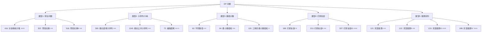

关联源素材：[[《labuladong的刷题笔记》-源素材]]

# 核心观点

**动态规划（Dynamic Programming）的本质是「带备忘录的递归」+「状态转移」**。核心思想是将大问题分解为**重叠子问题**，通过存储中间结果避免重复计算。掌握 **DP 四步法框架**（定义状态 → 状态转移方程 → 初始化 base case → 确定遍历顺序），配合**五大经典题型**（背包、子序列、路径计数、打家劫舍、股票），就能系统性地解决绝大多数 DP 问题。关键在于：**正确定义状态是成功的一半，状态转移方程是解决问题的灵魂**。

# 解题思维框架（通用套路）

## DP 的核心思想

```
动态规划 = 递归 + 备忘录（记忆化）
         或
动态规划 = 迭代 + DP 表（自底向上）

💡 核心优化：将指数级时间复杂度（递归）降低到多项式级别
💡 关键性质：
   ① 最优子结构：问题的最优解包含子问题的最优解
   ② 无后效性：一旦某个状态确定，就不受之后决策的影响
   ③ 重叠子问题：不同决策序列可能遇到相同的子问题
```

## DP 四步法框架

### Step 1: 定义状态（最关键！）

**问自己**：`dp[i]` 或 `dp[i][j]` 代表什么？

| 维度 | 常见含义 | 示例 |
|------|---------|------|
| `dp[i]` | 前 i 个元素/到第 i 步的最优解 | 最大子数组和、爬楼梯 |
| `dp[i][j]` | 前 i 个元素选 j 个/区间 [i,j] | 背包、编辑距离 |
| `dp[i][j][k]` | 多维度状态压缩 | 股票买卖（持有状态） |

**常见模式**：
```python
# 模式 1: 以 i 结尾
dp[i] = 以第 i 个元素结尾的 xxx 的最大值

# 模式 2: 前 i 个元素中
dp[i] = 前 i 个元素中的 xxx 的最大值

# 模式 3: 区间 [i, j]
dp[i][j] = 区间 [i, j] 内的 xxx 的最大值
```

### Step 2: 推导状态转移方程

**核心问题**：如何从已知状态推导新状态？

```
通用思路：
1. 分析「最后一步」做了什么选择
2. 根据选择分类讨论
3. 将每种选择的结果取 max/min

示例（0-1背包）：
对于每个物品，有两种选择：
  - 不选：dp[i][w] = dp[i-1][w]
  - 选：  dp[i][w] = dp[i-1][w-wi] + vi
→ 取两者较大值
```

### Step 3: 初始化 Base Case

**必须明确**：
- `dp[0]` 或 `dp[0][0]` 是什么？
- 边界条件如何处理？
- 是否需要初始化为特殊值（如 -inf, inf, 0）？

### Step 4: 确定遍历顺序

**规则**：依赖关系决定遍历顺序

```python
# 如果 dp[i] 依赖于 dp[i-1] → 从前往后遍历
for i in range(1, n+1):
    dp[i] = ...

# 如果 dp[i] 依赖于 dp[i+1] → 从后往前遍历
for i in range(n-1, -1, -1):
    dp[i] = ...

# 如果 dp[i][j] 依赖于左上方 → 对角线或按行遍历
for i in range(m):
    for j in range(n):
        dp[i][j] = ...
```

## 经典题型分类



# 代码模板（Java 版）

## 模板 1: 一维 DP 通用模板

```java
/**
 * 一维动态规划通用模板
 * 时间复杂度：O(n × 选择数)
 * 空间复杂度：O(n)
 */
int oneDimensionDP(int[] nums) {
    int n = nums.length;

    // 1. 定义 DP 数组（根据题意调整大小和初始值）
    int[] dp = new int[n + 1];

    // 2. 初始化 base case
    dp[0] = 0;  // 根据题目要求设置

    // 3. 遍历（注意起始位置和方向）
    for (int i = 1; i <= n; i++) {
        // 4. 枚举所有可能的选择
        for (int choice : choices) {
            // 5. 状态转移（取 max/min）
            dp[i] = Math.max(dp[i], /* 根据转移方程计算 */);
        }
    }

    // 6. 返回结果
    return dp[n];
}
```

## 模板 2: 二维 DP 通用模板

```java
/**
 * 二维动态规划通用模板（以路径问题为例）
 * 时间复杂度：O(m × n)
 * 空间复杂度：O(m × n) 可优化至 O(n)
 */
int twoDimensionDP(int[][] grid) {
    int m = grid.length;
    int n = grid[0].length;

    // 1. 定义 DP 数组
    int[][] dp = new int[m][n];

    // 2. 初始化 base case（第一行和第一列通常需要单独处理）
    dp[0][0] = grid[0][0];
    for (int i = 1; i < m; i++) {
        dp[i][0] = dp[i-1][0] + grid[i][0];
    }
    for (int j = 1; j < n; j++) {
        dp[0][j] = dp[0][j-1] + grid[0][j];
    }

    // 3. 遍历填充
    for (int i = 1; i < m; i++) {
        for (int j = 1; j < n; j++) {
            // 4. 状态转移（根据依赖关系）
            dp[i][j] = Math.min(
                dp[i-1][j],      // 从上面来
                dp[i][j-1]       // 从左边来
            ) + grid[i][j];     // 加上当前代价
        }
    }

    return dp[m-1][n-1];
}
```

## 模板 3: 0-1 背包问题 ⭐⭐⭐

```java
/**
 * 0-1 背包问题
 * 给定 n 个物品，每个物品有重量 w[i] 和价值 v[i]
 * 背包容量为 W，求能装入的最大价值
 *
 * LeetCode 416 变体
 * 时间复杂度：O(n × W)
 * 空间复杂度：O(n × W) 可优化至 O(W)
 */
class Solution {
    public int knapsack01(int[] weights, int[] values, int W) {
        int n = weights.length;

        // dp[i][w] = 前 i 个物品，容量为 w 时的最大价值
        int[][] dp = new int[n + 1][W + 1];

        // 遍历每个物品
        for (int i = 1; i <= n; i++) {
            int w = weights[i - 1];   // 第 i 个物品的重量
            int v = values[i - 1];    // 第 i 个物品的价值

            // 遍历每种容量
            for (int weight = 0; weight <= W; weight++) {
                // 不选第 i 个物品
                dp[i][weight] = dp[i - 1][weight];

                // 选第 i 个物品（如果放得下）
                if (weight >= w) {
                    dp[i][weight] = Math.max(
                        dp[i][weight],
                        dp[i - 1][weight - w] + v
                    );
                }
            }
        }

        return dp[n][W];
    }

    /**
     * 空间优化版本（滚动数组）
     * 空间复杂度：O(W)
     * 注意：内层循环必须倒序！
     */
    public int knapsack01Optimized(int[] weights, int[] values, int W) {
        int n = weights.length;
        int[] dp = new int[W + 1];

        for (int i = 0; i < n; i++) {
            int w = weights[i];
            int v = values[i];

            // 必须倒序遍历！确保每个物品只用一次
            for (int weight = W; weight >= w; weight--) {
                dp[weight] = Math.max(dp[weight], dp[weight - w] + v);
            }
        }

        return dp[W];
    }
}
```

## 模板 4: 最长递增子序列 LIS ⭐⭐

```java
/**
 * 最长递增子序列（Longest Increasing Subsequence）
 * LeetCode 300
 *
 * 方法 1: O(n²) DP
 * 时间复杂度：O(n²)
 * 空间复杂度：O(n)
 */
class Solution {
    public int lengthOfLIS(int[] nums) {
        if (nums == null || nums.length == 0) return 0;

        int n = nums.length;

        // dp[i] = 以 nums[i] 结尾的最长递增子序列长度
        int[] dp = new int[n];
        Arrays.fill(dp, 1);  // 每个元素本身长度至少为 1

        int maxLength = 1;

        for (int i = 1; i < n; i++) {
            for (int j = 0; j < i; j++) {
                // 如果 nums[j] < nums[i]，可以接在后面
                if (nums[j] < nums[i]) {
                    dp[i] = Math.max(dp[i], dp[j] + 1);
                }
            }
            maxLength = Math.max(maxLength, dp[i]);
        }

        return maxLength;
    }

    /**
     * 方法 2: O(n log n) 贪心 + 二分查找（进阶）
     * 思想：维护一个 tails 数组，tails[i] 表示长度为 i+1 的所有递增子序列末尾的最小值
     * 时间复杂度：O(n log n)
     * 空间复杂度：O(n)
     */
    public int lengthOfLISOptimized(int[] nums) {
        int n = nums.length;
        int[] tails = new int[n];
        int size = 0;

        for (int num : nums) {
            int left = 0, right = size;

            // 二分查找：找到第一个 >= num 的位置
            while (left < right) {
                int mid = left + (right - left) / 2;
                if (tails[mid] < num) {
                    left = mid + 1;
                } else {
                    right = mid;
                }
            }

            tails[left] = num;
            if (left == size) size++;
        }

        return size;
    }
}
```

## 模板 5: 编辑距离 ⭐⭐⭐

```java
/**
 * 编辑距离（Edit Distance）
 * LeetCode 72
 *
 * 给定两个单词 word1 和 word2，计算出将 word1 转换成 word2 所使用的最少操作数。
 * 操作包括：插入一个字符、删除一个字符、替换一个字符
 *
 * 时间复杂度：O(m × n)
 * 空间复杂度：O(m × n) 可优化至 O(min(m,n))
 */
class Solution {
    public int minDistance(String word1, String word2) {
        int m = word1.length();
        int n = word2.length();

        // dp[i][j] = word1[0..i-1] 转换为 word2[0..j-1] 的最少操作数
        int[][] dp = new int[m + 1][n + 1];

        // Base case
        // word1 为空，需要插入所有字符
        for (int j = 0; j <= n; j++) {
            dp[0][j] = j;
        }
        // word2 为空，需要删除所有字符
        for (int i = 0; i <= m; i++) {
            dp[i][0] = i;
        }

        // 填充 DP 表
        for (int i = 1; i <= m; i++) {
            for (int j = 1; j <= n; j++) {
                if (word1.charAt(i - 1) == word2.charAt(j - 1)) {
                    // 字符相同，不需要操作
                    dp[i][j] = dp[i - 1][j - 1];
                } else {
                    // 三种操作取最小值
                    dp[i][j] = Math.min(
                        dp[i - 1][j] + 1,     // 删除 word1[i-1]
                        Math.min(
                            dp[i][j - 1] + 1,  // 插入 word2[j-1]
                            dp[i - 1][j - 1] + 1  // 替换
                        )
                    );
                }
            }
        }

        return dp[m][n];
    }
}
```

## 模板 6: 股票买卖（状态机 DP）⭐⭐⭐

```java
/**
 * 买卖股票的最佳时机 III（最多完成两笔交易）
 * LeetCode 123
 *
 * 使用状态机 DP 思想：
 * 状态定义：
 *   buy1: 第一次买入后的最大利润
 *   sell1: 第一次卖出后的最大利润
 *   buy2: 第二次买入后的最大利润
 *   sell2: 第二次卖出后的最大利润
 *
 * 时间复杂度：O(n)
 * 空间复杂度：O(1)
 */
class Solution {
    public int maxProfit(int[] prices) {
        if (prices == null || prices.length == 0) return 0;

        // 初始化
        int buy1 = -prices[0];   // 第一次买入（花钱，所以是负数）
        int sell1 = 0;           // 第一次卖出
        int buy2 = -prices[0];   // 第二次买入（用第一次赚的钱）
        int sell2 = 0;           // 第二次卖出

        for (int i = 1; i < prices.length; i++) {
            int price = prices[i];

            // 状态转移（注意顺序！）
            buy1 = Math.max(buy1, -price);                    // 保持或今天买
            sell1 = Math.max(sell1, buy1 + price);           // 保持或今天卖
            buy2 = Math.max(buy2, sell1 - price);            // 保持或今天第二次买
            sell2 = Math.max(sell2, buy2 + price);           // 保持或今天第二次卖
        }

        return sell2;  // 最终答案一定是卖出状态
    }
}
```

# 代码模板（Python 版）

## 模板 1: 一维 DP 通用模板

```python
def one_dimension_dp(nums: list) -> int:
    """
    一维动态规划通用模板
    时间复杂度：O(n × 选择数)
    空间复杂度：O(n)
    """
    n = len(nums)

    # 1. 定义 DP 数组（根据题意调整大小和初始值）
    dp = [0] * (n + 1)

    # 2. 初始化 base case
    dp[0] = 0  # 根据题目要求设置

    # 3. 遍历（注意起始位置和方向）
    for i in range(1, n + 1):
        # 4. 枚举所有可能的选择
        for choice in choices:
            # 5. 状态转移（取 max/min）
            dp[i] = max(dp[i], ...)  # 根据转移方程计算

    # 6. 返回结果
    return dp[n]
```

## 模板 2: 二维 DP 通用模板

```python
def two_dimension_dp(grid: list) -> int:
    """
    二维动态规划通用模板（以路径问题为例）
    时间复杂度：O(m × n)
    空间复杂度：O(m × n) 可优化至 O(n)
    """
    m, n = len(grid), len(grid[0])

    # 1. 定义 DP 数组
    dp = [[0] * n for _ in range(m)]

    # 2. 初始化 base case（第一行和第一列通常需要单独处理）
    dp[0][0] = grid[0][0]

    for i in range(1, m):
        dp[i][0] = dp[i - 1][0] + grid[i][0]

    for j in range(1, n):
        dp[0][j] = dp[0][j - 1] + grid[0][j]

    # 3. 遍历填充
    for i in range(1, m):
        for j in range(1, n):
            # 4. 状态转移（根据依赖关系）
            dp[i][j] = min(
                dp[i - 1][j],    # 从上面来
                dp[i][j - 1]     # 从左边来
            ) + grid[i][j]       # 加上当前代价

    return dp[m - 1][n - 1]
```

## 模板 3: 0-1 背包问题

```python
class Solution:
    """
    0-1 背包问题
    给定 n 个物品，每个物品有重量 w[i] 和价值 v[i]
    背包容量为 W，求能装入的最大价值

    LeetCode 416 变体
    时间复杂度：O(n × W)
    空间复杂度：O(n × W) 可优化至 O(W)
    """

    def knapsack_01(self, weights: list, values: list, W: int) -> int:
        n = len(weights)

        # dp[i][w] = 前 i 个物品，容量为 w 时的最大价值
        dp = [[0] * (W + 1) for _ in range(n + 1)]

        # 遍历每个物品
        for i in range(1, n + 1):
            w, v = weights[i - 1], values[i - 1]

            # 遍历每种容量
            for weight in range(W + 1):
                # 不选第 i 个物品
                dp[i][weight] = dp[i - 1][weight]

                # 选第 i 个物品（如果放得下）
                if weight >= w:
                    dp[i][weight] = max(
                        dp[i][weight],
                        dp[i - 1][weight - w] + v
                    )

        return dp[n][W]

    def knapsack_01_optimized(self, weights: list, values: list, W: int) -> int:
        """
        空间优化版本（滚动数组）
        空间复杂度：O(W)
        注意：内层循环必须倒序！
        """
        n = len(weights)
        dp = [0] * (W + 1)

        for i in range(n):
            w, v = weights[i], values[i]

            # 必须倒序遍历！确保每个物品只用一次
            for weight in range(W, w - 1, -1):
                dp[weight] = max(dp[weight], dp[weight - w] + v)

        return dp[W]
```

## 模板 4: 最长递增子序列 LIS

```python
from typing import List
import bisect

class Solution:
    """
    最长递增子序列（Longest Increasing Subsequence）
    LeetCode 300

    方法 1: O(n²) DP
    """

    def lengthOfLIS(self, nums: List[int]) -> int:
        if not nums:
            return 0

        n = len(nums)

        # dp[i] = 以 nums[i] 结尾的最长递增子序列长度
        dp = [1] * n
        max_length = 1

        for i in range(1, n):
            for j in range(i):
                if nums[j] < nums[i]:
                    dp[i] = max(dp[i], dp[j] + 1)
            max_length = max(max_length, dp[i])

        return max_length

    def length_of_LIS_optimized(self, nums: List[int]) -> int:
        """
        方法 2: O(n log n) 贪心 + 二分查找（进阶）
        思想：维护一个 tails 数组，tails[i] 表示长度为 i+1 的所有递增子序列末尾的最小值
        """
        tails = []

        for num in nums:
            # 使用二分查找找到插入位置
            idx = bisect.bisect_left(tails, num)

            if idx == len(tails):
                tails.append(num)
            else:
                tails[idx] = num

        return len(tails)
```

## 模板 5: 编辑距离

```python
class Solution:
    """
    编辑距离（Edit Distance）
    LeetCode 72

    给定两个单词 word1 和 word2，计算出将 word1 转换成 word2 所使用的最少操作数。
    操作包括：插入一个字符、删除一个字符、替换一个字符

    时间复杂度：O(m × n)
    空间复杂度：O(m × n) 可优化至 O(min(m,n))
    """

    def minDistance(self, word1: str, word2: str) -> int:
        m, n = len(word1), len(word2)

        # dp[i][j] = word1[0..i-1] 转换为 word2[0..j-1] 的最少操作数
        dp = [[0] * (n + 1) for _ in range(m + 1)]

        # Base case
        # word1 为空，需要插入所有字符
        for j in range(n + 1):
            dp[0][j] = j

        # word2 为空，需要删除所有字符
        for i in range(m + 1):
            dp[i][0] = i

        # 填充 DP 表
        for i in range(1, m + 1):
            for j in range(1, n + 1):
                if word1[i - 1] == word2[j - 1]:
                    # 字符相同，不需要操作
                    dp[i][j] = dp[i - 1][j - 1]
                else:
                    # 三种操作取最小值
                    dp[i][j] = min(
                        dp[i - 1][j] + 1,     # 删除 word1[i-1]
                        dp[i][j - 1] + 1,     # 插入 word2[j-1]
                        dp[i - 1][j - 1] + 1  # 替换
                    )

        return dp[m][n]
```

## 模板 6: 股票买卖（状态机 DP）

```python
class Solution:
    """
    买卖股票的最佳时机 III（最多完成两笔交易）
    LeetCode 123

    使用状态机 DP 思想：
    状态定义：
      buy1: 第一次买入后的最大利润
      sell1: 第一次卖出后的最大利润
      buy2: 第二次买入后的最大利润
      sell2: 第二次卖出后的最大利润

    时间复杂度：O(n)
    空间复杂度：O(1)
    """

    def maxProfit(self, prices: List[int]) -> int:
        if not prices:
            return 0

        # 初始化
        buy1 = -prices[0]   # 第一次买入（花钱，所以是负数）
        sell1 = 0           # 第一次卖出
        buy2 = -prices[0]   # 第二次买入（用第一次赚的钱）
        sell2 = 0           # 第二次卖出

        for price in prices[1:]:
            # 状态转移（注意顺序！）
            buy1 = max(buy1, -price)              # 保持或今天买
            sell1 = max(sell1, buy1 + price)      # 保持或今天卖
            buy2 = max(buy2, sell1 - price)       # 保持或今天第二次买
            sell2 = max(sell2, buy2 + price)      # 保持或今天第二次卖

        return sell2  # 最终答案一定是卖出状态
```

# 经典例题解析

## 例题 1: [LeetCode 322] 零钱兑换（完全背包）⭐⭐

- **难度**：Medium
- **题意简述**：给定整数数组 `coins` 表示不同面额的硬币，和一个总金额 `amount`。计算并返回可以凑成总金额所需的**最少的硬币个数**。如果无法凑出，返回 `-1`。
- **示例**：
  - 输入：`coins = [1,2,5], amount = 11` → 输出：`3`（5+5+1）
  - 输入：`coins = [2], amount = 3` → 输出：`-1`
- **思路分析**：
  - 这是**完全背包问题**的典型应用（每个硬币可以使用无限次）
  - **状态定义**：`dp[i]` = 凑成金额 `i` 所需的最少硬币数
  - **状态转移**：对每种硬币，`dp[i] = min(dp[i], dp[i - coin] + 1)`
  - **初始化**：`dp[0] = 0`，其余设为 `inf`（表示不可达）

- **代码实现**：

```java
class Solution {
    public int coinChange(int[] coins, int amount) {
        // dp[i] = 凑成金额 i 所需的最少硬币数
        int[] dp = new int[amount + 1];
        Arrays.fill(dp, amount + 1);  // 初始化为一个不可能的大数
        dp[0] = 0;                     // 金额 0 需要 0 个硬币

        for (int i = 1; i <= amount; i++) {
            for (int coin : coins) {
                if (coin <= i) {  // 硬币面额不能超过当前金额
                    dp[i] = Math.min(dp[i], dp[i - coin] + 1);
                }
            }
        }

        return dp[amount] > amount ? -1 : dp[amount];
    }
}
```

```python
class Solution:
    def coinChange(self, coins: List[int], amount: int) -> int:
        # dp[i] = 凑成金额 i 所需的最少硬币数
        dp = [float('inf')] * (amount + 1)
        dp[0] = 0  # 金额 0 需要 0 个硬币

        for i in range(1, amount + 1):
            for coin in coins:
                if coin <= i:  # 硬币面额不能超过当前金额
                    dp[i] = min(dp[i], dp[i - coin] + 1)

        return dp[amount] if dp[amount] != float('inf') else -1
```

- **复杂度分析**：
  - 时间复杂度：O(amount × n)，n 为硬币种类数
  - 空间复杂度：O(amount)


## 例题 3: [LeetCode 198/213/337] 打家劫舍系列 ⭐~⭐⭐⭐

### I. [LeetCode 198] 打家劫舍 I ⭐

- **思路分析**：
  - **状态定义**：`dp[i]` = 抢到第 `i` 家时能获得的最大金额
  - **状态转移**：
    ```
    dp[i] = max(dp[i-1], dp[i-2] + nums[i])
          = max(不抢这家，抢这家)
    ```

```java
public int rob(int[] nums) {
    if (nums == null || nums.length == 0) return 0;
    if (nums.length == 1) return nums[0];

    int n = nums.length;
    int[] dp = new int[n];
    dp[0] = nums[0];
    dp[1] = Math.max(nums[0], nums[1]);

    for (int i = 2; i < n; i++) {
        dp[i] = Math.max(dp[i - 1], dp[i - 2] + nums[i]);
    }

    return dp[n - 1];
}
```

### II. [LeetCode 213] 打家劫舍 II ⭐⭐

- **区别**：房子围成一个圈（首尾相连）
- **思路**：分解为两种情况
  1. 不抢最后一间 → 在 `[0, n-2]` 上做打家劫舍 I
  2. 不抢第一间 → 在 `[1, n-1]` 上做打家劫舍 I
  - 取两者的最大值

### III. [LeetCode 337] 打家劫舍 III ⭐⭐⭐（树形 DP）

- **区别**：房子排列成二叉树结构
- **思路**：后序遍历 + 状态定义
  - 对每个节点返回两个值：`[抢该节点, 不抢该节点]`
  - 如果抢该节点 → 不能抢左右孩子
  - 如果不抢该节点 → 可以选择抢或不抢左右孩子

```java
class Solution {
    public int rob(TreeNode root) {
        int[] result = dfs(root);
        return Math.max(result[0], result[1]);  // 取最大值
    }

    // 返回值：[抢当前节点的最大收益, 不抢当前节点的最大收益]
    private int[] dfs(TreeNode node) {
        if (node == null) return new int[]{0, 0};

        int[] left = dfs(node.left);
        int[] right = dfs(node.right);

        // 抢当前节点：不能抢左右孩子
        int rob = node.val + left[1] + right[1];

        // 不抢当前节点：可以选择抢或不抢左右孩子
        int notRob = Math.max(left[0], left[1]) + Math.max(right[0], right[1]);

        return new int[]{rob, notRob};
    }
}
```


## 例题 5: [LeetCode 121/122/188] 股票系列 ⭐⭐~⭐⭐⭐

### I. [LeetCode 121] 只能买卖一次 ⭐⭐

- **思路**：维护「到目前为止的最低价格」和「最大利润」

```java
public int maxProfit(int[] prices) {
    int minPrice = Integer.MAX_VALUE;
    int maxProfit = 0;

    for (int price : prices) {
        minPrice = Math.min(minPrice, price);
        maxProfit = Math.max(maxProfit, price - minPrice);
    }

    return maxProfit;
}
```

### II. [LeetCode 122] 可以买卖多次 ⭐⭐

- **思路**：只要明天比今天贵就买（贪心）

```java
public int maxProfit(int[] prices) {
    int profit = 0;
    for (int i = 1; i < prices.length; i++) {
        if (prices[i] > prices[i - 1]) {
            profit += prices[i] - prices[i - 1];
        }
    }
    return profit;
}
```

### III. [LeetCode 188] 最多 k 笔交易 ⭐⭐⭐

- **思路**：使用二维状态机 DP
  - `dp[i][k][0/1]` = 第 `i` 天，已进行 `k` 笔交易，是否持有股票时的最大利润
  - 见模板 6 的详细实现

# 常见陷阱与易错点

## ❌ 易错点 1：状态定义错误导致无法转移

- **问题描述**：状态定义不清楚或不完整，导致无法写出正确的状态转移方程
- **典型错误**：
  ```java
  // 错误：状态定义模糊
  dp[i] = ???  // 到底代表什么？
  ```
- **正确做法**：
  ```java
  // ✅ 明确定义：dp[i] = 前 i 个元素中... / 以第 i 个元素结尾...
  // 写下完整的中文描述，确保无歧义
  ```

## ❌ 易错点 2：忘记初始化 Base Case

- **问题描述**：没有正确初始化边界情况
- **常见遗漏**：
  - `dp[0]` 应该是什么？（通常是 0 或 1 或 -inf）
  - 第一行/第一列如何初始化？
  - 是否需要用 `Integer.MIN_VALUE` 或 `Integer.MAX_VALUE` 作为哨兵？

## ❌ 易错点 3：遍历顺序错误

- **问题描述**：遍历顺序与依赖关系不一致
- **规则总结**：
  ```
  依赖前面 → 正序遍历（for i from 1 to n）
  依赖后面 → 倒序遍历（for i from n to 1）
  依赖左上 → 按行或按列正常遍历
  ```
- **特殊情况**：0-1 背包的空间优化版本**必须倒序**遍历容量

## ❌ 易错点 4：整数溢出

- **问题描述**：使用 `Integer.MAX_VALUE` 时做加法运算会溢出
- **正确做法**：
  ```java
  // 错误！
  int result = Integer.MAX_VALUE + 1;  // 溢出变成负数！

  // ✅ 正确：使用 long 或者用一个足够大的有限值
  int INF = (int) 1e9;  // 或使用 Long.MAX_VALUE
  ```

## ❌ 易错点 5：完全背包 vs 0-1 背包混淆

- **关键区别**：

| 特性 | 0-1 背包 | 完全背包 |
|------|---------|---------|
| 物品使用次数 | 每种只能用一次 | 每种可以用无限次 |
| 内层循环方向 | **倒序**（空间优化时） | **正序** |
| 典型题目 | 分割等和子集 | 零钱兑换 |

## ❌ 易错点 6：子序列 vs 子串混淆

- **子序列（Subsequence）**：可以不连续（LIS, LCS）
  - 状态转移：`dp[i] = max(dp[j] + 1)` 其中 `j < i`
- **子串（Substring）**：必须连续（最长公共子串）
  - 状态转移：如果 `s1[i] == s2[j]` 则 `dp[i][j] = dp[i-1][j-1] + 1`，否则 `dp[i][j] = 0`

## ✅ 最佳实践 1：先写暴力递归，再改写成 DP

```
步骤 1：写出递归解法（容易思考）
步骤 2：识别重叠子问题（画出递归树）
步骤 3：加入 memo（自顶向下 DP）
步骤 4：改为迭代（自底向上 DP）
步骤 5：（可选）空间优化
```

## ✅ 最佳实践 2：画表格辅助思考

- **强烈建议**：对于二维 DP，**手动画出 DP 表格**
- 填几个例子：
  - Base case 怎么填？
  - 中间的格子怎么计算？
  - 最终答案在哪个位置？

## ✅ 最佳实践 3：从简单案例开始验证

**必测场景**：
1. 空输入 `[]`
2. 单个元素 `[x]`
3. 所有元素相同
4. 已经有序 / 完全逆序
5. 边界值（最大/最小输入规模）

## ✅ 最佳实践 4：掌握常用优化技巧

| 优化技术 | 适用场景 | 效果 |
|---------|---------|------|
| 滚动数组 | 二维 DP | 空间 O(mn) → O(n) |
| 状态压缩 | 特殊约束 | 用位运算减少维度 |
| 单调栈/队列 | 某些优化问题 | 降低时间复杂度 |
| 贪心预处理 | 排序相关 | 先排序再 DP |

# 实战练习建议

## 📖 入门题（理解 DP 基本概念）

- [ ] [LeetCode 70](https://leetcode.cn/problems/climbing-stairs/) 爬楼梯 ⭐
- [ ] [LeetCode 53](https://leetcode.cn/problems/maximum-subarray/) 最大子数组和 ⭐
- [ ] [LeetCode 198](https://leetcode.cn/problems/house-robber/) 打家劫舍 I ⭐
- [ ] [LeetCode 121](https://leetcode.cn/problems/best-time-to-buy-and-sell-stock/) 买卖股票 I ⭐⭐
- [ ] [LeetCode 392](https://leetcode.cn/problems/is-subsequence/) 判断子序列 ⭐

## 🚀 进阶题（掌握经典题型）

- [ ] [LeetCode 62](https://leetcode.cn/problems/unique-paths/) 不同路径 ⭐⭐
- [ ] [LeetCode 64](https://leetcode.cn/problems/minimum-path-sum/) 最小路径和 ⭐⭐
- [LeetCode 300](https://leetcode.cn/problems/longest-increasing-subsequence/) 最长递增子序列 ⭐⭐
- [LeetCode 322](https://leetcode.cn/problems/coin-change/) 零钱兑换 ⭐⭐
- [LeetCode 416](https://leetcode.cn/problems/partition-equal-subset-sum/) 分割等和子集 ⭐⭐⭐
- [LeetCode 1143](https://leetcode.cn/problems/longest-common-subsequence/) 最长公共子序列 ⭐⭐

## ⭐ 挑战题（综合运用能力）

- [ ] [LeetCode 72](https://leetcode.cn/problems/edit-distance/) 编辑距离 ⭐⭐⭐
- [ ] [LeetCode 123](https://leetcode.cn/problems/best-time-to-buy-and-sell-stock-iii/) 买卖股票 III ⭐⭐⭐
- [ ] [LeetCode 188](https://leetcode.cn/problems/best-time-to-buy-and-sell-stock-iv/) 买卖股票 IV ⭐⭐⭐
- [ ] [LeetCode 337](https://leetcode.cn/problems/house-robber-iii/) 打家劫舍 III（树形DP）⭐⭐⭐
- [ ] [LeetCode 10](https://leetcode.cn/problems/regular-expression-matching/) 正则表达式匹配 ⭐⭐⭐
- [ ] [LeetCode 44](https://leetcode.cn/problems/wildcard-matching/) 通配符匹配 ⭐⭐⭐

# 关联阅读

- [[T14_动态规划]] - 动态规划理论基础
- [[T13_回溯算法]] - 回溯算法（某些问题可用 DP 优化）
- [[P05_二叉树递归专题]] - 二叉树递归（树形 DP 相关）
- [[P07_回溯算法专题]] - 回溯算法（穷举 + 记忆化）
- [[P00_刷题方法论与思维框架]] - 刷题方法论总览
