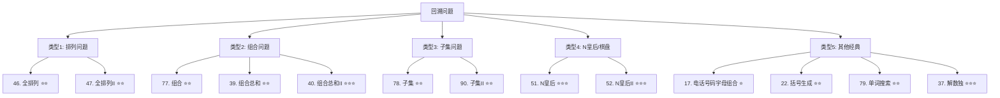

关联源素材：[[《labuladong的刷题笔记》-源素材]]

# 核心观点

**回溯算法的本质是「深度优先搜索（DFS）+ 状态重置（撤销选择）」**，是一种通过**穷举所有可能解**来寻找问题答案的通用方法。核心框架只有三步：**做选择 → 递归进入下一层 → 撤销选择**。掌握**五大经典题型**（排列、组合、子集、N皇后、其他经典问题），配合**剪枝优化技巧**，就能系统性地解决组合优化、约束满足等各类穷举问题。关键在于：**理解「路径、选择列表、结束条件」三要素，并在正确位置进行状态的重置**。

# 解题思维框架（通用套路）

## 回溯算法的本质

```
回溯 = DFS + 状态恢复

💡 核心思想：
   1. 尝试所有可能的选项（穷举）
   2. 当发现当前路径不可行时，返回上一步尝试其他选项（回溯）
   3. 通过「撤销选择」恢复到之前的状态

🎯 适用场景：
   • 需要找出所有可能的解（不是最优解）
   • 问题可以分解为多步决策
   • 每一步有有限的选择
   • 存在约束条件用于剪枝
```

## 回溯算法的三要素

### 要素 1：路径（Path）

- **定义**：已经做出的选择序列
- **作用**：记录当前的状态
- **实现**：通常用 List/Array 存储当前路径

### 要素 2：选择列表（Choices）

- **定义**：当前可以做的所有选择
- **作用**：决定下一步往哪里走
- **变化**：随着递归深入，选择列表会不断缩小

### 要素 3：结束条件（Termination）

- **定义**：到达决策树的底层，无法再做选择的条件
- **作用**：判断是否找到了一个合法解
- **操作**：将当前路径加入结果集

## 回溯算法通用框架

```python
def backtrack(path, choices):
    # ===== 结束条件 =====
    if 满足结束条件:
        result.add(path.copy())  # 注意要拷贝！
        return

    # ===== 遍历所有选择 =====
    for choice in choices:
        # ===== 做选择 =====
        path.add(choice)         # 将选择加入路径
        # 可能需要更新选择列表或标记已使用

        # ===== 进入下一层决策 =====
        backtrack(path, new_choices)

        # ===== 撤销选择（关键步骤！）=====
        path.remove(choice)      # 从路径中移除
        # 恢复选择列表或取消标记
```

## 经典题型分类



# 代码模板（Java 版）

## 模板 1: 全排列（基础版）⭐⭐

```java
import java.util.*;

/**
 * 全排列
 * LeetCode 46
 * 给定一个不含重复数字的数组 nums，返回其所有可能的全排列。
 *
 * 时间复杂度：O(n × n!)  n! 个排列，每个需要 O(n) 复制
 * 空间复杂度：O(n) 不算结果存储
 */
class Solution {
    private List<List<Integer>> result;
    private boolean[] used;

    public List<List<Integer>> permute(int[] nums) {
        result = new ArrayList<>();
        used = new boolean[nums.length];
        backtrack(nums, new ArrayList<>());
        return result;
    }

    private void backtrack(int[] nums, List<Integer> path) {
        // 结束条件：路径长度等于数组长度
        if (path.size() == nums.length) {
            result.add(new ArrayList<>(path));  // 必须拷贝！
            return;
        }

        // 遍历所有选择
        for (int i = 0; i < nums.length; i++) {
            // 跳过已使用的元素
            if (used[i]) continue;

            // 做选择
            used[i] = true;
            path.add(nums[i]);

            // 进入下一层决策
            backtrack(nums, path);

            // 撤销选择（关键！）
            path.remove(path.size() - 1);
            used[i] = false;
        }
    }
}
```

## 模板 2: 全排列 II（含重复元素）⭐⭐

```java
/**
 * 全排列 II
 * LeetCode 47
 * 给定一个可包含重复数字的序列 nums，按任意顺序返回所有不重复的全排列。
 *
 * 关键技巧：排序 + 剪枝
 */
class Solution {
    private List<List<Integer>> result;
    private boolean[] used;

    public List<List<Integer>> permuteUnique(int[] nums) {
        result = new ArrayList<>();
        used = new boolean[nums.length];
        Arrays.sort(nums);  // 关键！先排序
        backtrack(nums, new ArrayList<>());
        return result;
    }

    private void backtrack(int[] nums, List<Integer> path) {
        if (path.size() == nums.length) {
            result.add(new ArrayList<>(path));
            return;
        }

        for (int i = 0; i < nums.length; i++) {
            // 剪枝 1：跳过已使用的元素
            if (used[i]) continue;

            // 剪枝 2：跳过重复元素
            // 如果当前元素和前一个相同，且前一个没有被使用，
            // 说明这是重复的选择，跳过
            if (i > 0 && nums[i] == nums[i - 1] && !used[i - 1]) continue;

            // 做选择
            used[i] = true;
            path.add(nums[i]);

            // 进入下一层
            backtrack(nums, path);

            // 撤销选择
            path.remove(path.size() - 1);
            used[i] = false;
        }
    }
}
```

## 模板 3: 组合（基础版）⭐⭐

```java
/**
 * 组合
 * LeetCode 77
 * 给定两个整数 n 和 k，返回范围 [1, n] 中所有可能的 k 个数的组合。
 *
 * 时间复杂度：O(C(n,k) × k)
 * 空间复杂度：O(k)
 *
 * 核心区别于排列：
 * 1. 使用 start index 避免重复组合 [1,2] 和 [2,1] 视为相同
 * 2. 选择列表随递归缩小（只考虑后面的元素）
 */
class Solution {
    private List<List<Integer>> result;

    public List<List<Integer>> combine(int n, int k) {
        result = new ArrayList<>();
        backtrack(1, n, k, new ArrayList<>());
        return result;
    }

    /**
     * @param start 当前可选择的起始位置（避免重复）
     * @param n     最大值
     * @param k     还需要选几个数
     * @param path  当前路径
     */
    private void backtrack(int start, int n, int k, List<Integer> path) {
        // 结束条件：已经选了 k 个数
        if (k == 0) {
            result.add(new ArrayList<>(path));
            return;
        }

        // 优化：如果剩余元素不足，提前终止（剪枝）
        // 从 start 到 n 共有 (n - start + 1) 个数可选
        // 我们还需要 k 个数，所以必须 (n - start + 1) >= k
        for (int i = start; i <= n - k + 1; i++) {  // 注意这里的边界优化！
            // 做选择
            path.add(i);

            // 进入下一层：从 i+1 开始（避免重复）
            backtrack(i + 1, n, k - 1, path);

            // 撤销选择
            path.remove(path.size() - 1);
        }
    }
}
```

## 模板 4: 组合总和 ⭐⭐

```java
/**
 * 组合总和
 * LeetCode 39
 * 给定一个无重复元素的数组 candidates 和一个目标数 target，
 * 找出 candidates 中所有可以使数字和为 target 的组合。
 * candidates 中的数字可以无限制重复被选取。
 *
 * 时间复杂度：O(n^(target/min)) 最坏情况
 * 空间复杂度：O(target/min)
 */
class Solution {
    private List<List<Integer>> result;

    public List<List<Integer>> combinationSum(int[] candidates, int target) {
        result = new ArrayList<>();
        Arrays.sort(candidates);  // 方便剪枝
        backtrack(candidates, target, 0, new ArrayList<>(), 0);
        return result;
    }

    /**
     * @param candidates 候选数组
     * @param target     目标和
     * @param start      起始位置（避免重复组合）
     * @param path       当前路径
     * @param sum        当前和
     */
    private void backtrack(int[] candidates, int target, int start,
                          List<Integer> path, int sum) {
        // 结束条件：找到目标和
        if (sum == target) {
            result.add(new ArrayList<>(path));
            return;
        }

        // 剪枝：超过目标和（因为已排序，后面只会更大）
        if (sum > target) return;

        for (int i = start; i < candidates.length; i++) {
            // 做选择
            path.add(candidates[i]);

            // 注意：这里传 i（不是 i+1），因为可以重复使用同一元素
            backtrack(candidates, target, i, path, sum + candidates[i]);

            // 撤销选择
            path.remove(path.size() - 1);
        }
    }
}
```

## 模板 5: 子集（两种思路）⭐⭐

```java
/**
 * 子集
 * LeetCode 78
 * 给定整数数组 nums（无重复元素），返回该数组所有可能的子集（幂集）。
 *
 * 方法 1: 回溯法（枚举每个元素选或不选）
 */

class Solution {
    private List<List<Integer>> result;

    public List<List<Integer>> subsets(int[] nums) {
        result = new ArrayList<>();
        backtrack(nums, 0, new ArrayList<>());
        return result;
    }

    /**
     * 对每个元素有两种选择：选或不选
     */
    private void backtrack(int[] nums, int start, List<Integer> path) {
        // 每个节点都是一个合法的子集（包括空集）
        result.add(new ArrayList<>(path));

        for (int i = start; i < nums.length; i++) {
            // 选择当前元素
            path.add(nums[i]);

            // 继续探索后续元素
            backtrack(nums, i + 1, path);

            // 不选当前元素（撤销选择）
            path.remove(path.size() - 1);
        }
    }
}

/**
 * 方法 2: 二进制枚举（位运算）
 * 思路：n 个元素对应 n 位二进制，每位 0/1 表示不选/选
 * 时间复杂度：O(n × 2^n)
 */
class Solution {
    public List<List<Integer>> subsets(int[] nums) {
        List<List<Integer>> result = new ArrayList<>();
        int n = nums.length;

        // 枚举所有 2^n 种情况
        for (int mask = 0; mask < (1 << n); mask++) {
            List<Integer> subset = new ArrayList<>();
            for (int i = 0; i < n; i++) {
                // 检查第 i 位是否为 1
                if ((mask & (1 << i)) != 0) {
                    subset.add(nums[i]);
                }
            }
            result.add(subset);
        }

        return result;
    }
}
```

## 模板 6: N 皇后 ⭐⭐⭐

```java
/**
 * N 皇后
 * LeetCode 51
 * 按照国际象棋的规则，皇后可以攻击与之处在同一行或同一列或同一斜线上的棋子。
 * n × n 的棋盘上放置 n 个皇后，使彼此不能攻击。返回所有不同的解决方案。
 *
 * 时间复杂度：O(N!) 实际远小于此（因为有大量剪枝）
 * 空间复杂度：O(N²)
 */
class Solution {
    private List<List<String>> result;

    public List<List<String>> solveNQueens(int n) {
        result = new ArrayList<>();
        char[][] board = new char[n][n];

        // 初始化棋盘
        for (int i = 0; i < n; i++) {
            Arrays.fill(board[i], '.');
        }

        backtrack(board, 0);
        return result;
    }

    /**
     * 在第 row 行放置皇后
     */
    private void backtrack(char[][] board, int row) {
        int n = board.length;

        // 结束条件：所有行都放置完毕
        if (row == n) {
            result.add(constructSolution(board));
            return;
        }

        // 尝试在当前行的每一列放置皇后
        for (int col = 0; col < n; col++) {
            // 剪枝：检查当前位置是否安全
            if (!isValid(board, row, col)) continue;

            // 做选择：放置皇后
            board[row][col] = 'Q';

            // 进入下一行
            backtrack(board, row + 1);

            // 撤销选择：移除皇后
            board[row][col] = '.';
        }
    }

    /**
     * 检查在 (row, col) 放置皇后是否安全
     * 只需检查上方（因为是从上往下逐行放置）
     */
    private boolean isValid(char[][] board, int row, int col) {
        int n = board.length;

        // 检查正上方
        for (int i = 0; i < row; i++) {
            if (board[i][col] == 'Q') return false;
        }

        // 检查左上方
        for (int i = row - 1, j = col - 1; i >= 0 && j >= 0; i--, j--) {
            if (board[i][j] == 'Q') return false;
        }

        // 检查右上方
        for (int i = row - 1, j = col + 1; i >= 0 && j < n; i--, j++) {
            if (board[i][j] == 'Q') return false;
        }

        return true;
    }

    /**
     * 将棋盘转换为题目要求的格式
     */
    private List<String> constructSolution(char[][] board) {
        List<String> solution = new ArrayList<>();
        for (char[] row : board) {
            solution.add(new String(row));
        }
        return solution;
    }
}
```

# 代码模板（Python 版）

## 模板 1: 全排列（基础版）

```python
from typing import List

class Solution:
    """
    全排列 - LeetCode 46
    给定一个不含重复数字的数组 nums，返回其所有可能的全排列。

    时间复杂度：O(n × n!)
    空间复杂度：O(n) 不算结果存储
    """

    def permute(self, nums: List[int]) -> List[List[int]]:
        result = []
        used = [False] * len(nums)
        self._backtrack(nums, [], used, result)
        return result

    def _backtrack(self, nums: List[int], path: List[int],
                   used: List[bool], result: List[List[int]]):
        # 结束条件：路径长度等于数组长度
        if len(path) == len(nums):
            result.append(path.copy())  # 必须拷贝！
            return

        # 遍历所有选择
        for i in range(len(nums)):
            # 跳过已使用的元素
            if used[i]:
                continue

            # 做选择
            used[i] = True
            path.append(nums[i])

            # 进入下一层决策
            self._backtrack(nums, path, used, result)

            # 撤销选择（关键！）
            path.pop()
            used[i] = False
```

## 模板 2: 全排列 II（含重复元素）

```python
class Solution:
    """
    全排列 II - LeetCode 47
    给定一个可包含重复数字的序列 nums，返回所有不重复的全排列。

    关键技巧：排序 + 剪枝
    """

    def permuteUnique(self, nums: List[int]) -> List[List[int]]:
        result = []
        nums.sort()  # 关键！先排序
        used = [False] * len(nums)
        self._backtrack(nums, [], used, result)
        return result

    def _backtrack(self, nums: List[int], path: List[int],
                   used: List[bool], result: List[List[int]]):
        if len(path) == len(nums):
            result.append(path.copy())
            return

        for i in range(len(nums)):
            # 剪枝 1：跳过已使用的元素
            if used[i]:
                continue

            # 剪枝 2：跳过重复元素
            # 如果当前元素和前一个相同，且前一个没有被使用，
            # 说明这是重复的选择，跳过
            if i > 0 and nums[i] == nums[i - 1] and not used[i - 1]:
                continue

            # 做选择
            used[i] = True
            path.append(nums[i])

            # 进入下一层
            self._backtrack(nums, path, used, result)

            # 撤销选择
            path.pop()
            used[i] = False
```

## 模板 3: 组合（基础版）

```python
class Solution:
    """
    组合 - LeetCode 77
    给定两个整数 n 和 k，返回范围 [1, n] 中所有可能的 k 个数的组合。

    时间复杂度：O(C(n,k) × k)
    空间复杂度：O(k)

    核心区别于排列：
    1. 使用 start index 避免重复组合
    2. 选择列表随递归缩小
    """

    def combine(self, n: int, k: int) -> List[List[int]]:
        result = []
        self._backtrack(1, n, k, [], result)
        return result

    def _backtrack(self, start: int, n: int, k: int,
                   path: List[int], result: List[List[int]]):
        # 结束条件：已经选了 k 个数
        if k == 0:
            result.append(path.copy())
            return

        # 优化：如果剩余元素不足，提前终止（剪枝）
        for i in range(start, n - k + 2):  # 注意边界优化
            # 做选择
            path.append(i)

            # 进入下一层：从 i+1 开始（避免重复）
            self._backtrack(i + 1, n, k - 1, path, result)

            # 撤销选择
            path.pop()
```

## 模板 4: 组合总和

```python
class Solution:
    """
    组合总和 - LeetCode 39
    给定候选数组 candidates 和目标数 target，
    找出所有可以使数字和为 target 的组合。
    数字可以无限制重复被选取。

    时间复杂度：O(n^(target/min))
    """

    def combinationSum(self, candidates: List[int], target: int) -> List[List[int]]:
        result = []
        candidates.sort()  # 方便剪枝
        self._backtrack(candidates, target, 0, [], 0, result)
        return result

    def _backtrack(self, candidates: List[int], target: int,
                   start: int, path: List[int], current_sum: int,
                   result: List[List[int]]):
        # 结束条件：找到目标和
        if current_sum == target:
            result.append(path.copy())
            return

        # 剪枝：超过目标和（因为已排序，后面只会更大）
        if current_sum > target:
            return

        for i in range(start, len(candidates)):
            # 做选择
            path.append(candidates[i])

            # 注意：传 i（不是 i+1），因为可以重复使用同一元素
            self._backtrack(candidates, target, i, path,
                          current_sum + candidates[i], result)

            # 撤销选择
            path.pop()
```

## 模板 5: 子集（两种思路）

```python
class Solution:
    """
    子集 - LeetCode 78
    方法 1: 回溯法（枚举每个元素选或不选）
    """

    def subsets(self, nums: List[int]) -> List[List[int]]:
        result = []
        self._backtrack(nums, 0, [], result)
        return result

    def _backtrack(self, nums: List[int], start: int,
                   path: List[int], result: List[List[int]]):
        # 每个节点都是一个合法的子集（包括空集）
        result.append(path.copy())

        for i in range(start, len(nums)):
            # 选择当前元素
            path.append(nums[i])

            # 继续探索后续元素
            self._backtrack(nums, i + 1, path, result)

            # 不选当前元素（撤销选择）
            path.pop()


"""
方法 2: 二进制枚举（位运算）
思路：n 个元素对应 n 位二进制，每位 0/1 表示不选/选
时间复杂度：O(n × 2^n)
"""

class Solution:
    def subsets_bitwise(self, nums: List[int]) -> List[List[int]]:
        result = []
        n = len(nums)

        # 枚举所有 2^n 种情况
        for mask in range(1 << n):
            subset = []
            for i in range(n):
                # 检查第 i 位是否为 1
                if mask & (1 << i):
                    subset.append(nums[i])
            result.append(subset)

        return result
```

## 模板 6: N 皇后

```python
from typing import List

class Solution:
    """
    N 皇后 - LeetCode 51
    n × n 的棋盘上放置 n 个皇后，使彼此不能攻击。
    返回所有不同的解决方案。

    时间复杂度：O(N!) 实际远小于此（因为有大量剪枝）
    空间复杂度：O(N²)
    """

    def solveNQueens(self, n: int) -> List[List[str]]:
        result = []
        board = [['.' for _ in range(n)] for _ in range(n)]
        self._backtrack(board, 0, n, result)
        return result

    def _backtrack(self, board: List[List[str]], row: int,
                   n: int, result: List[List[str]]):
        # 结束条件：所有行都放置完毕
        if row == n:
            result.append([''.join(r) for r in board])
            return

        # 尝试在当前行的每一列放置皇后
        for col in range(n):
            # 剪枝：检查当前位置是否安全
            if not self._is_valid(board, row, col, n):
                continue

            # 做选择：放置皇后
            board[row][col] = = 'Q'

            # 进入下一行
            self._backtrack(board, row + 1, n, result)

            # 撤销选择：移除皇后
            board[row][col] = '.'

    def _is_valid(self, board: List[List[str]], row: int,
                  col: int, n: int) -> bool:
        # 检查正上方
        for i in range(row):
            if board[i][col] == 'Q':
                return False

        # 检查左上方
        i, j = row - 1, col - 1
        while i >= 0 and j >= 0:
            if board[i][j] == 'Q':
                return False
            i -= 1
            j -= 1

        # 检查右上方
        i, j = row - 1, col + 1
        while i >= 0 and j < n:
            if board[i][j] == 'Q':
                return False
            i -= 1
            j += 1

        return True
```

# 经典例题解析

## 例题 1: [LeetCode 17] 电话号码字母组合 ⭐

- **难度**：Medium
- **题意简述**：给定一个仅包含数字 `2-9` 的字符串，返回所有它能表示的字母组合。答案可以按 **任何顺序** 返回。给出数字到字母的映射如下（与电话按键相同）。注意 1 不对应任何字母。
- **示例**：
  - 输入：`digits = "23"` → 输出：`["ad","ae","af","bd","be","bf","cd","ce","cf"]`
- **思路分析**：
  - 这是**典型的多叉树遍历问题**
  - 每个数字对应一组字母选择
  - 对每个数字的位置，枚举其所有可能的字母
  - 使用回溯法穷举所有组合

- **代码实现**：

```java
class Solution {
    private Map<Character, String> phoneMap = Map.of(
        '2', "abc", '3', "def", '4', "ghi", '5', "jkl",
        '6', "mno", '7', "pqrs", '8', "tuv", '9', "wxyz"
    );
    private List<String> result;

    public List<String> letterCombinations(String digits) {
        result = new ArrayList<>();
        if (digits == null || digits.length() == 0) return result;
        backtrack(digits, 0, new StringBuilder());
        return result;
    }

    private void backtrack(String digits, int index, StringBuilder path) {
        // 结束条件：处理完所有数字
        if (index == digits.length()) {
            result.add(path.toString());
            return;
        }

        // 获取当前数字对应的字母
        String letters = phoneMap.get(digits.charAt(index));

        // 遍历所有可能的字母
        for (char letter : letters.toCharArray()) {
            // 做选择
            path.append(letter);

            // 处理下一个数字
            backtrack(digits, index + 1, path);

            // 撤销选择
            path.deleteCharAt(path.length() - 1);
        }
    }
}
```

```python
class Solution:
    def letterCombinations(self, digits: str) -> List[str]:
        if not digits:
            return []

        phone_map = {
            '2': 'abc', '3': 'def', '4': 'ghi', '5': 'jkl',
            '6': 'mno', '7': 'pqrs', '8': 'tuv', '9': 'wxyz'
        }
        result = []

        def backtrack(index: int, path: str):
            if index == len(digits):
                result.append(path)
                return

            for letter in phone_map[digits[index]]:
                backtrack(index + 1, path + letter)

        backtrack(0, '')
        return result
```


## 例题 3: [LeetCode 79] 单词搜索 ⭐⭐

- **难度**：Medium
- **题意简述**：给定一个 `m x n` 二维字符网格 `board` 和一个字符串单词 `word` 。如果 `word` 存在于网格中，返回 `true` ；否则，返回 `false` 。单词必须按照字母顺序，通过相邻的单元格内的字母构成，其中「相邻」单元格是那些水平相邻或垂直相邻的单元格。同一个单元格内的字母不允许被重复使用。
- **示例**：
  - 输入：`board = [["A","B","C","E"],["S","F","C","S"],["A","D","E","E"]]`, `word = "ABCCED"`
  - 输出：`true`
- **思路分析**：
  - 这是**二维网格上的 DFS + 回溯**
  - 对每个格子作为起点，尝试匹配单词
  - 匹配成功则继续向四个方向搜索
  - **必须标记已访问的格子**（防止循环），并**回溯时恢复**

- **代码实现**：

```java
class Solution {
    private static final int[][] DIRECTIONS = {{0, 1}, {1, 0}, {0, -1}, {-1, 0}};

    public boolean exist(char[][] board, String word) {
        int m = board.length, n = board[0].length;

        // 以每个格子作为起点尝试
        for (int i = 0; i < m; i++) {
            for (int j = 0; j < n; j++) {
                if (dfs(board, word, i, j, 0)) {
                    return true;
                }
            }
        }

        return false;
    }

    private boolean dfs(char[][] board, String word, int i, int j, int index) {
        // 成功匹配整个单词
        if (index == word.length()) return true;

        // 边界检查
        if (i < 0 || i >= board.length || j < 0 || j >= board[0].length) return false;

        // 字符不匹配或已访问
        if (board[i][j] != word.charAt(index) || board[i][j] == '#') return false;

        // 标记已访问
        char temp = board[i][j];
        board[i][j] = '#';

        // 向四个方向搜索
        for (int[] dir : DIRECTIONS) {
            if (dfs(board, word, i + dir[0], j + dir[1], index + 1)) {
                board[i][j] = temp;  // 恢复
                return true;
            }
        }

        // 撤销标记（回溯的关键！）
        board[i][j] = temp;

        return false;
    }
}
```

```python
class Solution:
    """
    单词搜索 - LeetCode 79
    """

    def exist(self, board: List[List[str]], word: str) -> bool:
        m, n = len(board), len(board[0])

        for i in range(m):
            for j in range(n):
                if self._dfs(board, word, i, j, 0):
                    return True

        return False

    def _dfs(self, board: List[List[str]], word: str,
             i: int, j: int, index: int) -> bool:
        # 成功匹配整个单词
        if index == len(word):
            return True

        # 边界检查
        if not (0 <= i < len(board) and 0 <= j < len(board[0])):
            return False

        # 字符不匹配或已访问
        if board[i][j] != word[index] or board[i][j] == '#':
            return False

        # 标记已访问
        temp = board[i][j]
        board[i][j] = '#'

        # 向四个方向搜索
        directions = [(0, 1), (1, 0), (0, -1), (-1, 0)]
        for di, dj in directions:
            if self._dfs(board, word, i + di, j + dj, index + 1):
                board[i][j] = temp  # 恢复
                return True

        # 撤销标记（回溯的关键！）
        board[i][j] = temp

        return False
```

---

## 例题 4: [LeetCode 51/52] N 皇后 ⭐⭐⭐

- **难度**：Hard / Hard
- **题意简述**：（见模板 6 详细说明）
- **进阶优化**：使用集合记录占用情况，减少 isValid 的时间复杂度

```java
// 优化版本：使用三个集合记录列、主对角线、副对角线的占用情况
class Solution {
    private Set<Integer> columns = new HashSet<>();
    private Set<Integer> diagonals1 = new HashSet<>();  // 主对角线：row - col
    private Set<Integer> diagonals2 = new HashSet<>();  // 副对角线：row + col
    private List<List<String>> result;

    public List<List<String>> solveNQueensOptimized(int n) {
        result = new ArrayList<>();
        char[][] board = new char[n][n];
        for (int i = 0; i < n; i++) {
            Arrays.fill(board[i], '.');
        }
        backtrackOptimized(board, 0, n);
        return result;
    }

    private void backtrackOptimized(char[][] board, int row, int n) {
        if (row == n) {
            result.add(constructSolution(board));
            return;
        }

        for (int col = 0; col < n; col++) {
            // O(1) 检查是否冲突
            if (columns.contains(col) ||
                diagonals1.contains(row - col) ||
                diagonals2.contains(row + col)) {
                continue;
            }

            // 做选择
            board[row][col] = 'Q';
            columns.add(col);
            diagonals1.add(row - col);
            diagonals2.add(row + col);

            // 下一行
            backtrackOptimized(board, row + 1, n);

            // 撤销选择
            board[row][col] = '.';
            columns.remove(col);
            diagonals1.remove(row - col);
            diagonals2.remove(row + col);
        }
    }
}
```

# 常见陷阱与易错点

## ❌ 易错点 1：忘记拷贝路径（最常见错误！）

- **问题描述**：直接将 path 引用添加到结果中
- **典型错误代码**：
  ```java
  // 错误！path 是引用类型，后续修改会影响已保存的结果
  result.add(path);  // ❌
  ```
- **后果**：最终结果中的所有路径都是相同的（最后一次的状态）
- **正确做法**：
  ```java
  result.add(new ArrayList<>(path));  // ✅ Java 创建副本
  result.add(path.copy());             # ✅ Python 创建副本
  ```

## ❌ 易错点 2：忘记撤销选择（回溯的核心！）

- **问题描述**：在递归返回后没有恢复状态
- **后果**：
  - 路径不断累积，导致错误结果
  - 标记数组没有清除，导致某些选择永远无法使用
- **正确做法**：
  ```java
  // 做选择
  path.add(choice);
  used[i] = true;

  // 递归
  backtrack(...);

  // 撤销选择（必须！）
  path.remove(path.size() - 1);  // ✅
  used[i] = false;               // ✅
  ```

## ❌ 易错点 3：排列 vs 组合混淆

| 特性 | 排列 | 组合 |
|------|------|------|
| 顺序重要 | `[1,2] ≠ [2,1]` | `[1,2] = [2,1]` |
| 是否使用 used 数组 | ✅ 需要 | ❌ 不需要 |
| 如何避免重复 | used 数组标记 | **start index** |
| 循环起点 | 总是从 0 开始 | 从上一个位置 +1 开始 |

## ❌ 易错点 4：重复元素导致的重复结果

- **问题描述**：输入包含重复元素时，产生重复的结果
- **解决方法**：
  1. **先排序**：`Arrays.sort(nums)`
  2. **剪枝条件**：
     ```java
     if (i > 0 && nums[i] == nums[i-1] && !used[i-1]) continue;
     ```
- **原理**：确保重复元素按固定顺序使用

## ❌ 易错点 5：剪枝不够导致超时

- **常见场景**：
  - N 皇后：每次都检查整行/整列/对角线 → 应该用集合 O(1) 查询
  - 组合问题：剩余元素不足时不提前终止
  - 单词搜索：不限制搜索方向
- **优化原则**：
  ```
  💡 能提前终止就提前终止
  💡 用空间换时间（哈希表、集合）
  💡 减少不必要的计算
  ```

## ❌ 易错点 6：递归深度过大导致栈溢出

- **问题描述**：对于大规模数据，递归层数太深
- **影响语言**：Python 默认递归深度约 1000
- **解决方案**：
  - Python：`sys.setrecursionlimit(10000)`（临时方案）
  - 更好：改用迭代法（但回溯问题较难改写）

## ✅ 最佳实践 1：画出递归树

- **强烈建议**：遇到复杂的回溯问题时，**画出递归树的前几层**
- 明确：
  - 每一层代表什么决策？
  - 有哪些分支（选择）？
  - 什么时候到达叶子节点？
  - 哪些分支会被剪掉？

## ✅ 最佳实践 2：统一回溯模板结构

```java
void backtrack(参数) {
    if (终止条件) {
        收集结果;
        return;
    }

    for (选择：本层集合中元素（树中节点孩子的数量就是集合的大小）) {
        处理节点;
        backtrack(路径，选择列表);  // 递归
        回溯，撤销处理结果           // 关键！
    }
}
```

## ✅ 最佳实践 3：测试用例要全面

**必测场景**：
1. 空输入 `[]`
2. 单个元素 `[x]`
3. 所有元素相同
4. 包含重复元素
5. 无解的情况
6. 只有一个解的情况
7. 大规模输入（测试性能）

## ✅ 最佳实践 4：时间复杂度的认知

| 问题类型 | 理论复杂度 | 实际表现 |
|---------|-----------|---------|
| 排列 | O(n × n!) | 数据量一般 ≤ 10 |
| 组合 | O(C(n,k)) | 取决于 k 的大小 |
| 子集 | O(n × 2ⁿ) | 一般 ≤ 20 |
| N 皇后 | O(N!) | 配合剪枝可达 N=15+ |

**注意**：回溯问题的复杂度通常是指数级，**必须配合剪枝才能通过**

# 实战练习建议

## 📖 入门题（掌握基本框架）

- [ ] [LeetCode 46](https://leetcode.cn/problems/permutations/) 全排列 ⭐⭐
- [ ] [LeetCode 77](https://leetcode.cn/problems/combinations/) 组合 ⭐⭐
- [ ] [LeetCode 78](https://leetcode.cn/problems/subsets/) 子集 ⭐⭐
- [ ] [LeetCode 17](https://leetcode.cn/problems/letter-combinations-of-a-phone-number/) 电话号码字母组合 ⭐

## 🚀 进阶题（熟练运用剪枝）

- [ ] [LeetCode 39](https://leetcode.cn/problems/combination-sum/) 组合总和 ⭐⭐
- [ ] [LeetCode 40](https://leetcode.cn/problems/combination-sum-ii/) 组合总和 II ⭐⭐⭐
- [ ] [LeetCode 47](https://leetcode.cn/problems/permutations-ii/) 全排列 II ⭐⭐
- [ ] [LeetCode 90](https://leetcode.cn/problems/subsets-ii/) 子集 II ⭐⭐
- [ ] [LeetCode 22](https://leetcode.cn/problems/generate-parentheses/) 括号生成 ⭐⭐
- [ ] [LeetCode 79](https://leetcode.cn/problems/word-search/) 单词搜索 ⭐⭐

## ⭐ 挑战题（综合运用能力）

- [ ] [LeetCode 51](https://leetcode.cn/problems/n-queens/) N 皇后 ⭐⭐⭐
- [ ] [LeetCode 37](https://leetcode.cn/problems/sudoku-solver/) 解数独 ⭐⭐⭐
- [ ] [LeetCode 52](https://leetcode.cn/problems/n-queens-ii/) N 皇后 II ⭐⭐⭐
- [ ] [LeetCode 131](https://leetcode.cn/problems/palindrome-partitioning/) 分割回文串 ⭐⭐⭐
- [ ] [LeetCode 212](https://leetcode.cn/problems/word-search-ii/) 单词搜索 II ⭐⭐⭐
- [ ] [LeetCode 140](https://leetcode.cn/problems/word-break-ii/) 单词拆分 II ⭐⭐⭐

# 关联阅读

- [[T13_回溯算法]] - 回溯算法理论基础
- [[T14_动态规划]] - 动态规划（某些回溯问题可用 DP 优化）
- [[P05_二叉树递归专题]] - 二叉树递归（DFS 遍历相关）
- [[P06_动态规划套路]] - 动态规划（记忆化搜索）
- [[P00_刷题方法论与思维框架]] - 刷题方法论总览
