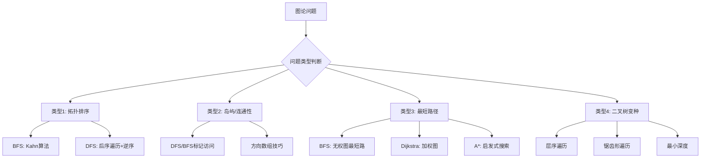

关联源素材：[[《labuladong的刷题笔记》-源素材]]

# 核心观点

**BFS（广度优先搜索）和 DFS（深度优先搜索）是图论算法的两大基石**，也是解决树、矩阵、网格等结构化问题的核心工具。**BFS 的本质是「层级遍历 + 队列」**，天然适合求最短路径（无权图）和层级相关问题；**DFS 的本质是「递归/栈 + 回溯」**，适合路径记录、拓扑排序、连通性判断等需要深入探索的问题。掌握 **四大经典题型**（拓扑排序、岛屿/连通性、最短路径、二叉树 BFS/DFS 变种），配合 **方向数组技巧** 和 **BFS vs DFS 选择指南**，就能系统性地解决各类图论搜索问题。

# 解题思维框架（通用套路）

## BFS vs DFS 核心对比

| 特性 | BFS（广度优先） | DFS（深度优先） |
|------|----------------|----------------|
| **数据结构** | 队列（Queue） | 栈（Stack）/ 递归 |
| **遍历方式** | 层级遍历，一圈圈扩展 | 沿一条路走到底再回溯 |
| **空间复杂度** | O(w) w=最大宽度 | O(h) h=最大深度 |
| **时间复杂度** | O(V+E) | O(V+E) |
| **核心优势** | **最短路径**（无权图） | **路径记录**、**拓扑排序** |
| **适用场景** | 最短路径、层级遍历 | 连通性、环检测、拓扑排序 |

## BFS vs DFS 选择指南

```
🎯 选择 BFS 的场景：
   ✅ 求无权图的最短路径
   ✅ 层级遍历（如二叉树层序）
   ✅ 需要按距离/层次处理节点
   ✅ 迷宫问题、最少步数

🎯 选择 DFS 的场景：
   ✅ 需要记录具体路径
   ✅ 拓扑排序、环检测
   ✅ 连通分量判断
   ✅ 剪枝优化明显的问题
   ✅ 空间受限（DFS 通常更省空间）
```

## 图论问题的通用解题步骤



# 代码模板（Java 版）

## 模板 1: BFS 通用框架 ⭐⭐

```java
import java.util.*;

/**
 * BFS 通用框架
 * 适用于：无权图最短路径、层级遍历、迷宫问题等
 *
 * 时间复杂度：O(V + E) V=顶点数, E=边数
 * 空间复杂度：O(V)
 */
class BFSTemplate {

    /**
     * 图的 BFS 遍历
     * @param graph 邻接表表示的图
     * @param start 起始节点
     */
    public void bfs(Map<Integer, List<Integer>> graph, int start) {
        Queue<Integer> queue = new LinkedList<>();
        Set<Integer> visited = new HashSet<>();

        // 初始化：将起始节点加入队列
        queue.offer(start);
        visited.add(start);

        while (!queue.isEmpty()) {
            int size = queue.size();  // 当前层的节点数

            // 遍历当前层（可选：如果需要按层处理）
            for (int i = 0; i < size; i++) {
                int node = queue.poll();

                // 处理当前节点
                System.out.println("Visit: " + node);

                // 遍历所有邻居
                if (graph.containsKey(node)) {
                    for (int neighbor : graph.get(node)) {
                        if (!visited.contains(neighbor)) {
                            visited.add(neighbor);
                            queue.offer(neighbor);
                        }
                    }
                }
            }
        }
    }

    /**
     * BFS 求最短路径（返回步数）
     * @return 从 start 到 target 的最短路径长度，不存在返回 -1
     */
    public int shortestPath(Map<Integer, List<Integer>> graph, int start, int target) {
        Queue<int[]> queue = new LinkedList<>();  // [node, distance]
        Set<Integer> visited = new HashSet<>();

        queue.offer(new int[]{start, 0});
        visited.add(start);

        while (!queue.isEmpty()) {
            int[] current = queue.poll();
            int node = current[0];
            int dist = current[1];

            // 找到目标
            if (node == target) {
                return dist;
            }

            // 扩展邻居
            if (graph.containsKey(node)) {
                for (int neighbor : graph.get(node)) {
                    if (!visited.contains(neighbor)) {
                        visited.add(neighbor);
                        queue.offer(new int[]{neighbor, dist + 1});
                    }
                }
            }
        }

        return -1;  // 不可达
    }
}
```

## 模板 2: DFS 通用框架 ⭐⭐

```java
/**
 * DFS 通用框架（递归版）
 * 适用于：路径记录、拓扑排序、连通性判断等
 *
 * 时间复杂度：O(V + E)
 * 空间复杂度：O(V) 递归栈深度
 */
class DFSTemplate {

    /**
     * DFS 遍历
     * @param graph 邻接表表示的图
     * @param node  当前节点
     * @param visited 已访问集合
     */
    public void dfs(Map<Integer, List<Integer>> graph,
                   int node, Set<Integer> visited) {
        // 终止条件：已访问
        if (visited.contains(node)) {
            return;
        }

        // 标记已访问
        visited.add(node);

        // 处理当前节点
        System.out.println("Visit: " + node);

        // 递归访问所有邻居
        if (graph.containsKey(node)) {
            for (int neighbor : graph.get(node)) {
                dfs(graph, neighbor, visited);
            }
        }
    }

    /**
     * DFS 记录路径版本
     * @param path 当前路径
     */
    public void dfsWithPath(Map<Integer, List<Integer>> graph,
                           int node, Set<Integer> visited,
                           List<Integer> path) {
        if (visited.contains(node)) {
            return;
        }

        visited.add(node);
        path.add(node);

        // 可以在这里检查是否到达目标或满足条件
        // if (node == target) { result.add(new ArrayList<>(path)); }

        if (graph.containsKey(node)) {
            for (int neighbor : graph.get(node)) {
                dfsWithPath(graph, neighbor, visited, path);
            }
        }

        // 回溯：撤销选择
        path.remove(path.size() - 1);
    }
}
```

## 模板 3: 拓扑排序（Kahn 算法 - BFS）⭐⭐

```java
import java.util.*;

/**
 * 拓扑排序 - Kahn 算法（基于 BFS）
 * LeetCode 207. 课程表
 *
 * 思路：
 * 1. 计算每个节点的入度
 * 2. 将入度为 0 的节点入队
 * 3. 每次取出队首节点，将其邻居的入度 -1
 * 4. 如果邻居入度变为 0，入队
 * 5. 最终如果所有节点都处理完，说明可以拓扑排序
 *
 * 时间复杂度：O(V + E)
 * 空间复杂度：O(V + E)
 */
class Solution {
    public boolean canFinish(int numCourses, int[][] prerequisites) {
        // 构建邻接表和入度数组
        List<List<Integer>> graph = new ArrayList<>();
        int[] inDegree = new int[numCourses];

        for (int i = 0; i < numCourses; i++) {
            graph.add(new ArrayList<>());
        }

        // prerequisites[i] = [a, b] 表示 b -> a（先学b才能学a）
        for (int[] pre : prerequisites) {
            int course = pre[0];
            int prereq = pre[1];
            graph.get(prereq).add(course);  // prereq -> course
            inDegree[course]++;              // course 的入度 +1
        }

        // 将所有入度为 0 的节点入队
        Queue<Integer> queue = new LinkedList<>();
        for (int i = 0; i < numCourses; i++) {
            if (inDegree[i] == 0) {
                queue.offer(i);
            }
        }

        // BFS 拓扑排序
        int count = 0;  // 已处理的课程数
        while (!queue.isEmpty()) {
            int curr = queue.poll();
            count++;

            // 将当前节点的所有邻居入度 -1
            for (int next : graph.get(curr)) {
                inDegree[next]--;
                if (inDegree[next] == 0) {
                    queue.offer(next);
                }
            }
        }

        // 如果所有课程都能完成，说明没有环
        return count == numCourses;
    }
}
```

## 模板 4: 岛屿数量（DFS/BFS）⭐⭐

```java
/**
 * 岛屿数量
 * LeetCode 200
 * 给你一个由 '1'（陆地）和 '0'（水）组成的的二维网格，
 * 请你计算网格中岛屿的数量。
 *
 * 岛屿总是被水包围，并且每座岛屿只能由水平方向或
 * 竖直方向上相邻的陆地连接形成。
 *
 * 技巧：方向数组 + 标记访问
 */

class Solution {
    // 方向数组：上、右、下、左
    private static final int[][] DIRECTIONS = {{-1, 0}, {0, 1}, {1, 0}, {0, -1}};

    public int numIslands(char[][] grid) {
        if (grid == null || grid.length == 0) return 0;

        int m = grid.length;
        int n = grid[0].length;
        int count = 0;

        for (int i = 0; i < m; i++) {
            for (int j = 0; j < n; j++) {
                if (grid[i][j] == '1') {
                    count++;
                    // 使用 DFS 或 BFS 标记整个岛屿
                    dfs(grid, i, j, m, n);
                    // bfs(grid, i, j, m, n);  // 也可以用 BFS
                }
            }
        }

        return count;
    }

    /**
     * DFS 标记整个岛屿（将 '1' 改为 '0'）
     */
    private void dfs(char[][] grid, int i, int j, int m, int n) {
        // 边界检查
        if (i < 0 || i >= m || j < 0 || j >= n) return;
        // 已经是水或已访问
        if (grid[i][j] != '1') return;

        // 标记为已访问
        grid[i][j] = '0';

        // 向四个方向扩展
        for (int[] dir : DIRECTIONS) {
            dfs(grid, i + dir[0], j + dir[1], m, n);
        }
    }

    /**
     * BFS 标记整个岛屿
     */
    private void bfs(char[][] grid, int i, int j, int m, int n) {
        Queue<int[]> queue = new LinkedList<>();
        queue.offer(new int[]{i, j});
        grid[i][j] = '0';

        while (!queue.isEmpty()) {
            int[] curr = queue.poll();
            int x = curr[0], y = curr[1];

            for (int[] dir : DIRECTIONS) {
                int nx = x + dir[0];
                int ny = y + dir[1];

                if (nx >= 0 && nx < m && ny >= 0 && ny < n && grid[nx][ny] == '1') {
                    grid[nx][ny] = '0';
                    queue.offer(new int[]{nx, ny});
                }
            }
        }
    }
}
```

## 模板 5: 最大岛屿面积（DFS）⭐⭐

```java
/**
 * 最大岛屿面积
 * LeetCode 695
 * 给定一个包含了一些 0 和 1 的非空二维数组 grid 。
 * 一个岛屿是由一些相邻的 1 (代表土地) 组成的组合，
 * 这里的「相邻」要求两个 1 在水平或者竖直方向上相邻。
 * 你可以假设 grid 的四个边缘都被 0（代表水）包围着。
 * 找到给定的二维数组中最大的岛屿面积。（如果没有岛屿，则面积为 0。）
 */
class Solution {
    private static final int[][] DIRECTIONS = {{-1, 0}, {0, 1}, {1, 0}, {0, -1}};

    public int maxAreaOfIsland(int[][] grid) {
        if (grid == null || grid.length == 0) return 0;

        int m = grid.length;
        int n = grid[0].length;
        int maxArea = 0;

        for (int i = 0; i < m; i++) {
            for (int j = 0; j < n; j++) {
                if (grid[i][j] == 1) {
                    maxArea = Math.max(maxArea, dfs(grid, i, j, m, n));
                }
            }
        }

        return maxArea;
    }

    /**
     * DFS 计算并返回当前岛屿面积
     */
    private int dfs(int[][] grid, int i, int j, int m, int n) {
        if (i < 0 || i >= m || j < 0 || j >= n || grid[i][j] != 1) {
            return 0;
        }

        grid[i][j] = 0;  // 标记已访问
        int area = 1;

        for (int[] dir : DIRECTIONS) {
            area += dfs(grid, i + dir[0], j + dir[1], m, n);
        }

        return area;
    }
}
```

## 模板 6: 二叉树层序遍历（BFS）⭐

```java
import java.util.*;

/**
 * 二叉树的层序遍历
 * LeetCode 102
 * 给你一个二叉树，请你返回其按 层序遍历 得到的节点值。
 * （即逐层地，从左到右访问所有节点）。
 *
 * 时间复杂度：O(n)
 * 空间复杂度：O(n)
 */
class Solution {
    public List<List<Integer>> levelOrder(TreeNode root) {
        List<List<Integer>> result = new ArrayList<>();

        if (root == null) return result;

        Queue<TreeNode> queue = new LinkedList<>();
        queue.offer(root);

        while (!queue.isEmpty()) {
            int levelSize = queue.size();  // 当前层的节点数
            List<Integer> currentLevel = new ArrayList<>();

            for (int i = 0; i < levelSize; i++) {
                TreeNode node = queue.poll();
                currentLevel.add(node.val);

                // 将下一层节点加入队列
                if (node.left != null) {
                    queue.offer(node.left);
                }
                if (node.right != null) {
                    queue.offer(node.right);
                }
            }

            result.add(currentLevel);
        }

        return result;
    }
}
```

# 代码模板（Python 版）

## 模板 1: BFS 通用框架

```python
from collections import deque
from typing import List, Set, Dict

class BFSTemplate:
    """
    BFS 通用框架
    适用于：无权图最短路径、层级遍历、迷宫问题等

    时间复杂度：O(V + E)
    空间复杂度：O(V)
    """

    def bfs(self, graph: Dict[int, List[int]], start: int):
        """图的 BFS 遍历"""
        queue = deque([start])
        visited = set([start])

        while queue:
            level_size = len(queue)  # 当前层的节点数

            # 遍历当前层（可选：按层处理）
            for _ in range(level_size):
                node = queue.popleft()

                # 处理当前节点
                print(f"Visit: {node}")

                # 遍历所有邻居
                for neighbor in graph.get(node, []):
                    if neighbor not in visited:
                        visited.add(neighbor)
                        queue.append(neighbor)

    def shortest_path(self, graph: Dict[int, List[int]],
                     start: int, target: int) -> int:
        """
        BFS 求最短路径
        返回从 start 到 target 的最短路径长度，不存在返回 -1
        """
        queue = deque([(start, 0)])  # (node, distance)
        visited = set([start])

        while queue:
            node, dist = queue.popleft()

            # 找到目标
            if node == target:
                return dist

            # 扩展邻居
            for neighbor in graph.get(node, []):
                if neighbor not in visited:
                    visited.add(neighbor)
                    queue.append((neighbor, dist + 1))

        return -1  # 不可达
```

## 模板 2: DFS 通用框架

```python
from typing import List, Set, Dict

class DFSTemplate:
    """
    DFS 通用框架（递归版）
    适用于：路径记录、拓扑排序、连通性判断等

    时间复杂度：O(V + E)
    空间复杂度：O(V) 递归栈深度
    """

    def dfs(self, graph: Dict[int, List[int]],
           node: int, visited: Set[int]):
        """DFS 遍历"""
        # 终止条件：已访问
        if node in visited:
            return

        # 标记已访问
        visited.add(node)

        # 处理当前节点
        print(f"Visit: {node}")

        # 递归访问所有邻居
        for neighbor in graph.get(node, []):
            self.dfs(graph, neighbor, visited)

    def dfs_with_path(self, graph: Dict[int, List[int]],
                     node: int, visited: Set[int],
                     path: List[int]):
        """DFS 记录路径版本"""
        if node in visited:
            return

        visited.add(node)
        path.append(node)

        # 可以在这里检查是否到达目标或满足条件
        # if node == target: result.append(path.copy())

        for neighbor in graph.get(node, []):
            self.dfs_with_path(graph, neighbor, visited, path)

        # 回溯：撤销选择
        path.pop()
```

## 模板 3: 拓扑排序（Kahn 算法）

```python
from collections import deque
from typing import List

class Solution:
    """
    拓扑排序 - Kahn 算法（基于 BFS）
    LeetCode 207. 课程表

    时间复杂度：O(V + E)
    空间复杂度：O(V + E)
    """

    def canFinish(self, numCourses: int, prerequisites: List[List[int]]) -> bool:
        from collections import defaultdict

        # 构建邻接表和入度数组
        graph = defaultdict(list)
        in_degree = [0] * numCourses

        # prerequisites[i] = [a, b] 表示 b -> a
        for course, prereq in prerequisites:
            graph[prereq].append(course)
            in_degree[course] += 1

        # 将所有入度为 0 的节点入队
        queue = deque([i for i in range(numCourses) if in_degree[i] == 0])
        count = 0  # 已处理的课程数

        # BFS 拓扑排序
        while queue:
            curr = queue.popleft()
            count += 1

            # 将当前节点的所有邻居入度 -1
            for next_course in graph[curr]:
                in_degree[next_course] -= 1
                if in_degree[next_course] == 0:
                    queue.append(next_course)

        # 如果所有课程都能完成，说明没有环
        return count == numCourses
```

## 模板 4: 岛屿数量（DFS/BFS）

```python
from typing import List
from collections import deque

class Solution:
    """
    岛屿数量 - LeetCode 200
    技巧：方向数组 + 标记访问
    """

    # 方向数组：上、右、下、左
    DIRECTIONS = [(-1, 0), (0, 1), (1, 0), (0, -1)]

    def numIslands(self, grid: List[List[str]]) -> int:
        if not grid or not grid[0]:
            return 0

        m, n = len(grid), len(grid[0])
        count = 0

        for i in range(m):
            for j in range(n):
                if grid[i][j] == '1':
                    count += 1
                    self._dfs(grid, i, j, m, n)
                    # self._bfs(grid, i, j, m, n)  # 也可以用 BFS

        return count

    def _dfs(self, grid: List[List[str]], i: int, j: int, m: int, n: int):
        """DFS 标记整个岛屿"""
        if i < 0 or i >= m or j < 0 or j >= n or grid[i][j] != '1':
            return

        grid[i][j] = '0'  # 标记已访问

        for di, dj in self.DIRECTIONS:
            self._dfs(grid, i + di, j + dj, m, n)

    def _bfs(self, grid: List[List[str]], i: int, j: int, m: int, n: int):
        """BFS 标记整个岛屿"""
        queue = deque([(i, j)])
        grid[i][j] = '0'

        while queue:
            x, y = queue.popleft()

            for di, dj in self.DIRECTIONS:
                nx, ny = x + di, y + dj
                if 0 <= nx < m and 0 <= ny < n and grid[nx][ny] == '1':
                    grid[nx][ny] = '0'
                    queue.append((nx, ny))
```

## 模板 5: 最大岛屿面积（DFS）

```python
from typing import List

class Solution:
    """
    最大岛屿面积 - LeetCode 695
    """

    DIRECTIONS = [(-1, 0), (0, 1), (1, 0), (0, -1)]

    def maxAreaOfIsland(self, grid: List[List[int]]) -> int:
        if not grid or not grid[0]:
            return 0

        m, n = len(grid), len(grid[0])
        max_area = 0

        for i in range(m):
            for j in range(n):
                if grid[i][j] == 1:
                    max_area = max(max_area, self._dfs(grid, i, j, m, n))

        return max_area

    def _dfs(self, grid: List[List[int]], i: int, j: int, m: int, n: int) -> int:
        """DFS 计算并返回当前岛屿面积"""
        if i < 0 or i >= m or j < 0 or j >= n or grid[i][j] != 1:
            return 0

        grid[i][j] = 0  # 标记已访问
        area = 1

        for di, dj in self.DIRECTIONS:
            area += self._dfs(grid, i + di, j + dj, m, n)

        return area
```

## 模板 6: 二叉树层序遍历（BFS）

```python
from collections import deque
from typing import List, Optional

class TreeNode:
    def __init__(self, val=0, left=None, right=None):
        self.val = val
        self.left = left
        self.right = right

class Solution:
    """
    二叉树的层序遍历 - LeetCode 102

    时间复杂度：O(n)
    空间复杂度：O(n)
    """

    def levelOrder(self, root: Optional[TreeNode]) -> List[List[int]]:
        if not root:
            return []

        result = []
        queue = deque([root])

        while queue:
            level_size = len(queue)  # 当前层的节点数
            current_level = []

            for _ in range(level_size):
                node = queue.popleft()
                current_level.append(node.val)

                # 将下一层节点加入队列
                if node.left:
                    queue.append(node.left)
                if node.right:
                    queue.append(node.right)

            result.append(current_level)

        return result
```

# 经典例题解析

## 例题 1: [LeetCode 1091] 二进制矩阵中的最短路径 ⭐⭐

- **难度**：Medium
- **题意简述**：给定一个 `n × n` 的二进制矩阵 `grid` ，返回**从左上角单元格 `(0, 0)` 到右下角单元格 `(n-1, n-1)` 的最短清晰路径的长度**。如果不存在这样的路径，返回 `-1` 。清晰路径是从左上角单元格出发，每次可以往 **8 个方向**（上、下、左、右、对角线）移动到另一个单元格，且经过的所有单元格的值都是 `0` 。
- **示例**：
  - 输入：`grid = [[0,1],[1,0]]` → 输出：`2`
- **思路分析**：
  - 这是 **8 方向 BFS 最短路径问题**
  - 使用 BFS 天然适合求最短路径（每一步权重相同）
  - 注意：可以往 **8 个方向** 移动（包括对角线）

- **代码实现**：

```java
class Solution {
    // 8 个方向（包括对角线）
    private static final int[][] DIRECTIONS = {
        {-1, -1}, {-1, 0}, {-1, 1},
        {0, -1},          {0, 1},
        {1, -1},  {1, 0}, {1, 1}
    };

    public int shortestPathBinaryMatrix(int[][] grid) {
        int n = grid.length;

        // 特殊情况：起点或终点是障碍物
        if (grid[0][0] == 1 || grid[n-1][n-1] == 1) {
            return -1;
        }

        // 只有一个格子的情况
        if (n == 1) {
            return 1;
        }

        Queue<int[]> queue = new LinkedList<>();
        boolean[][] visited = new boolean[n][n];

        // 起点：(0, 0)，初始路径长度为 1
        queue.offer(new int[]{0, 0, 1});
        visited[0][0] = true;

        while (!queue.isEmpty()) {
            int[] curr = queue.poll();
            int row = curr[0];
            int col = curr[1];
            int dist = curr[2];

            // 8 方向扩展
            for (int[] dir : DIRECTIONS) {
                int newRow = row + dir[0];
                int newCol = col + dir[1];

                // 到达终点
                if (newRow == n - 1 && newCol == n - 1) {
                    return dist + 1;
                }

                // 边界检查和可行性检查
                if (newRow >= 0 && newRow < n &&
                    newCol >= 0 && newCol < n &&
                    !visited[newRow][newCol] &&
                    grid[newRow][newCol] == 0) {

                    visited[newRow][newCol] = true;
                    queue.offer(new int[]{newRow, newCol, dist + 1});
                }
            }
        }

        return -1;  // 无法到达
    }
}
```

```python
from collections import deque
from typing import List

class Solution:
    """
    二进制矩阵中的最短路径 - LeetCode 1091
    8 方向 BFS
    """

    # 8 个方向（包括对角线）
    DIRECTIONS = [
        (-1, -1), (-1, 0), (-1, 1),
        (0, -1),           (0, 1),
        (1, -1),  (1, 0),  (1, 1)
    ]

    def shortestPathBinaryMatrix(self, grid: List[List[int]]) -> int:
        n = len(grid)

        # 特殊情况：起点或终点是障碍物
        if grid[0][0] == 1 or grid[n-1][n-1] == 1:
            return -1

        # 只有一个格子的情况
        if n == 1:
            return 1

        queue = deque([(0, 0, 1)])  # (row, col, distance)
        visited = [[False] * n for _ in range(n)]
        visited[0][0] = True

        while queue:
            row, col, dist = queue.popleft()

            # 8 方向扩展
            for dr, dc in self.DIRECTIONS:
                new_row, new_col = row + dr, col + dc

                # 到达终点
                if new_row == n - 1 and new_col == n - 1:
                    return dist + 1

                # 边界检查和可行性检查
                if (0 <= new_row < n and 0 <= new_col < n and
                    not visited[new_row][new_col] and
                    grid[new_row][new_col] == 0):

                    visited[new_row][new_col] = True
                    queue.append((new_row, new_col, dist + 1))

        return -1  # 无法到达
```


## 例题 3: [LeetCode 111] 二叉树的最小深度 ⭐

- **难度**：Easy
- **题意简述**：给定一个二叉树，找出其**最小深度**。最小深度是从根节点到最近叶子节点的最短路径上的节点数量。**说明**：叶子节点是指没有子节点的节点。
- **示例**：
  - 输入：`root = [3,9,20,null,null,15,7]` → 输出：`2`
- **思路分析**：
  - **BFS 天然适合**：第一个遇到的叶子节点就是最小深度
  - 比 DFS 更优：DFS 需要遍历所有节点找最小值，BFS 可以提前终止

- **代码实现**：

```java
import java.util.*;

class Solution {
    public int minDepth(TreeNode root) {
        if (root == null) return 0;

        Queue<TreeNode> queue = new LinkedList<>();
        queue.offer(root);
        int depth = 1;

        while (!queue.isEmpty()) {
            int size = queue.size();

            for (int i = 0; i < size; i++) {
                TreeNode node = queue.poll();

                // 找到叶子节点，直接返回当前深度
                if (node.left == null && node.right == null) {
                    return depth;
                }

                if (node.left != null) queue.offer(node.left);
                if (node.right != null) queue.offer(node.right);
            }

            depth++;  // 进入下一层
        }

        return depth;
    }
}
```

```python
from collections import deque
from typing import Optional

class Solution:
    """
    二叉树的最小深度 - LeetCode 111
    BFS 提前终止优势
    """

    def minDepth(self, root: Optional[TreeNode]) -> int:
        if not root:
            return 0

        queue = deque([root])
        depth = 1

        while queue:
            level_size = len(queue)

            for _ in range(level_size):
                node = queue.popleft()

                # 找到叶子节点，直接返回当前深度
                if not node.left and not node.right:
                    return depth

                if node.left:
                    queue.append(node.left)
                if node.right:
                    queue.append(node.right)

            depth += 1  # 进入下一层

        return depth
```

# 常见陷阱与易错点

## ❌ 易错点 1：BFS 忘记标记已访问导致死循环

- **问题描述**：在将节点加入队列时忘记标记已访问
- **后果**：同一个节点可能被多次加入队列，导致无限循环
- **正确做法**：
  ```java
  // ✅ 正确：加入队列时就标记
  if (!visited.contains(neighbor)) {
      visited.add(neighbor);
      queue.offer(neighbor);  // 先标记再加入队列！
  }
  ```

## ❌ 易错点 2：DFS 递归深度过大导致栈溢出

- **问题描述**：对于大规模图/网格，递归层数太深
- **影响语言**：Python 默认递归深度约 1000
- **解决方案**：
  ```python
  # 方案 1：临时增大递归深度（不推荐用于生产环境）
  import sys
  sys.setrecursionlimit(10000)

  # 方案 2：改用迭代式 DFS（使用显式栈）
  def dfs_iterative(start):
      stack = [start]
      visited = set()
      while stack:
          node = stack.pop()
          if node not in visited:
              visited.add(node)
              # 处理节点...
              for neighbor in reversed(graph[node]):  # 反转保证顺序一致
                  if neighbor not in visited:
                      stack.append(neighbor)
  ```

## ❌ 易错点 3：方向数组定义错误或遗漏方向

- **常见错误**：
  - 只考虑上下左右 4 个方向，但题目要求 8 个方向（含对角线）
  - 方向数组坐标写反（如把 `{dx, dy}` 写成 `{dy, dx}`）
- **最佳实践**：
  ```java
  // 4 方向（上下左右）
  int[][] dirs4 = {{-1, 0}, {0, 1}, {1, 0}, {0, -1}};

  // 8 方向（含对角线）
  int[][] dirs8 = {
      {-1, -1}, {-1, 0}, {-1, 1},
      {0, -1},           {0, 1},
      {1, -1},  {1, 0},  {1, 1}
  };
  ```

## ❌ 易错点 4：拓扑排序中入度计算错误

- **问题描述**：搞清楚边的方向和入度的关系
- **关键理解**：
  ```
  prerequisites = [[a, b]]  表示 "要学 a，必须先学 b"
  即边是：b → a（b 是前置课程）
  所以：a 的入度应该 +1（因为有一条边指向 a）
  ```

## ❌ 易错点 5：BFS 层级遍历时混淆当前层和下一层

- **问题描述**：在层序遍历中没有正确区分当前层和下一层
- **正确做法**：
  ```java
  while (!queue.isEmpty()) {
      int size = queue.size();  // ★ 关键：先记录当前层大小！

      for (int i = 0; i < size; i++) {  // 只处理当前层的节点
          TreeNode node = queue.poll();
          // ... 处理当前节点 ...

          // 将子节点加入队列（这些属于下一层）
          if (node.left != null) queue.offer(node.left);
          if (node.right != null) queue.offer(node.right);
      }
  }
  ```

## ✅ 最佳实践 1：根据问题特征选择 BFS 还是 DFS

| 问题特征 | 推荐算法 | 原因 |
|---------|---------|------|
| 求**最短路径**（无权图） | **BFS** | 第一时间找到的就是最短的 |
| 按**层次**处理 | **BFS** | 天然按层级遍历 |
| 需要**记录路径** | **DFS** | 递归天然维护路径状态 |
| **拓扑排序** | **DFS/BFS** | 都可以实现 |
| **连通分量** | **DFS/BFS** | 都可以实现 |
| **空间敏感** | **DFS** | 通常比 BFS 更省空间 |

## ✅ 最佳实践 2：网格/矩阵问题的通用模式

```java
// 网格问题的标准模板
void gridDFS/MazeBFS(int[][] grid, int i, int j) {
    // 1. 边界检查
    if (i < 0 || i >= m || j < 0 || j >= n) return;

    // 2. 可行性检查（是否已访问、是否是障碍物等）
    if (grid[i][j] != targetValue) return;

    // 3. 标记已访问（原地修改或使用 visited 数组）
    grid[i][j] = MARKED_VALUE;  // 或 visited[i][j] = true;

    // 4. 向四个（或八个）方向扩展
    for (int[] dir : DIRECTIONS) {
        gridDFS(grid, i + dir[0], j + dir[1]);
    }
}
```

## ✅ 最佳实践 3：BFS 求最短路径的模式

```java
// BFS 最短路径通用模板
int bfsShortestPath(start, target) {
    Queue<Node> queue = new LinkedList<>();
    Set<Node> visited = new HashSet<>();

    queue.offer(new Node(start, 0));  // (节点, 距离)
    visited.add(start);

    while (!queue.isEmpty()) {
        Node curr = queue.poll();

        if (curr.node == target) {
            return curr.distance;  // ★ 第一个找到的一定是最短的！
        }

        for (Node neighbor : getNeighbors(curr.node)) {
            if (!visited.contains(neighbor)) {
                visited.add(neighbor);
                queue.offer(new Node(neighbor, curr.distance + 1));
            }
        }
    }

    return -1;  // 不可达
}
```

# 实战练习建议

## 📖 入门题（掌握基本框架）

- [ ] [LeetCode 102](https://leetcode.cn/problems/binary-tree-level-order-traversal/) 二叉树的层序遍历 ⭐
- [ ] [LeetCode 200](https://leetcode.cn/problems/number-of-islands/) 岛屿数量 ⭐⭐
- [ ] [LeetCode 111](https://leetcode.cn/problems/minimum-depth-of-binary-tree/) 二叉树的最小深度 ⭐
- [ ] [LeetCode 207](https://leetcode.cn/problems/course-schedule/) 课程表 ⭐⭐

## 🚀 进阶题（熟练运用技巧）

- [ ] [LeetCode 103](https://leetcode.cn/problems/binary-tree-zigzag-level-order-traversal/) 锯齿形层序遍历 ⭐⭐
- [ ] [LeetCode 1091](https://leetcode.cn/problems/shortest-path-in-binary-matrix/) 二进制矩阵中的最短路径 ⭐⭐
- [ ] [LeetCode 695](https://leetcode.cn/problems/max-area-of-island/) 最大岛屿面积 ⭐⭐
- [ ] [LeetCode 210](https://leetcode.cn/problems/course-schedule-ii/) 课程表 II ⭐⭐
- [ ] [LeetCode 417](https://leetcode.cn/problems/pacific-atlantic-water-flow/) 太平洋大西洋水流问题 ⭐⭐⭐
- [ ] [LeetCode 127](https://leetcode.cn/problems/word-ladder/) 单词接龙 ⭐⭐⭐

## ⭐ 挑战题（综合运用能力）

- [ ] [LeetCode 126](https://leetcode.cn/problems/word-ladder-ii/) 单词接龙 II ⭐⭐⭐
- [ ] [LeetCode 407](https://leetcode.cn/problems/trapping-rain-water-ii/) 接雨水 II ⭐⭐⭐
- [ ] [LeetCode 847](https://leetcode.cn/problems/shortest-path-visiting-all-nodes/) 访问所有节点的最短路径 ⭐⭐⭐
- [ ] [LeetCode 1293](https://leetcode.cn/problems/shortest-path-in-a-grid-with-obstacles-elimination/) 网格中的最短路径 ⭐⭐⭐

# 关联阅读

- [[P07_回溯算法专题]] - 回溯算法（DFS 的应用场景之一）
- [[P05_二叉树递归专题]] - 二叉树递归（DFS 遍历相关）
- [[P09_并查集与高级结构]] - 并查集（另一种解决连通性问题的方式）
- [[P00_刷题方法论与思维框架]] - 刷题方法论总览
- [[T08_图论基础]] - 图论理论基础
