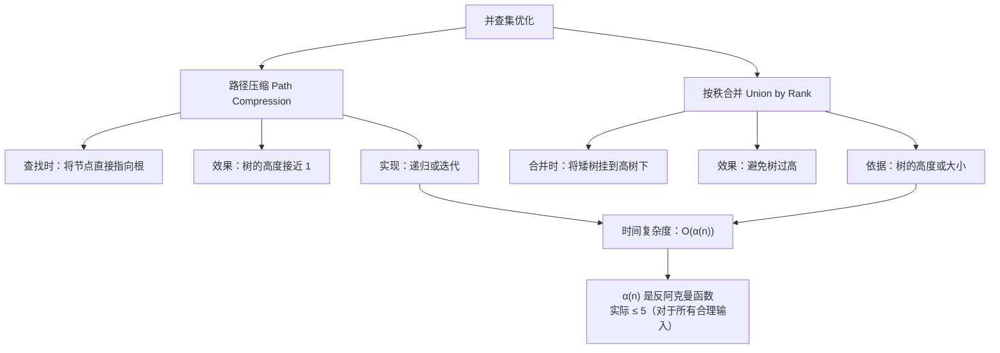
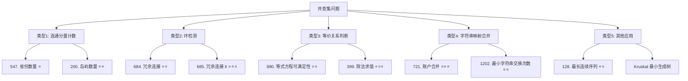

关联源素材：[[《labuladong的刷题笔记》-源素材]]

# 核心观点

**并查集（Union-Find）是一种专门处理「动态连通性」问题的数据结构**，核心思想是**用树形结构维护元素的分组关系**，支持 **O(α(n))** 近似常数时间的**合并（Union）** 和**查找（Find）** 操作。通过 **路径压缩** 和 **按秩合并** 两大优化技巧，并查集能够高效解决连通分量、环检测、最小生成树等问题。掌握并查集的 **标准模板** 和 **五大经典应用场景**（省份数量、冗余连接、等式方程、账户合并、最长连续序列），配合对 **线段树/树状数组** 的基本了解，就能应对面试中绝大多数高级数据结构问题。

# 解题思维框架（通用套路）

## 并查集的核心思想

```
💡 并查集的本质：
   将 n 个元素划分为若干个不相交的集合
   支持两种操作：
   1. Find(x): 查询 x 所属的集合（找到根节点）
   2. Union(x, y): 合并 x 和 y 所在的集合

🎯 适用场景：
   • 动态连通性问题（元素之间的连接关系会变化）
   • 需要频繁查询两个元素是否在同一组
   • 图的连通分量、环检测
   • 最小生成树（Kruskal 算法）
```

## 并查集的两大优化技巧



## 经典题型分类



# 代码模板（Java 版）

## 模板 1: 并查集标准模板（路径压缩 + 按秩合并）⭐⭐⭐

```java
/**
 * 并查集（Union-Find）标准模板
 * 包含路径压缩和按秩合并两种优化
 *
 * 时间复杂度：
 * - Find: O(α(n)) 反阿克曼函数，近似 O(1)
 * - Union: O(α(n))
 * - Connected: O(α(n))
 *
 * 空间复杂度：O(n)
 */
class UnionFind {
    private int[] parent;  // parent[i] 表示 i 的父节点
    private int[] rank;    // rank[i] 表示以 i 为根的树的秩（高度上界）

    /**
     * 初始化：每个节点自成一个集合
     * @param n 元素个数（0 到 n-1）
     */
    public UnionFind(int n) {
        parent = new int[n];
        rank = new int[n];
        for (int i = 0; i < n; i++) {
            parent[i] = i;  // 初始时每个节点的父节点是自己
            rank[i] = 1;    // 初始秩为 1
        }
    }

    /**
     * 查找 x 的根节点（带路径压缩）
     * 路径压缩：将查找路径上的所有节点直接指向根
     */
    public int find(int x) {
        if (parent[x] != x) {
            parent[x] = find(parent[x]);  // 递归路径压缩
        }
        return parent[x];

        // 迭代版路径压缩（可选）：
        /*
        int root = x;
        while (parent[root] != root) {
            root = parent[root];
        }
        // 路径压缩：将 x 到根路径上的所有节点直接指向根
        while (parent[x] != root) {
            int next = parent[x];
            parent[x] = root;
            x = next;
        }
        return root;
        */
    }

    /**
     * 合并 x 和 y 所在的集合
     * @return 如果 x 和 y 本来就在同一集合，返回 false；否则返回 true
     */
    public boolean union(int x, int y) {
        int rootX = find(x);
        int rootY = find(y);

        if (rootX == rootY) {
            return false;  // 已经在同一集合
        }

        // 按秩合并：将秩小的树挂到秩大的树下
        if (rank[rootX] < rank[rootY]) {
            parent[rootX] = rootY;
        } else if (rank[rootX] > rank[rootY]) {
            parent[rootY] = rootX;
        } else {
            // 秩相等，任意挂一个，并将被挂的树的秩 +1
            parent[rootY] = rootX;
            rank[rootX]++;
        }

        return true;
    }

    /**
     * 判断 x 和 y 是否在同一集合
     */
    public boolean connected(int x, int y) {
        return find(x) == find(y);
    }

    /**
     * 获取集合数量（需要额外维护 count 变量）
     */
    public int getCount() {
        int count = 0;
        for (int i = 0; i < parent.length; i++) {
            if (parent[i] == i) {  // 只有根节点的 parent 是自己
                count++;
            }
        }
        return count;
    }
}
```

## 模板 2: LeetCode 547 - 省份数量 ⭐

```java
/**
 * 省份数量
 * LeetCode 547
 *
 * 有 n 个城市，其中一些彼此相连，另一些没有相连。
 * 如果城市 a 与城市 b 直接相连，且城市 b 与城市 c 直接相连，
 * 那么城市 a 与城市 c 间接相连。
 * 省份是一组直接或间接相连的城市组，
 * 「不」包含其他没有相连的城市。
 * 给你一个 n x n 的矩阵 isConnected ，
 * 其中 isConnected[i][j] = 1 表示第 i 个城市和第 j 个城市直接相连，
 * 而 isConnected[i][j] = 0 表示二者不直接相连。
 * 返回矩阵中省份的数量。
 *
 * 思路：使用并查集，最终统计集合数量
 */
class Solution {
    public int findCircleNum(int[][] isConnected) {
        int n = isConnected.length;
        UnionFind uf = new UnionFind(n);

        // 遍历上三角矩阵（对称矩阵只需遍历一半）
        for (int i = 0; i < n; i++) {
            for (int j = i + 1; j < n; j++) {
                if (isConnected[i][j] == 1) {
                    uf.union(i, j);  // 相连的城市合并
                }
            }
        }

        return uf.getCount();  // 返回集合数量（省份数量）
    }
}
```

## 模板 3: LeetCode 684 - 冗余连接 ⭐⭐

```java
import java.util.*;

/**
 * 冗余连接
 * LeetCode 684
 *
 * 树可以用无向无环图表示。在本问题中，树指的是连通且无环的无向图。
 * 输入图由一个包含了 n 个节点（节点值从 1 到 n）的列表和
 * 一个边列表组成（由边列表表示）。
 * 边列表中的每条边 [a, b] 表示图中节点 a 和节点 b 之间存在一条边。
 * 这条边可以是一条属于树的边，也可以是一条附加的边（冗余边）。
 * 返回一条可以删去的边，使得结果图是一个有 n 个节点的树。
 * 如果有多个答案，则返回二维数组中最后出现的边。
 *
 * 思路：遍历每条边，如果边的两个端点已经在同一集合，
 *       则这条边就是冗余边（会导致环）
 */
class Solution {
    public int[] findRedundantConnection(int[][] edges) {
        int n = edges.length;
        UnionFind uf = new UnionFind(n + 1);  // 节点编号从 1 开始

        for (int[] edge : edges) {
            int u = edge[0], v = edge[1];

            // 如果 u 和 v 已经连通，说明这条边会造成环
            if (!uf.union(u, v)) {
                return edge;  // 找到冗余边
            }
        }

        return new int[]{};  // 理论上不会执行到这里
    }
}
```

## 模板 4: LeetCode 990 - 等式方程的可满足性 ⭐⭐

```java
import java.util.*;

/**
 * 等式方程的可满足性
 * LeetCode 990
 *
 * 给定一个由表示变量之间关系的字符串方程组成的数组，
 * 每个字符串方程 equations[i] 的长度为 4，
 * 并采用以下两种形式之一："a==b" 或 "a!=b"。
 * 在这里，a 和 b 是小写字母（不一定不同），表示单字母变量名。
 * 只有当可以将整数分配给变量名，以便满足所有给定的方程时才返回 true，
 * 否则返回 false。
 *
 * 思路：
 * 1. 先处理所有 "==" 关系，将相等的变量合并到一个集合
 * 2. 再检查所有 "!=" 关系，如果有矛盾的则不可满足
 */
class Solution {
    public boolean equationsPossible(String[] equations) {
        // 26 个小写字母
        UnionFind uf = new UnionFind(26);

        // 第一步：处理所有相等关系
        for (String eq : equations) {
            if (eq.charAt(1) == '=') {
                char a = eq.charAt(0);
                char b = eq.charAt(3);
                uf.union(a - 'a', b - 'a');
            }
        }

        // 第二步：检查所有不等关系是否矛盾
        for (String eq : equations) {
            if (eq.charAt(1) == '!') {
                char a = eq.charAt(0);
                char b = eq.charAt(3);
                // 如果 a 和 b 在同一集合，但要求不相等，矛盾！
                if (uf.connected(a - 'a', b - 'a')) {
                    return false;
                }
            }
        }

        return true;
    }
}
```

## 模板 5: LeetCode 128 - 最长连续序列（并查集解法）⭐⭐

```java
import java.util.*;

/**
 * 最长连续序列（并查集解法）
 * LeetCode 128
 *
 * 给定一个未排序的整数数组 nums ，找出数字连续的最长序列的长度。
 * 请你设计并实现时间复杂度为 O(n) 的算法解决此问题。
 *
 * 注意：这道题最常用的解法是 HashSet + 哈希表，
 * 这里展示并查集解法作为练习
 */
class Solution {
    public int longestConsecutive(int[] nums) {
        if (nums.length == 0) return 0;

        // 使用 HashMap 映射数值到索引
        Map<Integer, Integer> numToIndex = new HashMap<>();
        int n = nums.length;
        for (int i = 0; i < n; i++) {
            numToIndex.put(nums[i], i);  // 如果有重复，后面的会覆盖前面的
        }

        UnionFind uf = new UnionFind(n);

        // 对每个数，尝试与相邻的数合并
        for (int num : nums) {
            if (numToIndex.containsKey(num + 1)) {
                uf.union(numToIndex.get(num), numToIndex.get(num + 1));
            }
        }

        // 统计每个集合的大小，找最大值
        Map<Integer, Integer> sizeMap = new HashMap<>();
        int maxSize = 1;

        for (int i = 0; i < n; i++) {
            int root = uf.find(i);
            sizeMap.put(root, sizeMap.getOrDefault(root, 0) + 1);
            maxSize = Math.max(maxSize, sizeMap.get(root));
        }

        return maxSize;
    }
}
```

# 代码模板（Python 版）

## 模板 1: 并查集标准模板（路径压缩 + 按秩合并）

```python
from typing import List

class UnionFind:
    """
    并查集（Union-Find）标准模板
    包含路径压缩和按秩合并两种优化

    时间复杂度：
    - Find: O(α(n)) 反阿克曼函数，近似 O(1)
    - Union: O(α(n))
    - Connected: O(α(n))

    空间复杂度：O(n)
    """

    def __init__(self, n: int):
        """
        初始化：每个节点自成一个集合
        :param n: 元素个数（0 到 n-1）
        """
        self.parent = list(range(n))
        self.rank = [1] * n  # 秩（高度上界）

    def find(self, x: int) -> int:
        """
        查找 x 的根节点（带路径压缩）
        路径压缩：将查找路径上的所有节点直接指向根
        """
        if self.parent[x] != x:
            self.parent[x] = self.find(self.parent[x])  # 递归路径压缩
        return self.parent[x]

        # 迭代版路径压缩（可选）：
        # root = x
        # while self.parent[root] != root:
        #     root = self.parent[root]
        # # 路径压缩
        # while self.parent[x] != root:
        #     self.parent[x], x = root, self.parent[x]
        # return root

    def union(self, x: int, y: int) -> bool:
        """
        合并 x 和 y 所在的集合
        :return: 如果 x 和 y 本来就在同一集合，返回 False；否则返回 True
        """
        root_x = self.find(x)
        root_y = self.find(y)

        if root_x == root_y:
            return False  # 已经在同一集合

        # 按秩合并：将秩小的树挂到秩大的树下
        if self.rank[root_x] < self.rank[root_y]:
            self.parent[root_x] = root_y
        elif self.rank[root_x] > self.rank[root_y]:
            self.parent[root_y] = root_x
        else:
            # 秩相等，任意挂一个，并将被挂的树的秩 +1
            self.parent[root_y] = root_x
            self.rank[root_x] += 1

        return True

    def connected(self, x: int, y: int) -> bool:
        """判断 x 和 y 是否在同一集合"""
        return self.find(x) == self.find(y)

    def get_count(self) -> int:
        """获取集合数量"""
        return sum(1 for i in range(len(self.parent)) if self.parent[i] == i)
```

## 模板 2: LeetCode 547 - 省份数量

```python
from typing import List

class Solution:
    """
    省份数量 - LeetCode 547
    使用并查集求解
    """

    def findCircleNum(self, isConnected: List[List[int]]) -> int:
        n = len(isConnected)
        uf = UnionFind(n)

        # 遍历上三角矩阵（对称矩阵只需遍历一半）
        for i in range(n):
            for j in range(i + 1, n):
                if isConnected[i][j] == 1:
                    uf.union(i, j)

        return uf.get_count()
```

## 模板 3: LeetCode 684 - 冗余连接

```python
from typing import List

class Solution:
    """
    冗余连接 - LeetCode 684
    使用并查集检测环
    """

    def findRedundantConnection(self, edges: List[List[int]]) -> List[int]:
        n = len(edges)
        uf = UnionFind(n + 1)  # 节点编号从 1 开始

        for u, v in edges:
            # 如果 u 和 v 已经连通，说明这条边会造成环
            if not uf.union(u, v):
                return [u, v]

        return []
```

## 模板 4: LeetCode 990 - 等式方程的可满足性

```python
from typing import List

class Solution:
    """
    等式方程的可满足性 - LeetCode 990
    先处理等式关系，再检查不等式是否矛盾
    """

    def equationsPossible(self, equations: List[str]) -> bool:
        # 26 个小写字母
        uf = UnionFind(26)

        # 第一步：处理所有相等关系
        for eq in equations:
            if eq[1] == '=':
                a = ord(eq[0]) - ord('a')
                b = ord(eq[3]) - ord('a')
                uf.union(a, b)

        # 第二步：检查所有不等关系是否矛盾
        for eq in equations:
            if eq[1] == '!':
                a = ord(eq[0]) - ord('a')
                b = ord(eq[3]) - ord('a')
                # 如果 a 和 b 在同一集合，但要求不相等，矛盾！
                if uf.connected(a, b):
                    return False

        return True
```

# 经典例题解析

## 例题 1: [LeetCode 721] 账户合并 ⭐⭐⭐

- **难度**：Medium
- **题意简述**：给定一个列表 `accounts`，每个元素 `accounts[i]` 是一个字符串列表，其中第一个元素是名称 (`name`)，其余元素是邮箱地址。如果两个账户有共同的邮箱地址，则这两个账户可能属于同一个人。请将这些账户合并，返回合并后的账户列表。
- **示例**：
  - 输入：`accounts = [["John","johnsmith@mail.com","john_newyork@mail.com"],["John","johnsmith@mail.com","john00@mail.com"],["Mary","mary@mail.com"]]`
  - 输出：`[["John","john00@mail.com","john_newyork@mail.com","johnsmith@mail.com"],["Mary","mary@mail.com"]]`
- **思路分析**：
  - 这是**带字符串映射的并查集问题**
  - 每个**邮箱**对应一个节点
  - 同一账户中的所有邮箱应该合并到一起
  - 最后按根节点分组，收集结果

- **代码实现**：

```java
import java.util.*;

class Solution {
    public List<List<String>> accountsMerge(List<List<String>> accounts) {
        // 将邮箱映射到唯一 ID
        Map<String, Integer> emailToId = new HashMap<>();
        Map<String, String> emailToName = new HashMap<>();
        int id = 0;

        // 第一步：为每个邮箱分配唯一 ID
        for (List<String> account : accounts) {
            String name = account.get(0);
            for (int i = 1; i < account.size(); i++) {
                String email = account.get(i);
                if (!emailToId.containsKey(email)) {
                    emailToId.put(email, id++);
                    emailToName.put(email, name);
                }
            }
        }

        // 第二步：使用并查集合并同一账户的邮箱
        UnionFind uf = new UnionFind(id);
        for (List<String> account : accounts) {
            int firstEmailId = emailToId.get(account.get(1));
            for (int i = 2; i < account.size(); i++) {
                int currentEmailId = emailToId.get(account.get(i));
                uf.union(firstEmailId, currentEmailId);
            }
        }

        // 第三步：按根节点分组
        Map<Integer, List<String>> rootToEmails = new HashMap<>();
        for (String email : emailToId.keySet()) {
            int root = uf.find(emailToId.get(email));
            rootToEmails.computeIfAbsent(root, k -> new ArrayList<>()).add(email);
        }

        // 第四步：构建结果
        List<List<String>> result = new ArrayList<>();
        for (List<String> emails : rootToEmails.values()) {
            Collections.sort(emails);  // 排序邮箱
            List<String> account = new ArrayList<>();
            account.add(emailToName.get(emails.get(0)));  // 添加名字
            account.addAll(emails);
            result.add(account);
        }

        return result;
    }
}
```

```python
from typing import List
from collections import defaultdict

class Solution:
    """
    账户合并 - LeetCode 721
    带字符串映射的并查集问题
    """

    def accountsMerge(self, accounts: List[List[str]]) -> List[List[str]]:
        # 将邮箱映射到唯一 ID
        email_to_id = {}
        email_to_name = {}
        id_counter = 0

        # 第一步：为每个邮箱分配唯一 ID
        for account in accounts:
            name = account[0]
            for email in account[1:]:
                if email not in email_to_id:
                    email_to_id[email] = id_counter
                    email_to_name[email] = name
                    id_counter += 1

        # 第二步：使用并查集合并同一账户的邮箱
        uf = UnionFind(id_counter)
        for account in accounts:
            first_email_id = email_to_id[account[1]]
            for email in account[2:]:
                current_email_id = email_to_id[email]
                uf.union(first_email_id, current_email_id)

        # 第三步：按根节点分组
        root_to_emails = defaultdict(list)
        for email in email_to_id:
            root = uf.find(email_to_id[email])
            root_to_emails[root].append(email)

        # 第四步：构建结果
        result = []
        for emails in root_to_emails.values():
            emails.sort()  # 排序邮箱
            account = [email_to_name[emails[0]]]  # 添加名字
            account.extend(emails)
            result.append(account)

        return result
```

---

## 例题 2: [LeetCode 128] 最长连续序列（最优解法）⭐⭐

- **难度**：Medium
- **题意简述**：（见模板 5 说明）
- **思路分析**：
  - **最优解法是 HashSet**（不是并查集）
  - 但这里展示并查集思想的应用
  - **HashSet 解法**：对每个数 `num`，如果 `num-1` 不存在，则以 `num` 为起点向右扩展

- **代码实现（HashSet 最优解）**：

```java
import java.util.*;

class Solution {
    /**
     * 最优解法：HashSet + 序列扩展
     * 时间复杂度：O(n)
     * 空间复杂度：O(n)
     */
    public int longestConsecutive(int[] nums) {
        Set<Integer> set = new HashSet<>();
        for (int num : nums) {
            set.add(num);
        }

        int maxLen = 0;

        for (int num : set) {
            // 只从序列的起点开始扩展
            // 如果 num-1 存在，说明 num 不是起点，跳过
            if (!set.contains(num - 1)) {
                int currNum = num;
                int currLen = 1;

                // 向右扩展
                while (set.contains(currNum + 1)) {
                    currNum++;
                    currLen++;
                }

                maxLen = Math.max(maxLen, currLen);
            }
        }

        return maxLen;
    }
}
```

```python
from typing import List

class Solution:
    """
    最长连续序列 - LeetCode 128
    最优解法：HashSet + 序列扩展
    时间复杂度：O(n)
    空间复杂度：O(n)
    """

    def longestConsecutive(self, nums: List[int]) -> int:
        num_set = set(nums)
        max_len = 0

        for num in num_set:
            # 只从序列的起点开始扩展
            if num - 1 not in num_set:
                curr_num = num
                curr_len = 1

                # 向右扩展
                while curr_num + 1 in num_set:
                    curr_num += 1
                    curr_len += 1

                max_len = max(max_len, curr_len)

        return max_len
```

# 进阶：线段树与树状数组简介

## 线段树（Segment Tree）

```
💡 线段树是什么？
   一种二叉树结构，用于维护区间信息
   每个节点代表一个区间，存储该区间的聚合值（如求和、最大值、最小值）

🎯 适用场景：
   • 区间查询（区间和、区间最大值、区间最小值）
   • 单点更新 / 区间更新
   • 频繁的区间操作

⚡ 时间复杂度：
   • 构建：O(n)
   • 查询：O(log n)
   • 更新：O(log n)

📚 经典题目：
   • LeetCode 307. 区域和检索 - 数组可修改
   • LeetCode 303. 区域和检索 - 数组不可变（前缀和即可）
```

## 树状数组（Binary Indexed Tree / Fenwick Tree）

```
💡 树状数组是什么？
   一种更简洁的数据结构，支持前缀和查询和单点更新
   比线段树代码更短，但功能相对有限

🎯 适用场景：
   • 前缀和查询
   • 单点更新
   • 求逆序对

⚡ 时间复杂度：
   • 构建：O(n log n) 或 O(n)
   • 查询前缀和：O(log n)
   • 单点更新：O(log n)

📚 经典题目：
   • LeetCode 315. 计算右侧小于当前元素的个数
   • LeetCode 493. 翻转对
```

# 常见陷阱与易错点

## ❌ 易错点 1：忘记路径压缩导致超时

- **问题描述**：只实现了基本的 find，没有路径压缩
- **后果**：在最坏情况下（链状结构），find 操作退化为 O(n)
- **正确做法**：
  ```java
  // ✅ 必须加路径压缩！
  public int find(int x) {
      if (parent[x] != x) {
          parent[x] = find(parent[x]);  // 路径压缩
      }
      return parent[x];
  }
  ```

## ❌ 易错点 2：按秩合并参数搞反

- **问题描述**：合并时把大树挂到小树下
- **后果**：树的高度增加，降低效率
- **正确做法**：
  ```java
  // ✅ 小树挂到大树下
  if (rank[rootX] > rank[rootY]) {
      parent[rootY] = rootX;  // Y 挂到 X 下
  } else {
      parent[rootX] = rootY;  // X 挂到 Y 下
      if (rank[rootX] == rank[rootY]) {
          rank[rootY]++;  // 秩相等时，被挂的树秩 +1
      }
  }
  ```

## ❌ 易错点 3：节点编号从 1 开始但数组从 0 开始

- **问题描述**：题目中节点编号从 1 到 n，但初始化时用了 n 而不是 n+1
- **典型错误**：
  ```java
  // ❌ 错误！节点 1~n 会越界
  UnionFind uf = new UnionFind(n);

  // ✅ 正确！预留位置 0（不用即可）
  UnionFind uf = new UnionFind(n + 1);
  ```

## ❌ 易错点 4：等式方程问题中先检查不等式

- **问题描述**：在 LeetCode 990 中，先处理不等式再处理等式
- **后果**：逻辑错误，可能导致错误判断
- **正确顺序**：
  ```
  1. 先处理所有 "==" 关系（合并集合）
  2. 再处理所有 "!=" 关系（检查矛盾）
  ```

## ❌ 易错点 5：冗余连接问题中返回第一条而不是最后一条

- **问题描述**：LeetCode 684 要求返回最后出现的冗余边
- **关键理解**：按顺序遍历，遇到的第一条形成环的边就是答案
- **因为**：后面的边不会影响前面已经形成的环

## ✅ 最佳实践 1：并查集解题三步走

```
Step 1: 初始化并查集
   → 确定 n（元素个数）
   → 创建 UnionFind(n) 或 UnionFind(n+1)

Step 2: 遍历数据进行 union 操作
   → 根据题目条件决定何时 union
   → 可能需要先做映射（如字符串 → 整数 ID）

Step 3: 统计结果
   → 统计集合数量（getCount）
   → 或检查某些条件（connected）
   → 或按根节点分组
```

## ✅ 最佳实践 2：字符串映射问题的通用模式

```java
// 当节点是字符串时的通用模式
Map<String, Integer> strToInt = new HashMap<>();
int id = 0;

// 分配 ID
for (String str : allStrings) {
    if (!strToInt.containsKey(str)) {
        strToInt.put(str, id++);
    }
}

// 使用并查集
UnionFind uf = new UnionFind(id);
for (...) {
    uf.union(strToInt.get(str1), strToInt.get(str2));
}

// 按根节点分组
Map<Integer, List<String>> groups = new HashMap<>();
for (String str : strToInt.keySet()) {
    int root = uf.find(strToInt.get(str));
    groups.computeIfAbsent(root, k -> new ArrayList<>()).add(str);
}
```

## ✅ 最佳实践 3：选择合适的数据结构

| 问题类型 | 推荐数据结构 | 原因 |
|---------|------------|------|
| 动态连通性 | **并查集** | 天然适合 |
| 静态连通分量 | DFS/BFS | 更直观 |
| 区间查询/更新 | **线段树/树状数组** | 专用数据结构 |
| 最长连续序列 | **HashSet** | 更简单高效 |
| 带权等式 | **带权并查集/DFS** | 需要额外维护权重 |

# 实战练习建议

## 📖 入门题（掌握基本框架）

- [ ] [LeetCode 547](https://leetcode.cn/problems/number-of-provinces/) 省份数量 ⭐
- [ ] [LeetCode 684](https://leetcode.cn/problems/redundant-connection/) 冗余连接 ⭐⭐
- [ ] [LeetCode 990](https://leetcode.cn/problems/satisfiability-of-equations/) 等式方程的可满足性 ⭐⭐
- [ ] [LeetCode 128](https://leetcode.cn/problems/longest-consecutive-sequence/) 最长连续序列 ⭐⭐

## 🚀 进阶题（熟练运用技巧）

- [ ] [LeetCode 721](https://leetcode.cn/problems/accounts-merge/) 账户合并 ⭐⭐⭐
- [ ] [LeetCode 685](https://leetcode.cn/problems/redundant-connection-ii/) 冗余连接 II ⭐⭐⭐
- [ ] [LeetCode 399](https://leetcode.cn/problems/evaluate-division/) 除法求值 ⭐⭐⭐
- [ ] [LeetCode 1202](https://leetcode.cn/problems/smallest-string-with-swaps/) 交换字符串中的元素 ⭐⭐
- [ ] [LeetCode 924](https://leetcode.cn/problems/minimize-malware-spread/) 尽量减少恶意软件的传播 ⭐⭐
- [ ] [LeetCode 1319](https://leetcode.cn/problems/number-of-operations-to-make-network-connected/) 连通网络的操作次数 ⭐⭐

## ⭐ 挑战题（综合运用能力）

- [ ] [LeetCode 1579](https://leetcode.cn/problems/remove-max-number-of-edges-to-keep-graph-fully-traversable/) 保证图可完全遍历 ⭐⭐⭐
- [ ] [LeetCode 1101](https://leetcode.cn/problems/the-earliest-moment-when-everyone-become-friends/) 彼此熟识的最早时间 ⭐⭐⭐
- [ ] [LeetCode 959](https://leetcode.cn/problems/regions-cut-by-slashes/) 由斜杠划分区域 ⭐⭐⭐
- [ ] [LeetCode 778](https://leetcode.cn/problems/swim-in-rising-water/) 水位上升的泳池中游泳 ⭐⭐⭐（可用并查集或 BFS/Dijkstra）

# 关联阅读

- [[P08_BFS_DFS专题]] - BFS/DFS（另一种解决连通性问题的方式）
- [[P07_回溯算法专题]] - 回溯算法（DFS 应用）
- [[T08_图论基础]] - 图论理论基础
- [[P00_刷题方法论与思维框架]] - 刷题方法论总览
