关联源素材：[[《面试题资料》-源素材]]

# 核心观点

**Java 面试的核心在于「理解底层原理 + 掌握高频知识点 + 能结合项目经验」**。Java 面试题通常围绕 **五大核心模块**展开：**集合框架**（HashMap 原理、ConcurrentHashMap 实现）、**JVM 与内存管理**（内存模型、垃圾回收算法、类加载机制）、**多线程与并发**（synchronized vs Lock、线程池原理、CAS 与 AQS）、**Spring 框架**（IOC/AOP、Bean 生命周期）和 **设计模式**（单例、工厂、策略等）。掌握 **15 道精选高频题** 的完整答案要点，配合 **代码示例和对比表格**，就能系统性地应对 Java 后端面试中的绝大多数问题。

# 知识体系总览

```mermaid
graph TD
    A[Java 面试知识体系] --> B[集合框架 25%]
    A --> C[JVM与内存管理 25%]
    A --> D[多线程与并发 25%]
    A --> E[Spring 框架 15%]
    A --> F[设计模式 10%]

    B --> B1[ArrayList vs LinkedList]
    B --> B2[HashMap 实现原理]
    B --> B3[ConcurrentHashMap]
    B --> B4[HashSet vs TreeSet]
    B --> B5[Queue/Deque 实现]

    C --> C1[JVM 内存模型]
    C --> C2[垃圾回收算法]
    C --> C3[GC Roots 可达性分析]
    C --> C4[类加载机制]
    C --> C5[JVM 调优参数]

    D --> D1[Thread vs Runnable vs Callable]
    D --> D2[synchronized vs ReentrantLock]
    D --> D3[线程池 ThreadPoolExecutor]
    D --> D4[CAS 操作与 Atomic 类]
    D --> D5[AQS 原理简介]
    D --> D6[volatile 关键字]

    E --> E1[IOC 与 DI]
    E --> E2[AOP 原理]
    E --> E3[Bean 生命周期]
    E --> E4[事务管理]

    F --> F1[单例模式]
    F --> F2[工厂模式]
    F --> F3[策略模式]
    F --> F4[观察者模式]
```



# 一、集合框架（高频 25%）

## 1. ArrayList vs LinkedList vs Vector

### 对比总结

| 特性 | ArrayList | LinkedList | Vector |
|------|-----------|------------|--------|
| **底层结构** | 动态数组 | 双向链表 | 动态数组 |
| **随机访问** | O(1) ⭐⭐⭐ | O(n) | O(1) ⭐⭐⭐ |
| **头部插入/删除** | O(n) | O(1) ⭐⭐⭐ | O(n) |
| **尾部插入/删除** | 均摊 O(1) ⭐⭐ | O(1) ⭐⭐⭐ | O(1) |
| **中间插入/删除** | O(n) | O(n)（需先定位） | O(n) |
| **内存开销** | 较小 | 较大（每个节点额外指针） | 较小 |
| **线程安全** | ❌ 不安全 | ❌ 不安全 | ✅ 安全（synchronized） |
| **扩容机制** | 1.5 倍 | 无需扩容 | 2 倍 |
| **适用场景** | 随机访问多 | 插入删除多 | 需要线程安全 |

### 使用建议

```java
// 场景 1：需要频繁随机访问 → ArrayList
List<String> list = new ArrayList<>();
list.get(1000);  // O(1)

// 场景 2：需要在头部/中间频繁插入删除 → LinkedList
Deque<String> deque = new LinkedList<>();
deque.addFirst("first");   // O(1)
deque.addLast("last");     // O(1)
deque.removeFirst();       // O(1)

// 场景 3：需要线程安全的 List → Vector 或 Collections.synchronizedList()
List<String> syncList = Collections.synchronizedList(new ArrayList<>());

// ⚠️ 注意：Vector 已过时，推荐使用 CopyOnWriteArrayList（读多写少场景）
List<String> cowList = new CopyOnWriteArrayList<>();
```

## 2. HashMap 的实现原理

### 底层结构（JDK 1.8+）

```
💡 HashMap 核心结构：
   数组 + 链表 + 红黑树

┌─────────────────────────────────────────────┐
│  Entry[] table (数组)                        │
│  ┌───┬───┬───┬───┬───┬───┬───┬───┐        │
│  │ 0 │ 1 │ 2 │ 3 │ 4 │ 5 │...│16│        │
│  └─┬─┴─┬─┴───┴───┴─┬─┴───┴───┴─┬─┘        │
│    │   │          │         │              │
│    ▼   ▼          ▼         ▼              │
│ [k,v]→[k,v]    null     [k,v]             │
│                    │        │               │
│                    ▼        ▼               │
│                [红黑树]   [k,v]→null       │
└─────────────────────────────────────────────┘

关键参数：
- capacity: 数组默认初始容量 16
- loadFactor: 负载因子 0.75
- threshold = capacity * loadFactor (扩容阈值)
- TREEIFY_THRESHOLD = 8 (链表转红黑树的阈值)
- UNTREEIFY_THRESHOLD = 6 (红黑树转回链表的阈值)
```

### 核心流程

```java
/**
 * put() 方法核心流程：
 *
 * 1. 计算 key 的 hash 值：(h = key.hashCode()) ^ (h >>> 16)
 *    （高位参与运算，减少碰撞）
 *
 * 2. 计算桶索引：index = (n - 1) & hash
 *    （n 必须是 2 的幂次方，等价于 hash % n）
 *
 * 3. 判断桶状态：
 *    a. 桶为空 → 直接插入
 *    b. 桶不为空且 key 相同 → 覆盖 value
 *    c. 桶是红黑树节点 → 红黑树插入
 *    d. 桇是链表 → 链表遍历插入/追加
 *
 * 4. 扩容判断：
 *    size > threshold → resize()
 *    扩容为原来的 2 倍，重新计算所有元素的位置
 */

// 为什么容量必须是 2 的幂？
// (n - 1) & hash 比 hash % n 更快（位运算取模）
// 且能保证分布更均匀
```

### 哈希碰撞解决

```java
/**
 * JDK 1.7: 数组 + 链表（头插法）
 * 问题：
 *   1. 多线程下可能形成循环链表（死循环）
 *   2. 头插法导致逆序
 *
 * JDK 1.8: 数组 + 链表 + 红黑树（尾插法）
 * 改进：
 *   1. 尾插法避免逆序
 *   2. 链表长度 >= 8 时转为红黑树（查询 O(log n)）
 *   3. 红黑树节点 <= 6 时转回链表
 */
```

## 3. ConcurrentHashMap（重点！）

### JDK 1.7 vs JDK 1.8 实现

| 特性 | JDK 1.7 | JDK 1.8 |
|------|---------|---------|
| **数据结构** | Segment 数段锁 | Node 数组 + CAS + synchronized |
| **锁粒度** | Segment 级别（粗粒度） | 桶级别（细粒度） |
| **并发度** | 默认 16 个 Segment | 理论上支持任意并发 |
| **实现方式** | ReentrantLock | CAS + synchronized |
| **空桶处理** | 允许空值 | **不允许空值或空键** |

### JDK 1.8 核心实现

```java
/**
 * ConcurrentHashMap (JDK 1.8) 核心要点：
 *
 * 1. 数据结构：Node<K,V>[] table
 *    - 大部分情况类似 HashMap
 *    - 关键操作使用 CAS + synchronized
 *
 * 2. put() 流程：
 *    a. 计算 hash，定位桶
 *    b. 桶为空 → CAS 无锁插入
 *    c. 桶正在扩容 → 帮助扩容（helpTransfer）
 *    d. 桶有数据 → synchronized 锁住当前桶的头节点
 *       - 链表：遍历插入
 *       - 红黑树：树形插入
 *
 * 3. size() 统计：
 *    - 使用 CounterCell[] 分散计数
 *    - baseCount + 所有 CounterCell 的值
 *    - 无需全局锁
 *
 * 4. 为什么不允许空值？
 *    - 二义性问题：get(key) 返回 null 无法区分
 *      "key不存在" 还是 "key存在但value是null"
 */

// 使用示例
ConcurrentHashMap<String, Integer> map = new ConcurrentHashMap<>();

// 原子操作
map.putIfAbsent("key", 1);           // 不存在才放入
map.computeIfAbsent("key", k -> 0);  // 不存在时计算并放入
map.merge("key", 1, Integer::sum);   // 合并值

// 遍历（弱一致性）
map.forEach((k, v) -> System.out.println(k + "=" + v));
```

## 4. HashSet vs TreeSet vs LinkedHashSet

| 特性 | HashSet | TreeSet | LinkedHashSet |
|------|---------|---------|---------------|
| **底层** | HashMap | TreeMap | LinkedHashMap |
| **顺序** | 无序 | 自然排序/自定义排序 | 插入顺序 |
| **null 值** | ✅ 允许 | ❌ 不允许 | ✅ 允许 |
| **性能** | O(1) | O(log n) | O(1) |
| **线程安全** | ❌ | ❌ | ❌ |
| **使用场景** | 快速查找 | 需要排序 | 保持插入顺序 |

## 5. Queue/Deque 实现类对比

```java
/**
 * Queue（队列）：FIFO 先进先出
 * Deque（双端队列）：两端都可进出
 */
Queue<Integer> queue;

// 1. ArrayDeque（推荐用于普通队列/栈）
queue = new ArrayDeque<>();  // 循环数组，无容量限制

// 2. LinkedList（可同时用作 List 和 Queue）
queue = new LinkedList<>();  // 双向链表

// 3. PriorityQueue（优先队列/堆）
queue = new PriorityQueue<>();  // 最小堆（自然排序）
queue = new PriorityQueue<>(Comparator.reverseOrder());  // 最大堆

// 4. ConcurrentLinkedQueue（线程安全无界队列）
queue = new ConcurrentLinkedQueue<>();

// 5. ArrayBlockingQueue（线程安全有界阻塞队列）
BlockingQueue<Integer> bq = new ArrayBlockingQueue<>(100);
bq.put(element);   // 队列满时阻塞
bq.take();         // 队列空时阻塞
```

# 二、JVM 与内存管理（高频 25%）

## 1. JVM 内存模型

```
┌─────────────────────────────────────────────────────────┐
│                       JVM 内存结构                       │
├─────────────────────────────────────────────────────────┤
│                                                         │
│  ┌─────────────────────────────────────────────────┐   │
│  │                  线程共享区域                     │   │
│  │  ┌─────────────┐ ┌──────────────┐              │   │
│  │  │    堆 Heap   │ │  方法区 Method │             │   │
│  │  │  (对象实例)  │ │  Area/MetaSpace│            │   │
│  │  │             │ │ (类信息、常量池)│            │   │
│  │  │  新生代 Old  │ │              │             │   │
│  │  │  Eden/S0/S1 │ │              │             │   │
│  │  └─────────────┘ └──────────────┘              │   │
│  └─────────────────────────────────────────────────┘   │
│                                                         │
│  ┌──────────┐ ┌──────────┐ ┌──────────────────┐       │
│  │程序计数器 │ │虚拟机栈   │ │ 本地方法栈       │       │
│  │PC Register│ │ VM Stack │ │ Native Method    │       │
│  │(线程私有) │ │(线程私有) │ │ Stack (线程私有) │       │
│  └──────────┘ └──────────┘ └──────────────────┘       │
│                                                         │
└─────────────────────────────────────────────────────────┘

关键区域说明：

1. 堆（Heap）- 最大区域
   - 存放对象实例（几乎所有对象都在这里分配）
   - GC 主要管理的区域
   - 可通过 -Xms -Xmx 设置大小

2. 方法区（Method Area / MetaSpace）
   - 存储类信息、常量池、静态变量
   - JDK 1.8 及之后叫 Metaspace（使用本地内存）
   - 可通过 -XX:MetaspaceSize 设置

3. 虚拟机栈（VM Stack）
   - 每个方法调用创建一个栈帧
   - 存储：局部变量表、操作数栈、动态链接、返回地址
   - StackOverflowError: 栈深度超限
   - OutOfMemoryError: 栈扩展失败

4. 程序计数器（PC Register）
   - 当前线程执行的字节码行号指示器
   - 唯一不会 OOM 的区域
```

## 2. 垃圾回收算法

### 四种基本算法

```java
/**
 * 1. 标记-清除算法（Mark-Sweep）
 *    过程：标记所有存活对象 → 清除未标记对象
 *    优点：简单
 *    缺点：产生内存碎片
 *
 * 2. 复制算法（Copying）
 *    过程：将存活对象复制到另一块内存
 *    优点：无碎片、简单高效
 *    缺点：浪费一半空间（实际使用 Eden:S0:S1 = 8:1:1）
 *    适用：新生代
 *
 * 3. 标记-整理算法（Mark-Compact）
 *    过程：标记存活 → 将存活对象向一端移动
 *    优点：无碎片
 *    缺点：移动对象成本高
 *    适用：老年代
 *
 * 4. 分代收集算法（Generational Collection）
 *    思想：不同生命周期对象采用不同算法
 *    - 新生代（短命对象）：复制算法
 *    - 老年代（长命对象）：标记-清除/标记-整理
 */
```

### 常见垃圾收集器

| 收集器 | 类型 | 适用区域 | 算法 | 特点 |
|--------|------|----------|------|------|
| Serial | 串行 | 新生代 | 复制 | 单线程，STW 时间长 |
| Parallel New | 并行 | 新生代 | 复制 | 多线程，吞吐量优先 |
| Parallel Scavenge | 并行 | 新生代 | 复制 | 吞吐量可控 |
| CMS | 并发 | 老年代 | 标记-清除 | 低停顿（已废弃） |
| G1 | 并行+并发 | 全堆 | Region + 复制/整理 | 可预测停顿（推荐） |
| ZGC | 并发 | 全堆 | 染色指针 | <10ms 停顿（JDK 15+ 生产可用） |

## 3. GC Roots 可达性分析

```
💡 GC Roots（垃圾收集根对象）：
   从这些对象开始，向下搜索，不可达的对象就是垃圾。

📍 可作为 GC Roots 的对象：
   1. 虚拟机栈中引用的对象（局部变量）
   2. 方法区中静态属性引用的对象
   3. 方法区中常量引用的对象（如字符串常量池）
   4. 本地方法栈中 JNI 引用的对象
   5. 同步锁持有的对象
   6. JVM 内部引用（Class 对象、异常对象等）

🔄 对象的最终状态：
   - 可达 → 存活
   - 不可达 → 可被回收（还需判断是否重写 finalize()）
```

## 4. 类加载机制（双亲委派模型）

### 类加载过程

```
加载(.class文件→二进制字节流) → 验证(格式/语义/符号引用) → 
准备(静态变量赋默认值) → 解析(符号引用→直接引用) → 
初始化(静态变量赋初值+静态代码块) → 使用 → 卸载
```

### 双亲委派模型

```
                    Bootstrap ClassLoader
                    (启动类加载器 - C++实现)
                           ↑
                          委托
                           │
                   Extension ClassLoader
                   (扩展类加载器 - Java实现)
                           ↑
                          委托
                           │
                   Application ClassLoader
                   (应用程序类加载器 - Java实现)
                           ↑
                          委托
                           │
                   Custom ClassLoader
                   (自定义类加载器)

💡 双亲委派原则：
   1. 一个类收到加载请求，先委托给父加载器
   2. 父加载器无法完成，子加载器才尝试加载
   
✅ 优势：
   • 避免重复加载
   • 保证核心类库安全（如防止自定义 java.lang.String）
   
❌ 如何打破双亲委派？
   • SPI 机制（如 JDBC DriverManager）
   • Tomcat 类加载机制（Web 应用隔离）
   • OSGi 模块化
```

## 5. JVM 调优参数简介

```bash
# 堆内存设置
-Xms512m        # 初始堆大小
-Xmx1024m       # 最大堆大小
-Xmn256m        # 新生代大小
-XX:MetaspaceSize=128m  # 元空间初始大小

# 垃圾收集器选择
-XX:+UseG1GC              # 使用 G1 收集器（推荐）
-XX:+UseZGC               # 使用 ZGC（JDK 15+）
-XX:+UseParallelGC        # 使用并行收集器

# GC 日志
-Xlog:gc*                  # JDK 9+ 统一日志
-XX:+PrintGCDetails        # 打印 GC 详情（旧版）
-XX:+PrintGCDateStamps     # 打印 GC 时间戳

# OOM 相关
-XX:+HeapDumpOnOutOfMemoryError  # OOM 时导出堆转储
-XX:HeapDumpPath=/tmp/dump.hprof # 堆转储路径

# 性能调优
-XX:MaxGCPauseMillis=200  # G1 最大 GC 停顿目标（ms）
-XX:InitiatingHeapOccupancyPercent=45  # G1 触发并发标记的堆占用比
```

# 三、多线程与并发（高频 25%）

## 1. Thread vs Runnable vs Callable

```java
// 方式 1: 继承 Thread 类
public class MyThread extends Thread {
    @Override
    public void run() {
        System.out.println("Thread running");
    }
}
new MyThread().start();

// 方式 2: 实现 Runnable 接口（推荐）
public class MyRunnable implements Runnable {
    @Override
    public void run() {
        System.out.println("Runnable running");
    }
}
new Thread(new MyRunnable()).start();

// 方式 3: 实现 Callable 接口（可以返回结果 + 抛异常）
public class MyCallable implements Callable<String> {
    @Override
    public String call() throws Exception {
        return "Callable result";
    }
}
ExecutorService executor = Executors.newFixedThreadPool(1);
Future<String> future = executor.submit(new MyCallable());
String result = future.get();  // 阻塞获取结果

/**
 * 三者区别：
 * Thread: 继承方式，单继承局限，不能返回结果
 * Runnable: 接口方式，灵活，不能返回结果
 * Callable: 接口方式，可以返回 Future<T>，可以抛异常
 */
```

## 2. synchronized vs ReentrantLock vs volatile

### 对比总结

| 特性 | synchronized | ReentrantLock | volatile |
|------|-------------|----------------|----------|
| **类型** | 关键字/内置锁 | API/显式锁 | 关键字/轻量级同步 |
| **获取释放** | 自动（代码块结束） | 手动 lock()/unlock() | N/A |
| **公平性** | 非公平 | 可选公平/非公平 | N/A |
| **可中断** | ❌ | ✅ lockInterruptibly() | N/A |
| **尝试锁** | ❌ | ✅ tryLock() | N/A |
| **条件变量** | 单一（wait/notify） | 多个 Condition | N/A |
| **可见性** | ✅ | ✅ | ✅ |
| **原子性** | ✅ | ✅ | ❌ |
| **性能** | JDK 6后优化好 | 略高开销 | 极低 |

### 使用示例

```java
// ===== synchronized 用法 =====
// 1. 同步方法
public synchronized void method() { ... }

// 2. 同步代码块（推荐，范围更小）
public void method() {
    synchronized(this) { ... }        // 锁当前对象
    synchronized(MyClass.class) { }   // 锁类对象
    synchronized(lockObject) { }      // 锁指定对象
}

// ===== ReentrantLock 用法 =====
ReentrantLock lock = new ReentrantLock(true);  // true = 公平锁

try {
    lock.lock();
    // 临界区代码
} finally {
    lock.unlock();  // 必须在 finally 中释放！
}

// 条件变量
Condition notEmpty = lock.newCondition();
Condition notFull = lock.newCondition();

// ===== volatile 用法 =====
private volatile boolean flag = false;
// 保证可见性：一个线程修改，其他线程立即可见
// 但不保证原子性：flag++ 不是原子的！
```

## 3. 线程池（ThreadPoolExecutor 参数详解）

### 七大核心参数

```java
ThreadPoolExecutor executor = new ThreadPoolExecutor(
    int corePoolSize,        // ① 核心线程数（即使空闲也不销毁）
    int maximumPoolSize,     // ② 最大线程数（任务队列满后才创建非核心线程）
    long keepAliveTime,      // ③ 非核心线程空闲存活时间
    TimeUnit unit,           // ④ 时间单位
    BlockingQueue<Runnable> workQueue,  // ⑤ 任务队列
    ThreadFactory threadFactory,        // ⑥ 线程工厂（可命名线程）
    RejectedExecutionHandler handler    // ⑦ 拒绝策略
);

/**
 * 任务执行流程：
 *
 * 1. 线程数 < corePoolSize → 创建核心线程执行
 * 2. 线程数 ≥ corePoolSize → 任务放入队列等待
 * 3. 队列满 && 线程数 < maximumPoolSize → 创建非核心线程
 * 4. 队列满 && 线程数 ≥ maximumPoolSize → 执行拒绝策略
 *
 * 四种拒绝策略：
 * - AbortPolicy（默认）：抛出 RejectedExecutionException
 * - CallerRunsPolicy：由提交任务的线程自己执行
 * - DiscardPolicy：静默丢弃任务
 * - DiscardOldestPolicy：丢弃队列最老的任务，重新提交
 */
```

### 推荐创建方式

```java
// ❌ 不推荐：Executors 创建的线程池可能导致 OOM
ExecutorService fixed = Executors.newFixedThreadPool(10);  // 队列无界
ExecutorService cached = Executors.newCachedThreadPool();   // 最大线程数 Integer.MAX_VALUE

// ✅ 推荐：手动创建 ThreadPoolExecutor
ThreadPoolExecutor executor = new ThreadPoolExecutor(
    2,                              // 核心线程数（根据 CPU 核数）
    Runtime.getRuntime().availableProcessors(),  // 最大线程数
    60L,                            // 空闲线程存活时间
    TimeUnit.SECONDS,
    new LinkedBlockingQueue<>(1000), // 有界队列（防止 OOM）
    new ThreadFactoryBuilder().setNameFormat("my-pool-%d").build(),
    new ThreadPoolExecutor.CallerRunsPolicy()  // 拒绝策略
);
```

## 4. Atomic 类与 CAS 操作

### CAS 原理

```
💡 CAS (Compare And Swap)：比较并交换
   是一种乐观锁的实现方式
   
   操作过程：
   1. 读取当前值 V
   2. 计算新值 N
   3. CAS(V, expected, N): 如果 V == expected，则更新为 N；否则重试
   
   优势：
   - 无锁（不需要 synchronized）
   - 高并发下性能更好
   
   问题：
   - ABA 问题（V: A→B→A，看起来没变但其实变了）
     解决方案：AtomicStampedReference（版本号）
   - 自旋时间长消耗 CPU
   - 只能保证单个变量的原子性
```

### 常用 Atomic 类

```java
import java.util.concurrent.atomic.*;

// 基本类型
AtomicInteger count = new AtomicInteger(0);
count.incrementAndGet();     // ++i
count.getAndIncrement();     // i++
count.compareAndSet(0, 1);  // CAS: 如果是0则改为1

// 数组类型
AtomicIntegerArray array = new AtomicIntegerArray(10);
array.getAndSet(0, 100);     // 原子设置

// 引用类型
AtomicReference<User> userRef = new AtomicReference<>();
userRef.set(newUser);
userRef.compareAndSet(oldUser, newUser);  // CAS

// 字段更新器（原子更新对象的某个字段）
AtomicIntegerFieldUpdater<User> ageUpdater =
    AtomicIntegerFieldUpdater.newUpdater(User.class, "age");
ageUpdater.incrementAndGet(user);  // 原子自增 age 字段

// ABA 问题解决方案
AtomicStampedReference<Integer> stampedRef =
    new AtomicStampedReference<>(0, 0);  // 值 + 版本号
stampedRef.compareAndSet(0, 1, stamp, stamp + 1);  // 同时比较版本号
```

## 5. ThreadLocal 原理与应用

```java
/**
 * ThreadLocal: 线程局部变量
 * 为每个线程提供独立的变量副本，互不影响
 *
 * 原理：
 * - 每个 Thread 内部维护一个 ThreadLocalMap
 * - key 是 ThreadLocal 对象，value 是该线程的副本
 * - get() 时从当前线程的 Map 中取值
 */

// 基本用法
ThreadLocal<User> userContext = new ThreadLocal<>();

// 在请求开始时设置
userContext.set(currentUser);

// 在后续代码中使用（无需传参）
User user = userContext.get();

// 在请求结束时清理（防止内存泄漏！）
userContext.remove();

/**
 * ⚠️ 内存泄漏问题：
 * - ThreadLocalMap 的 key 是 WeakReference（会被 GC）
 * - 但 value 是强引用（不会自动回收）
 * - 如果线程长时间不结束（如线程池），value 会泄漏
 *
 * ✅ 解决方案：
 * - 必须在 finally 中调用 remove()
 * - 或者使用 try-finally 包裹
 */
try {
    userContext.set(value);
    // 业务逻辑...
} finally {
    userContext.remove();  // 必须！
}

/** 典型应用场景：
 * 1. 用户会话信息（Web 请求上下文）
 * 2. 数据库连接/事务（每个线程独立连接）
 * 3. SimpleDateFormat（线程安全）
 * 4. 请求链路追踪（TraceId）
 */
```

## 6. volatile 关键字的可见性与有序性保证

```
💡 volatile 三大特性：

1. 可见性（Visibility）
   - 对一个 volatile 变量的写，对其他线程立即可见
   - 实现：插入内存屏障（Memory Barrier）
   
2. 有序性（Ordering）
   - 禁止指令重排序（编译器和处理器层面）
   - 保证 volatile 之前的代码不会被重排到后面
   
3. 不保证原子性（Atomicity）⚠️
   - volatile i++ 不是原子的（读-改-写三步操作）
   - 原子性需要用 synchronized / Atomic 类

📍 内存语义（JMM）：
   写 volatile:
   1. 将工作内存刷新到主内存
   2. 在写操作前插入 StoreStore 屏障
   3. 在写操作后插入 StoreLoad 屏障
   
   读 volatile:
   1. 使本地缓存失效
   2. 在读操作后插入 LoadLoad 屏障
   3. 在读操作后插入 LoadStore 屏障

🎯 适用场景：
   - 状态标志位（boolean flag）
   - 单次发布（一次性安全发布对象）
   - 独立观察（volatile 变量之间无依赖）
   - 不适合：复合操作（如 i++）
```

## 7. AQS（AbstractQueuedSynchronizer）简介

```
💡 AQS 是什么？
   AbstractQueuedSynchronizer = 抽象队列同步器
   是 Java 并发包（J.U.C）的基础框架
   ReentrantLock、Semaphore、CountDownLatch、CyclicBarrier 都基于它

🏗️ 核心设计思想：
   1. state 变量（int 类型，volatile）
      - 表示资源状态（0 表示未锁定，>0 表示锁定次数）
      - 子类通过 getState/setState/compareAndSetState 访问
   
   2. CLH 队列（双向链表）
      - 等待获取资源的线程组成的队列
      - FIFO 先进先出
      
   3. 两种共享模式：
      - 独占模式（Exclusive）：ReentrantLock
      - 共享模式（Shared）：Semaphore、CountDownLatch

📊 工作流程：
   1. 线程尝试获取资源（tryAcquire/tryAcquireShared）
   2. 成功 → 直接返回
   3. 失败 → 包装成 Node 加入 CLH 队尾，阻塞（park）
   4. 前驱节点释放资源后唤醒后继节点（unpark）
   5. 后继节点重新尝试获取资源

🔑 核心模板方法（钩子方法，子类实现）：
   - tryAcquire(int): 独占式获取
   - tryRelease(int): 独占式释放
   - tryAcquireShared(int): 共享式获取
   - tryReleaseShared(int): 共享式释放
   - isHeldExclusively(): 是否被当前线程独占
```

# 四、Spring 框架（中等 15%）

## 1. IOC（控制反转）与 DI（依赖注入）

### 核心概念

```
💡 IOC (Inversion of Control) - 控制反转：
   传统：程序员手动创建和管理对象
   IOC：将控制权交给 Spring 容器，容器负责创建和组装对象
   
💡 DI (Dependency Injection) - 依赖注入：
   IOC 的实现方式之一
   容器在创建对象时，自动注入它所依赖的对象

📍 三种注入方式：
   1. 构造函数注入（推荐）
   2. Setter 注入
   3. 字段注入（@Autowired，不推荐 - 测试困难）

🔄 Bean 的作用域（Scope）：
   - singleton（默认）：单例，整个容器只有一个
   - prototype：原型，每次请求创建新的
   - request：每次 HTTP 请求一个（Web 环境）
   - session：每次 HTTP Session 一个（Web 环境）
```

### 示例代码

```java
// 1. 定义 Bean
@Component
public class UserService {
    private final UserRepository userRepository;

    // ✅ 推荐：构造函数注入
    @Autowired  // Spring 4.3+ 单构造函数可省略
    public UserService(UserRepository userRepository) {
        this.userRepository = userRepository;
    }
}

// 2. 配置类
@Configuration
@ComponentScan(basePackages = "com.example")
public class AppConfig {
    @Bean
    public DataSource dataSource() {
        return new HikariDataSource();
    }
}

// 3. 使用
ApplicationContext ctx = new AnnotationConfigApplicationContext(AppConfig.class);
UserService userService = ctx.getBean(UserService.class);
```

## 2. AOP（面向切面编程）原理

### 核心概念

```
💡 AOP (Aspect-Oriented Programming):
   将横切关注点（日志、事务、权限）从业务逻辑中分离出来

📍 核心术语：
   - Aspect（切面）：横切关注点的模块化
   - Join Point（连接点）：程序执行的某个特定位置（如方法调用）
   - Pointcut（切入点）：匹配连接点的表达式
   - Advice（通知）：切面在特定连接点执行的动作
   - Target Object（目标对象）：被通知的对象
   - Proxy（代理）：AOP 创建的对象

📌 通知类型（Advice Types）：
   - @Before：前置通知（目标方法执行前）
   - @After：后置通知（目标方法执行后，无论成功还是异常）
   - @AfterReturning：返回通知（目标方法正常返回后）
   - @AfterThrowing：异常通知（目标方法抛出异常后）
   - @Around：环绕通知（最强大，可控制是否执行目标方法）

⚙️ 实现原理：
   - JDK 动态代理（基于接口）→ 目标类实现了接口
   - CGLIB 代理（基于继承）→ 目标类没有实现接口
   - Spring Boot 2.x 默认使用 CGLIB
```

### 示例代码

```java
// 定义切面
@Aspect
@Component
public class LoggingAspect {

    // 切入点定义
    @Pointcut("execution(* com.example.service.*.*(..))")
    public void serviceLayer() {}

    // 环绕通知
    @Around("serviceLayer()")
    public Object logExecutionTime(ProceedingJoinPoint joinPoint) throws Throwable {
        long start = System.currentTimeMillis();

        Object result = joinPoint.proceed();  // 执行目标方法

        long duration = System.currentTimeMillis() - start;
        String methodName = joinPoint.getSignature().getName();
        logger.info("{} executed in {} ms", methodName, duration);

        return result;
    }

    // 异常通知
    @AfterThrowing(pointcut = "serviceLayer()", throwing = "ex")
    public void logException(JoinPoint joinPoint, Exception ex) {
        logger.error("Exception in {}: {}", joinPoint.getSignature(), ex.getMessage());
    }
}
```

## 3. Bean 的生命周期

```
完整的 Bean 生命周期：

1. 实例化（Instantiate）
   通过反射调用构造函数创建实例

2. 属性赋值（Populate Properties）
   注入依赖的属性

3.Aware 接口回调
   - BeanNameAware: setBeanName()
   - BeanFactoryAware: setBeanFactory()
   - ApplicationContextAware: setApplicationContext()

4. BeanPostProcessor.postProcessBeforeInitialization()
   初始化前的后置处理

5. InitializingBean.afterPropertiesSet()
   或 @PostConstruct 或 init-method
   自定义初始化逻辑

6. BeanPostProcessor.postProcessAfterInitialization()
   初始化后的后置处理（AOP 代理在这里创建！）

7. 就绪状态（Ready）
   Bean 可以使用了

8. DisposableBean.destroy()
   或 @PreDestroy 或 destroy-method
   容器关闭时的销毁逻辑

💡 关键点：
   - AOP 代理在第 6 步创建（初始化后）
   - BeanPostProcessor 可以干预 Bean 的创建过程
   - 单例 Bean 在容器启动时就创建（懒加载除外）
```

## 4. Spring 事务管理

### 编程式 vs 声明式

```java
// 1. 声明式事务（推荐，注解方式）
@Service
@Transactional(isolation = Isolation.READ_COMMITTED,
               propagation = Propagation.REQUIRED,
               rollbackFor = Exception.class,
               timeout = 30)
public void transferMoney(Long fromId, Long toId, BigDecimal amount) {
    accountDao.debit(fromId, amount);
    accountDao.credit(toId, amount);
}

// 2. 事务传播行为（Propagation）
/*
REQUIRED（默认）：如果存在事务就加入，否则新建
REQUIRES_NEW：挂起当前事务，创建新事务
NESTED：嵌套事务（savepoint）
SUPPORTS：如果有事务就加入，否则非事务运行
NOT_SUPPORTED：以非事务方式运行，挂起当前事务
MANDATORY：必须在已有事务中运行，否则抛异常
NEVER：必须非事务运行，否则抛异常
*/

// 3. 事务失效的常见原因
/*
❌ 1. 方法不是 public
❌ 2. 方法内部调用（this.transfer() 绕过了代理）
❌ 3. 异常被 catch 吞掉了（没有抛出）
❌ 4. 数据库引擎不支持事务（如 MySQL MyISAM）
❌ 5. 类没有被 Spring 管理（没有加 @Component 等）
❌ 6. rollbackFor 配置错误（默认只回滚 RuntimeException）
*/
```

# 五、设计模式（中等 10%）

## 1. 单例模式（多种实现方式及线程安全）

```java
/**
 * 方式 1: 饿汉式（线程安全，但不能延迟加载）
 */
public class EagerSingleton {
    private static final EagerSingleton INSTANCE = new EagerSingleton();

    private EagerSingleton() {}

    public static EagerSingleton getInstance() {
        return INSTANCE;
    }
}

/**
 * 方式 2: 懒汉式（线程不安全）
 */
public class LazySingletonUnsafe {
    private static LazySingletonUnsafe instance;

    private LazySingletonUnsafe() {}

    public static LazySingletonUnsafe getInstance() {
        if (instance == null) {
            instance = new LazySingletonUnsafe();
        }
        return instance;
    }
}

/**
 * 方式 3: 懒汉式 + synchronized（线程安全，但效率低）
 */
public class LazySingletonSafe {
    private static volatile LazySingletonSafe instance;  // volatile 防止指令重排

    private LazySingletonSafe() {}

    public static synchronized LazySingletonSafe getInstance() {
        if (instance == null) {
            instance = new LazySingletonSafe();
        }
        return instance;
    }
}

/**
 * 方式 4: 双重检查锁定（DCL）- 推荐 ✅
 */
public class DoubleCheckSingleton {
    private static volatile DoubleCheckSingleton instance;

    private DoubleCheckSingleton() {}

    public static DoubleCheckSingleton getInstance() {
        if (instance == null) {                    // 第一次检查（无锁）
            synchronized (DoubleCheckSingleton.class) {
                if (instance == null) {             // 第二次检查（有锁）
                    instance = new DoubleCheckSingleton();
                }
            }
        }
        return instance;
    }
}

/**
 * 方式 5: 静态内部类 - 最佳实践 ✅
 * 利用类加载机制保证线程安全和延迟加载
 */
public class InnerClassSingleton {
    private InnerClassSingleton() {}

    private static class Holder {
        private static final InnerClassSingleton INSTANCE =
            new InnerClassSingleton();
    }

    public static InnerClassSingleton getInstance() {
        return Holder.INSTANCE;
    }
}

/**
 * 方式 6: 枚举单例 - 最简洁 ✅
 * 《Effective Java》推荐的方式
 * 天然线程安全、防反射、防序列化破坏
 */
public enum EnumSingleton {
    INSTANCE;

    public void doSomething() {
        // 业务方法
    }
}
```

## 2. 其他常用设计模式速览

```java
/**
 * 工厂模式（Factory Pattern）
 * 创建对象时不暴露创建逻辑，通过共同接口指向新创建的对象
 */
interface Shape {
    void draw();
}

class Circle implements Shape { public void draw() {} }
class Square implements Shape { public void draw() {}; }

class ShapeFactory {
    public Shape createShape(String type) {
        switch (type.toLowerCase()) {
            case "circle": return new Circle();
            case "square": return new Square();
            default: throw new IllegalArgumentException("Unknown type");
        }
    }
}

/**
 * 策略模式（Strategy Pattern）
 * 定义一系列算法，将它们封装起来，使它们可以相互替换
 */
interface PaymentStrategy {
    void pay(double amount);
}

class AlipayStrategy implements PaymentStrategy {
    public void pay(double amount) { /* 支付宝支付 */ }
}

class WechatPayStrategy implements PaymentStrategy {
    public void pay(double amount) { /* 微信支付 */ }
}

class PaymentContext {
    private PaymentStrategy strategy;

    public void setStrategy(PaymentStrategy strategy) {
        this.strategy = strategy;
    }

    public void pay(double amount) {
        strategy.pay(amount);
    }
}

/**
 * 观察者模式（Observer Pattern）
 * 一对多的依赖关系，当对象改变状态时，所有依赖它的对象都会收到通知
 */
interface Observer {
    void update(String message);
}

class ConcreteObserver implements Observer {
    private String name;

    public void update(String message) {
        System.out.println(name + " received: " + message);
    }
}

class Subject {
    private List<Observer> observers = new ArrayList<>();

    public void attach(Observer observer) {
        observers.add(observer);
    }

    public void notifyObservers(String message) {
        for (Observer observer : observers) {
            observer.update(message);
        }
    }
}

/**
 * 装饰器模式（Decorator Pattern）
 * 动态地给对象添加额外的职责
 */
interface DataSource {
    void writeData(String data);
    String readData();
}

class BasicDataSource implements DataSource {
    private String data;

    public void writeData(String data) { this.data = data; }
    public String readData() { return data; }
}

class EncryptedDataSource extends BasicDataSource {
    private DataSource wrappedDataSource;

    public EncryptedDataSource(DataSource dataSource) {
        this.wrappedDataSource = dataSource;
    }

    public void writeData(String data) {
        wrappedDataSource.writeData(encrypt(data));  // 加密后写入
    }

    public String readData() {
        return decrypt(wrappedDataSource.readData());  // 读取后解密
    }
}
```

# 六、精选高频面试题 15 道（附答案要点）

## Q1: HashMap 的底层实现原理？JDK 1.7 和 1.8 有什么区别？

```
答案要点：
1. 底层：数组 + 链表 (+ 红黑树 in JDK 1.8)
2. put 流程：hash → 定位桶 → 判断状态 → 插入/覆盖 → 判断扩容
3. 扩容：2 倍扩容，rehash
4. JDK 1.7 vs 1.8 区别：
   - 1.7: 数组+链表，头插法，多线程可能死循环
   - 1.8: 数组+链表+红黑树，尾插法，链表>=8转红黑树
5. 为什么容量是 2 的幂？位运算优化取模
```

## Q2: ConcurrentHashMap 的实现原理？

```
答案要点：
1. JDK 1.7: Segment 分段锁（ReentrantLock），16个Segment
2. JDK 1.8: Node数组 + CAS + synchronized（锁桶的头节点）
3. put 流程：CAS插入空桶 → synchronized锁桶 → 链表/红黑树插入
4. size 统计：baseCount + CounterCell[] 分散计数
5. 为什么不允许 null 键值？（二义性问题）
6. 与 Hashtable/synchronizedHashMap 的区别
```

## Q3: JVM 内存分为哪些区域？各区域存放什么？

```
答案要点：（参见上文"JVM 内存模型"章节）
1. 堆（Heap）：对象实例，GC 主要区域
2. 方法区（Method Area/MetaSpace）：类信息、常量池、静态变量
3. 虚拟机栈（VM Stack）：栈帧、局部变量、操作数栈
4. 本地方法栈（Native Method Stack）：Native 方法
5. 程序计数器（PC Register）：字节码行号
6. 堆外内存（Direct Memory）：NIO、Netty 使用
```

## Q4: 垃圾回收算法有哪些？CMS 和 G1 的区别？

```
答案要点：
1. 四种基本算法：标记-清除、复制、标记-整理、分代收集
2. CMS：标记-清除，低停顿但有碎片问题，已废弃
3. G1：
   - Region 化内存布局
   - 可预测停顿时间
   - 并发标记 + 最终混合回收
   - 推荐 JDK 9+ 默认使用
4. ZGC：染色指针技术，<10ms 停顿
```

## Q5: 类加载的双亲委派模型是什么？如何打破？

```
答案要点：（参见上文"双亲委派模型"章节）
1. 委派流程：AppClassLoader → ExtClassLoader → BootstrapClassLoader
2. 优势：避免重复加载、保护核心类
3. 打破方式：
   - SPI 机制（JDBC、SLF4J）
   - Tomcat 类加载器（WebappClassLoader）
   - OSGi
   - 重写 loadClass() 方法
```

## Q6: synchronized 和 ReentrantLock 的区别？

```
答案要点：（参见上文对比表格）
1. synchronized 是关键字/JVM层面，Lock是API/Java层面
2. synchronized 自动释放锁，Lock 需手动 unlock()
3. Lock 支持公平锁、可中断、超时、多条件变量
4. synchronized 不支持，Lock 支持
5. 性能：JDK 6后两者差不多
6. 选择：简单场景用 synchronized，复杂场景用 Lock
```

## Q7: 线程池的核心参数和工作流程？

```
答案要点：（参见上文"线程池参数详解"章节）
1. 七大参数：corePoolSize, maxPoolSize, keepAliveTime, unit,
   workQueue, threadFactory, handler
2. 任务提交流程：核心线程 → 队列 → 非核心线程 → 拒绝策略
3. 四种拒绝策略：AbortPolicy, CallerRunsPolicy, DiscardPolicy, DiscardOldestPolicy
4. 为什么不用 Executors？可能导致 OOM
5. 如何合理配置线程池大小？
   CPU密集型：CPU核数+1
   I/O密集型：CPU核数*(1+等待时间/计算时间)
```

## Q8: volatile 关键字的作用和原理？

```
答案要点：（参见上文"volatile"章节）
1. 三大特性：可见性、有序性、但不保证原子性
2. 实现原理：内存屏障（Memory Barrier）
3. JMM 中的 happens-before 规则
4. 适用场景：状态标志位、单次发布
5. 不适用：复合操作（i++）
6. DCL（双重检查锁定）为什么要加 volatile？
   防止指令重排序导致其他线程拿到未初始化完成的对象
```

## Q9: ThreadLocal 的原理和使用场景？内存泄漏怎么解决？

```
答案要点：（参见上文"ThreadLocal"章节）
1. 原理：每个线程维护 ThreadLocalMap，key是ThreadLocal，value是副本
2. 使用场景：用户上下文、数据库连接、SimpleDateFormat、TraceId
3. 内存泄漏原因：ThreadLocalMap的value是强引用，线程不结束就不回收
4. 解决方案：必须在finally中remove()
5. 为什么key是WeakReference？为了让ThreadLocal对象能被GC回收
```

## Q10: 什么是 AQS？它在 JUC 中的作用？

```
答案要点：（参见上文"AQS简介"章节）
1. AQS = AbstractQueuedSynchronizer，JUC 的基础框架
2. 核心组件：state变量 + CLH队列（FIFO双向链表）
3. 两种模式：独占模式（ReentrantLock）、共享模式（Semaphore）
4. 工作流程：tryAcquire → 失败 → 入队 → park → unpark → 重试
5. 基于AQS实现的组件：ReentrantLock, Semaphore, CountDownLatch, CyclicBarrier
```

## Q11: Spring IOC 的原理？Bean 的生命周期？

```
答案要点：（参见上文相关章节）
1. IOC 原理：工厂模式 + 反射 + XML/注解配置
2. BeanFactory vs ApplicationContext
3. 依赖注入的三种方式：构造函数、Setter、字段
4. Bean 生命周期（10步左右）：
   实例化 → 属性注入 → Aware → BeanPostProcessor.before →
   InitializingBean/@PostConstruct → BeanPostProcessor.after →
   Ready → DisposableBean/@PreDestroy
5. 循环依赖如何解决？（三级缓存）
```

## Q12: Spring AOP 的原理？动态代理有哪些方式？

```
答案要点：（参见上文"AOP原理"章节）
1. AOP 核心概念：切面、切入点、连接点、通知
2. 通知类型：Before, After, AfterReturning, AfterThrowing, Around
3. 实现原理：
   - JDK 动态代理：基于接口，反射
   - CGLIB 代理：基于继承，字节码生成
4. Spring Boot 2.x 默认使用 CGLIB
5. AOP 的应用场景：日志、事务、权限、缓存、性能监控
```

## Q13: Spring 事务传播行为有哪些？什么情况下事务会失效？

```
答案要点：（参见上文"事务管理"章节）
1. 七种传播行为：REQUIRED, REQUIRES_NEW, NESTED, SUPPORTS,
   NOT_SUPPORTED, MANDATORY, NEVER
2. 事务失效的常见原因：
   - 方法不是 public
   - 内部调用（绕过代理）
   - 异常被吞掉
   - 数据库不支持事务
   - 未被Spring管理
   - rollbackFor配置错误
3. @Transactional 工作原理：AOP 代理
```

## Q14: 设计模式有哪些？请介绍几种常用的？

```
答案要点：（参见上文"设计模式"章节）
1. 三大类：创建型（5种）、结构型（7种）、行为型（11种）
2. 必须掌握的单例模式的多种实现方式
3. 工厂模式（简单工厂、工厂方法、抽象工厂）
4. 策略模式（避免if-else，符合开闭原则）
5. 观察者模式（事件驱动、消息订阅）
6. 装饰器模式（IO流、动态添加职责）
7. 适配器模式（接口转换）
8. 代理模式（Spring AOP、RPC）
```

## Q15: 如何进行 JVM 调优？遇到过哪些 OOM 问题？

```
答案要点：
1. 调优步骤：
   - 监控：jstat, jvisualvm, Arthas
   - 分析：GC日志、dump文件
   - 调整：堆大小、GC选择、参数优化
2. 常见OOM及解决方案：
   - java.lang.OutOfMemoryError: Java heap space → 加大堆或排查内存泄漏
   - java.lang.OutOfMemoryError: Metaspace → 加大元空间或加载类过多
   - java.lang.OutOfMemoryError: GC overhead limit exceeded → 98%时间在GC
   - java.lang.StackOverflowError → 递归太深或栈太小
   - java.lang.OutOfMemoryError: Direct buffer memory → Netty/ByteBuffer泄漏
3. 排查工具：jmap, jhat, MAT, VisualVM
4. 调优经验：根据具体业务场景调整，不要盲目照搬网上的参数
```

# 关联阅读

- [[P10_Python面试核心题]] - Python 面试核心题（对比学习）
- [[P08_BFS_DFS专题]] - BFS/DFS 算法专题
- [[T13_Java基础]] - Java 基础知识（如有）
- [[P00_刷题方法论与思维框架]] - 刷题方法论总览
